# Historical design journal

Fresh 10.75 / 12 / 13.25 kg G contact checks are documented in [G results](analysis/rev-g2/G-RESULTS.md). One spool changes bracket movement by about 0.452 mm; material accuracy and physical qualification remain open.

These entries preserve earlier reasoning and superseded values. Use the current [engineering guide](README.md) and its linked results for present criteria and conclusions.

## September 11 — build E plus F, cut 29%, then reinvest locally

Resolved the crown-moulding interface: preserve the G lower wall corner at
X=0, Y=-32 mm and a horizontal underside for at least 25.4 mm outward. Rod and
mount heights stay fixed. Actual moulding projection is 19.05 mm. No moulding
support is credited by the mechanics model.

Built E's deeper frame with F-derived seat-root backing, retaining exact G
bearing/capture geometry. The first full actual-slice contact screen is
5.660824 mm maximum movement and 39.997226 MPa raw tensile peak, with 11.09%
nominal material omitted by the inscribed 0.2 mm grid. It is worse than G,
despite a small 1.475% extrusion saving; this is not a winning design.

The objective is now a substantial material reserve. Successive actual slices
save 10.977%, 16.851%, then 29.211% of matched G spent extrusion. The 29.211%
cut retains two walls, three 0.2 mm top/bottom layers, a 0.6 mm central helper
plate and reduced broad dense bands. Sacrificial bridges remain spent plastic
with zero stiffness or bond credit.

Added a separate local helper at three stressed transitions identified in the
accepted EF reference: inner seat into forearm, upper brace into wall, and
seat into lower post. The actual slice adds back 6.342 cm3 and retains 20.653%
net saving. Cut-versus-reinforced mechanics are underway. Further material
needed for reinforcement should come from low-stress/low-energy areas, with
new structural and slicing checks. Low stress alone is not an unconditional
permission to remove a connection or print support.

The original strict contact solve and stronger coarse retry failed. Settling
contact first at 1e-4 and then independently checking 1e-5 succeeds. Every
finite stress sample, contact iterate, failed preparation and raw cache is
preserved. See `analysis/rev-g2/EF-RESULTS.md` for the current result rather
than treating historical failure fields as predictions.

## September 11 — reopen the outer body and finish the local pilot

The helper-only pilot was too narrow for the architecture objective. The next
study varies the actual body, depth, braces, windows and through-width material
arrangement. Rod and mounting positions are fixed again. The matching bottom
corner and 15 mm outboard relationship are required, with their exact datums
pending. The old local silhouette floor is not an imposed search boundary.

Published [six reproducible XY body sketches](designs/rev-g2/shape-seeds/README.md):
open triangular frame, curved braces, deep keel, independent arms, seat portals,
and reshaped shear panels. All are connected in projection, add and remove
substantial projected area relative to G, and pass the nominal spool-clearance
sweep. They are unbuilt concepts: CAD, arbitrary helpers, sliced mass, actual
connectivity, manufacturing checks and mechanical ranking remain unfinished.

The local helper pilot's final same-material mesh check is complete. Releasing
adaptive constraints changes its leader from 4.129457 to 4.154745 mm maximum
movement. All 10,234,400 fine-node displacements are compared; maximum nodal
change is 0.025293 mm. The raw tensile peak moves and changes from 20.429187
to 19.679217 MPa; all 67,740,528 uniform-mesh samples are retained. Preparation,
solve/export, audit and comparison take 318.10 active seconds. The 8.12% boundary
material omission persists. This supports the pilot's local movement screen;
small stress differences and transfer to broad architectures remain unresolved.

The second stiffness candidate failed its bounded retry as well as its initial
solve; total active treatment including both audits was 9 min 55 s. No failed
field is promoted to a prediction. All evidence remains preserved in the
[completed loop record](analysis/rev-g2/EVOLUTION.md).

## September 11 — staged evolutionary screening pilot

Established a bounded local helper search around G: paired intuition seeds,
four generations of 25, 5–10% quantized mutations, recombination and independent
exploration. The corrected raw-volume 2D baseline is retained; new helper
responses are explicitly approximate and require real slicing and 3D feedback.
All 100 new proposals passed reduced equilibrium and retained every stress
cell in 677.87 s. A preliminary rounding-policy failure is preserved separately.

The first actual finalist completed CAD, P1S PETG slicing, material mapping,
adaptive GPU contact and all-field audit in 414.80 s. It gives 4.129457 mm
maximum movement, versus 4.335468 mm for the fresh process control. Its raw
peak is 20.429187 MPa versus 20.024198 MPa for the control, and the peak moves
to another location. The movement estimate was close; the cheap global stress
score missed the increase. This supports staged confirmation, not automatic
acceptance of reduced-model winners.

The fresh process check exposed a parser omission: Orca's P1S `0x2` nozzle
offset must be restored before model placement is inverted. The fix leaves
every historical neutral-reference path array identical. Earlier P1S caches
and the failed default-grid-budget attempt remain preserved. No stopped CPU
tetrahedral meshing job restarted. See [the loop record](analysis/rev-g2/EVOLUTION.md)
for subsequent finalists, mesh refinement, evidence and current limits.

## September 11 — G contact results and a measured numerical tolerance study

Implemented exact material-integrated Galerkin coarse correction and a GPU
V-cycle; independent operator, direct-solve beam and changed-load contact
fixtures pass. The original full-G residual gate delayed all wall-contact
updates. Keeping that gate explicit, a 1e-5 intermediate solve tolerance
allowed 28 contact steps to settle in 734 seconds. Rechecking at 1e-6 took
72 seconds and changed no original-node displacement by more than 4.894e-7 mm
and no retained stress component by more than 5.527e-5 MPa.

At 12 kg the retained-material screen gives 4.335477 mm maximum movement and
20.025374 MPa raw tensile stress. It has no wall penetration or tensile active
wall reactions. This model exceeds the 4 mm bracket allocation, but its 8.0177%
material omission, idealized hardware and unmeasured isotropic material law
prevent a printed-part pass/fail qualification. The raw peak remains unconverged
with respect to mesh/material representation. All G stress samples and failed
attempts survive. The coarser mesh trial failed linear convergence.

[Results, fresh spool-load checks, evidence and next accuracy gate](analysis/rev-g2/G-RESULTS.md).
Existing G STEP/helper exports are reused; G2 architectures remain unbuilt.

## September 11 — adaptive constraints, finer boundaries and bounded whole-G trials

Implemented two-level hex coarsening with Q1 hanging-node constraints and a
matrix-free CUDA `P.T K P` operator. Independent scikit-fem, affine/rigid,
Dirichlet and bending fixtures pass. Real G exposed a partially connected edge
case; its initial rejection is retained and split-bond neighborhoods now stay
fine. Protecting those neighborhoods plus seats/fixings/wall contact reduces
8,265,873 cells to 4,096,575 without changing the eroded material union.

The 1,000-iteration and subsequent 12,000-iteration GPU trials failed linear
equilibrium convergence. Complete failed fields and every raw stress sample
survive; neither failure yields a movement or strength result. A useful coarse
correction/preconditioner is still required. No old CPU meshing job restarted.

A separate geometry-only boundary census reaches 0.025 mm XY with 1.10% raw
material omission using 11.75 million prisms before grading, versus 568.79
million uniform fine cells. Multilevel constraints and mechanical refinement
remain unfinished; this is not a solve-time speedup measurement.

An actual installed P1S/Generic PETG slice completed in 2.67 s. Bambu G-code
comment aliases preserve the historical parsed arrays exactly. An initial
footer accounting rejection was traced to 75.526 mm3 of startup priming lines;
counting that spent, nonstructural plastic passes the unchanged accounting
gate and enables a fresh raw shape. Historical neutral slices remain separate.

[Full evidence, failures, limitations and reproduction](analysis/rev-g2/ADAPTIVE-MESH.md).
G's existing aligned STEP/helpers and all seven unbuilt G2 concepts retain
their prior status. No preferred or physically qualified prototype is added.

## September 11 — test the free GPU route on real hardware and raw slices

Installed Warp 1.17.0 in an isolated WSL environment and verified its explicit
Apache-2.0 license and tagged upstream example hash. The DTU snapshots did not
establish reuse permission and were not incorporated. The upstream nonlinear
2D example passes CPU/GPU agreement after an explicit tighter CG tolerance;
the default-tolerance failures remain preserved with full fields.

A new matrix-free GPU Q1 hex adapter passes independent analytic stress/energy,
rigid-motion, scikit-fem operator/displacement, 0.4 mm hollow-wall and 3D
nonzero-gap opening/closing/release contact fixtures. It gives no void or thick
bridge stiffness and splits edge/corner-only nodal bonds. All finite Gauss
stress samples and raw sampled peaks are retained.

An 8x8x24 mm crop of G's actual raw two-wall/five-skin-layer material passes
manufactured GPU patch tests at 0.4, 0.2 and 0.1 mm XY spacing. The finest has
198,853 cells, takes 0.437 s for its patch solve and reaches 117.2 MiB in the
CUDA allocation pool. These surface-prescribed patch timings do not predict
whole-bracket or long-beam performance. Conservative voxelization still removes
17.12%, 8.37% and 4.31% of the crop, respectively; this representation is not
accepted for G. Geometry/bond preservation and preconditioning are next.

[Complete evidence, failures and reproduction](analysis/rev-g2/GPU-VALIDATION.md).
No corrected G 3D load solution or new G2 CAD candidate is claimed. Existing
STEP/helper handoffs, earlier numerical evidence and stopped CPU meshing jobs
remain preserved.

## September 11 — correct slicer-to-FEM material mapping before G2

The long whole-part CPU tetrahedral meshing attempts were stopped without an
accepted G mesh. The next route is GPU voxel/immersed FEM. A
[primary-source software review](analysis/rev-g2/GPU-FEM-REVIEW.md) distinguishes
existing GPU applications, published elasticity kernels and incomplete research
frameworks. No replacement solver or GPU result is established yet; the raw
slicer-material representation and earlier failures remain preserved.

The five-case shape validation is now complete: 50,000 independent
variable-width capsule occupancy samples and through-thickness checks agree
within the explicitly bounded polygonization uncertainty. All effective
wall/skin settings, zero base infill, three 100% helpers, unchanged G geometry
hashes and P1S bed/exclusion checks pass. Raw slice evidence is archived.

The reference cache loads in about 1.6 seconds; 10,000 occupancy queries take
about 0.06 seconds on the analysis machine. Nominal footprint volume and
extrusion E accounting remain separate. Boundary-only TetGen reproduces the
continuum volume and cavities, but the independent topology/quality audit
rejects it for mechanics. A bounded-envelope mesher is being checked next.
[Validation and current state](analysis/rev-g2/README.md).

The hand-built G shell/core and one-direction footprint coverage audit did
not establish equality with emitted material. The current recheck uses the
same body and helpers, zero base infill and two walls minimum. A two/eight-wall
by two/eight-skin-layer matrix tests the new representation. Thick 0.4 mm
bridge paths remain in plastic use but receive no structural credit.

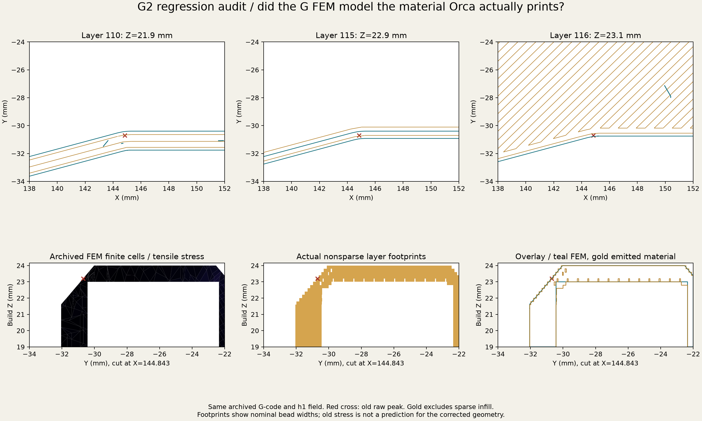

This initial overlay is diagnostic; it is not a corrected strength result.
The broad architecture brief also supersedes the draft's fixed rail/fixing
positions and local E13 silhouette constraint. [Current brief](G2-BRIEF.md).

## Post-G — September 11 design envelope

Replaced exact exterior preservation with an explicit admissible volume and
functional fit/retention/mounting requirements. The underside may extend up
to 8 mm below its current local profile, with an absolute floor of Y=-51 mm.
Material may be removed anywhere; walls, skins, plates, ribs and windows are
variables. Helpers have no fixed count, shape or placement; their union is
clipped to the body before mass and toolpath checks.

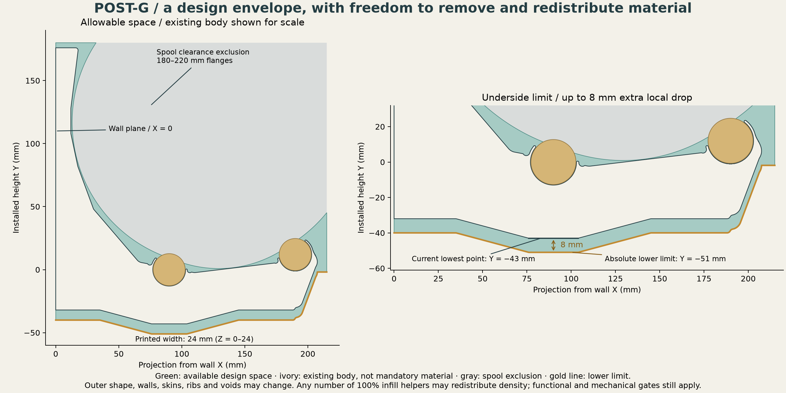

The envelope builder verifies accepted removal/addition probes and rejects
excessive drop and wall penetration. No expanded optimization or new bracket
qualification has run. [Contract and evidence](designs/design-envelope/README.md).

## Rev G — repeatable genetic study completed; no accepted finalist

Implemented a cached canonical plane-stress evaluator and seeded integer
genetic search. Four uncached reference cases reproduce the existing full
fields. Two broad-family seeds plus a full-plane family informed by 3D
failures evaluate 1,458 distinct parameter sets; two cached search replays
reproduce complete population ledgers and selections exactly.

The thin first-seed candidate slices to 84.35 g but fails movement, raw 3D
strength and dense-path coverage. The full-plane feedback candidate uses
103.76 g, 37.9% less than E13, with 3.246 mm vertical movement at E = 1 GPa
on h1. Matched stiffness per gram improves 6.6%. Its 3D tensile peak rises
32.29 → 37.99 → 55.05 MPa across h2/h1.5/h1, so it fails the 4× nominal
fracture screen. The final peak is beside a preserved E13 exterior chamfer.
A wider inner-seat support variant costs 108.03 g and improves coarse
movement to 2.988 mm, but remains rejected on strength.

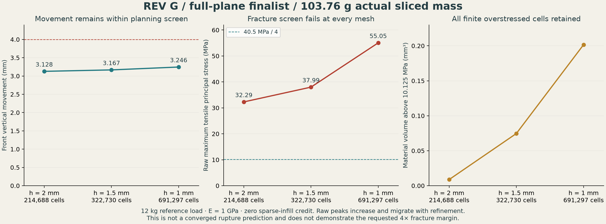

The F light-helper connectivity failure is repaired without changing its
printed density domain; it now slices to 93.76 g, while its original F
strength failure remains. Full-plane G and wider-seat toolpath gates pass.
Quadratic buckling is benchmarked and reported separately from fracture.
All finite stress fields, failed constraints and source hashes are retained.

No tested G finalist is computationally accepted or physically qualified.
The search sprint is complete under its explicit no-feasible-finalist outcome;
E13 stays the established prototype handoff. The next study must resolve
local geometry and material behavior before claiming a fracture margin.
[Rev G evidence](analysis/rev-g/README.md) · [CAD](designs/rev-g/README.md)
· [F checkpoint](REV-F-CHECKPOINT.md) · [Next study](NEXT-SPRINT.md).

## Rev F — September 10 checkpoint; evolutionary search next

Added two angular windows inside E13's unchanged exterior outline and protected
functional interfaces. Explored shaped internal planes and three precise infill
helpers with selection tabs outside the body. The three-wall shaped and
four-wall full-plane packages pass geometry and real Orca toolpath checks;
external tabs do not print.

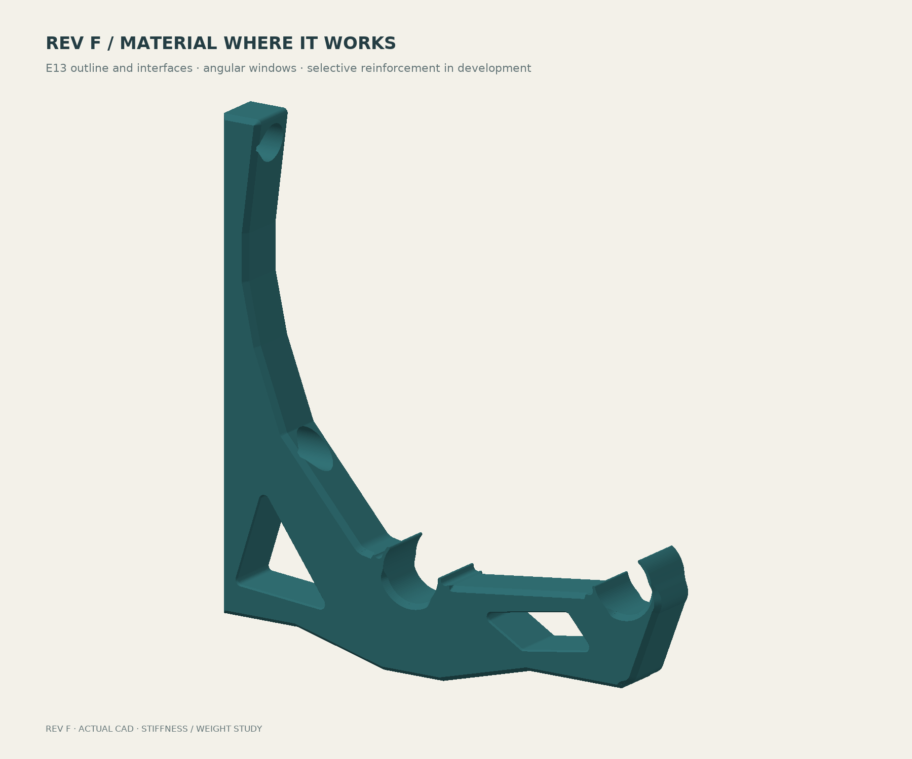

The four-wall full-plane slice uses 147.02 g versus E13 eight walls at 167.11 g
(neutral 1.24 g/cm³), with 2.1565 mm versus 2.1480 mm front movement at E = 1 GPa
on matched h1 meshes. The objective was then clarified to minimum mass within
5 mm total movement, 1 mm change per spool and 4× nominal fracture margin;
matching baseline stiffness is no longer a constraint.

The new one-wall light candidate estimates 87.81 g and gives 3.582 mm bracket
movement in 3D, but its conservative raw-peak strength ratio is only 0.85.
Its modifier STL connectivity check also fails, so its mass remains unsliced.
No Rev F candidate demonstrates the required 4× fracture margin. All finite
peaks and the checked fields are retained in the checkpoint.

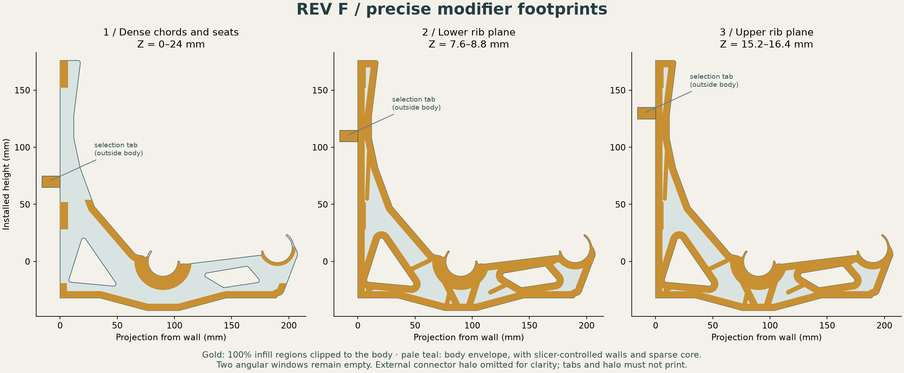

The incomplete-native-project Orca CLI crash was traced to missing preset
metadata on the wrong import path; truthful model-only metadata and fixed
orientation now pass repeated slicing. E13 remains the established prototype
handoff. [Rev F status and evidence](analysis/rev-f/README.md) ·
[Experimental CAD](designs/rev-f/README.md).

**Next sprint:** a seeded evolutionary optimizer with cached candidate results,
actual Orca mass and hard serviceability, 3D strength and manufacturing gates.
No optimizer is implemented in this checkpoint. [Archived sprint brief](REV-G-SPRINT-BRIEF.md).

## E13 — angular reinforcement and finer stress meshes

Replaced the broad curved underside with straight 11 mm-deep flanks into a
short flat, 1.5 mm deeper than E12. Small corner blends keep the faceted look.
The 207.51 × 219 mm body retains the fingers, relief pockets, rigid shoulders,
mirrored 50-degree finish, screw geometry and four continuous plates.

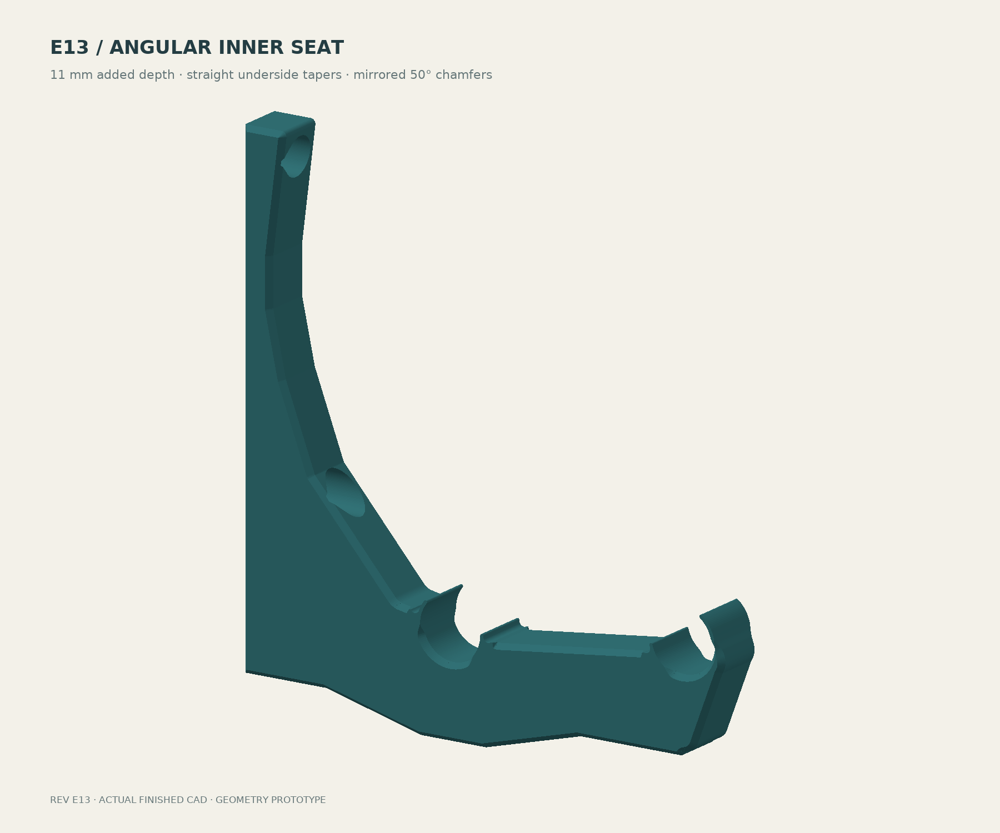

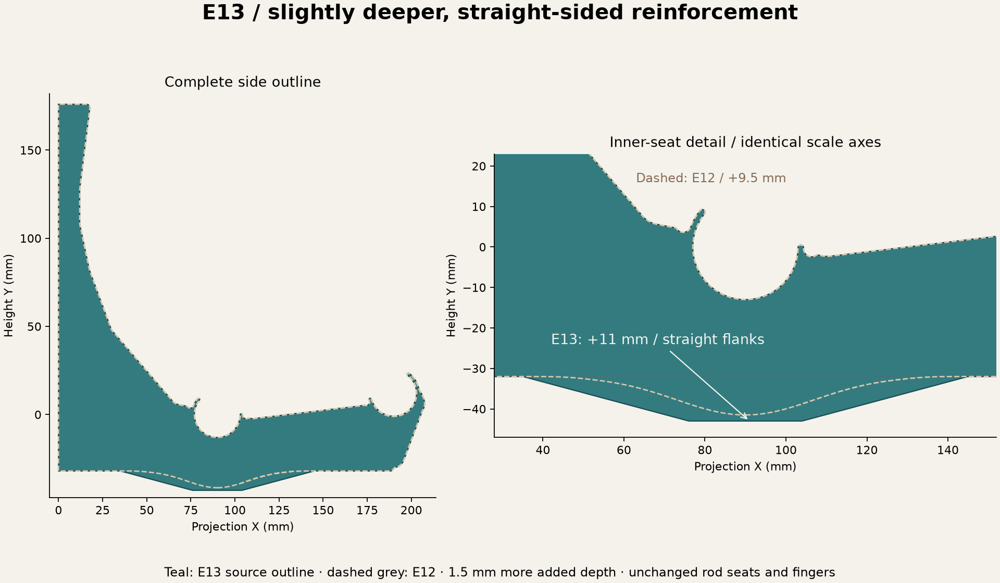

The matched reduced model improves near-seat stress by 12–13% versus E12,
40–41% versus E10, with about 16% less movement than E12. Three new global mesh
levels per wall count and two new fine E12 baselines assess the rest of the
stress field. Raw peaks and their cell locations/volumes are retained; the
package does not claim all stress concentrations have disappeared.

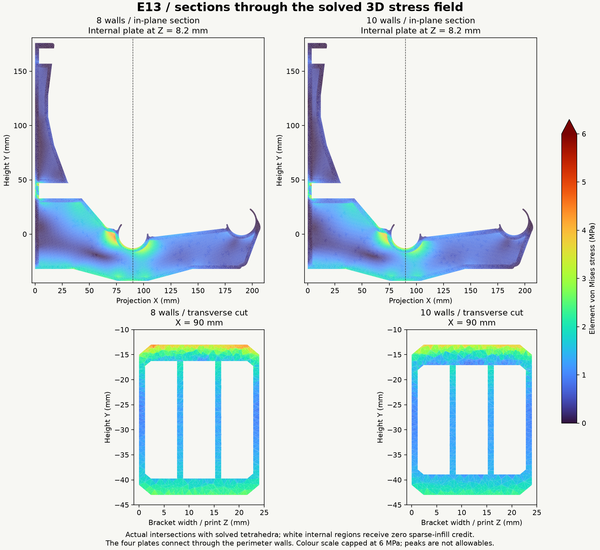

Current front coefficients are K=2147.972 MPa mm (8 walls) and 1936.610 (10).
All ten 3D fields pass independent residual, force and moment checks; geometry
and both OrcaSlicer path audits pass. Physical fit, insertion, loaded movement
and sustained/hot qualification are the next steps. No lifetime rating is
assigned. [Current guide](README.md) · [Hotspot evidence](analysis/e13/HOTSPOTS.md).

## E12 — one-quarter protrusion, most of the measured benefit

Reduced the added underside depth from 38 to 9.5 mm, meeting the preferred
one-quarter target and the one-third maximum. A broader smooth blend produces
an approximately 28.5 mm inner-center section and 207.51 x 217.50 mm print
footprint. The fingers, relief pockets, R6 rigid shoulders, 50-degree mirrored
finish, hardware and four continuous plates remain. No relief holes were added.

The explicit compactness requirement supersedes E11's adjacent-section margin
criterion. The finished seat still improves over E10, but no longer exceeds
both neighboring reference bands. Matched near-seat stress is 31.7-32.5% lower
than E10 and front movement is only 5.6-7.1% higher than E11. The outer-only
near-seat statistic improves about 35% over E10.

All E12 3D/material/landing results were rerun. Fine front coefficients are
K=2472.537 MPa mm (8 walls) and 2241.876 (10 walls). The accepted fields pass
independent residual/force/moment gates; rejected 10-wall mesh attempts are
recorded. Both OrcaSlicer audits pass the solid-band, wall and finger checks.

Next: configure the aligned helpers for the intended filament, verify actual
rod fit and print the prototype, then measure immediate/sustained/hot movement.
No physical or lifetime rating is claimed. [E12 guide](E12-ENGINEERING-GUIDE.md) and
[complete numerical results](analysis/e12/RESULTS.md).

## E11 — strong inner seat, 50° chamfers and refreshed FEA

Deepened the underside beneath the inner rod by 38 mm, giving approximately
57 mm center section depth. The smooth underside and R6 rigid-shoulder blends
restore the reduced bending section while retaining the functional snap sectors,
relief pockets, rail centers and hardware. The minimum seat-band bending I is
1.539 times the stronger adjacent plain-arm reference; elastic section modulus
is at least 1.282 times that reference. Both reference bands include the new
underside runouts.

The 2 mm face inset now rises 2.384 mm at 50° above the bed, mirrored on the
opposite side. Independent STEP probes measure the angles. Complete flexible
finger sectors match E10 through nine print depths. Delivered STEP solids,
closed STLs, hardware access and the 322-case nominal spool sweep pass; minimum
clearance is 3.927 mm.

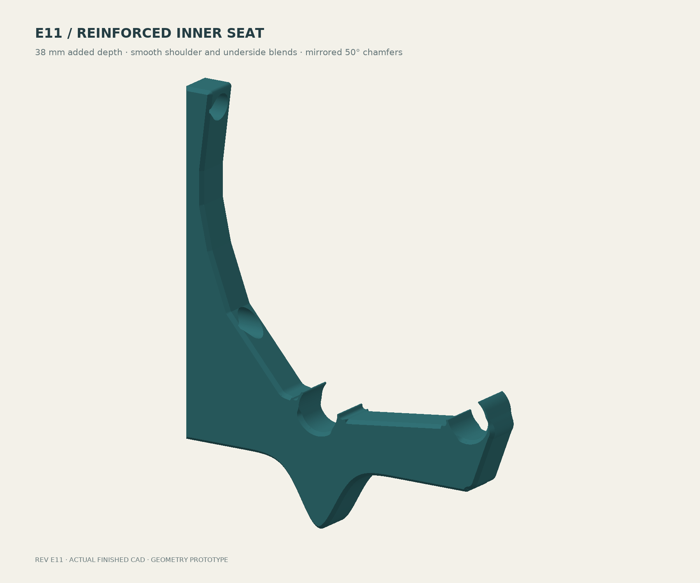

Matched E10/E11 reduced FEM gives 37.4–37.6% lower near-seat stress and
35.1–35.5% less front movement. The outer-rod-only diagnostic lowers stress
under the unloaded inner seat by 43.5%, supporting reduced-section bending.
New E11 8/10-wall 3D solves include the finished geometry and contact restraints;
their refined K values are 2306.334 and 2098.156 MPa·mm. Material movement,
creep sensitivities, screw demand and the landing submodel are all updated.
Rejected numerical fields and topology cleanup are explicitly audited.

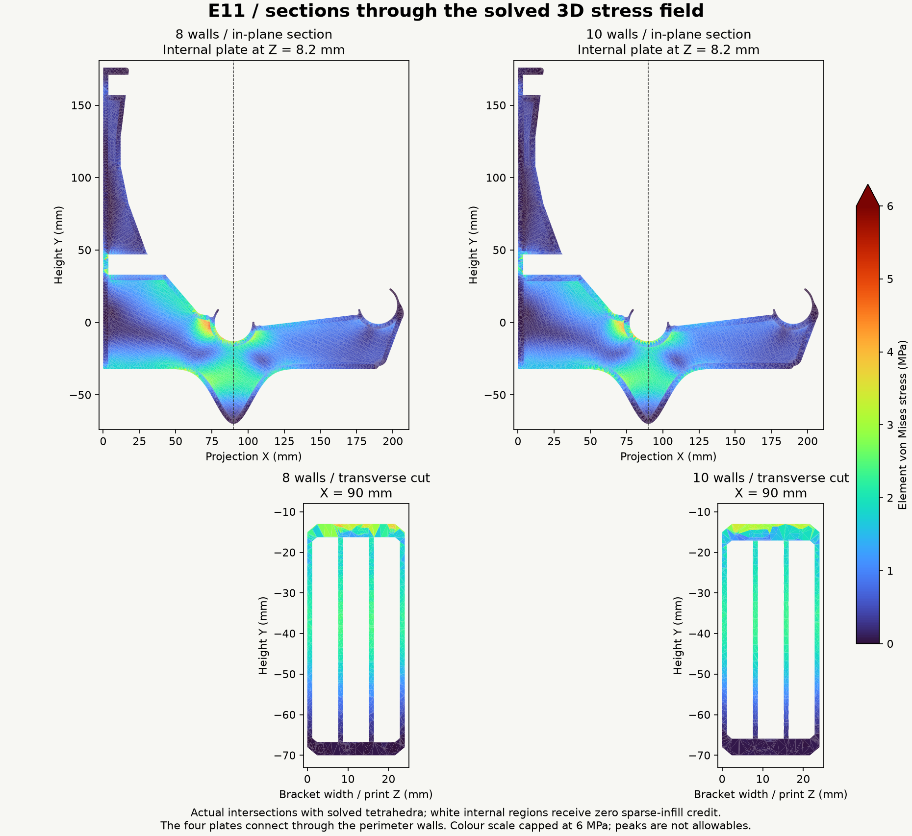

Actual OrcaSlicer 2.4.2 audits verify 120 layers, all four intended solid bands,
and continuous seat-wall footprints at 8/10 walls. These are nominal path checks,
not calibrated printer profiles. The new print footprint is approximately
207.51 × 246.00 mm. The concrete next step is to configure the delivered helpers
in the intended filament profile, check measured rod fit, print the prototype
and run the stated immediate/sustained/hot movement checks. No lifetime spool
rating is assigned. [Archived E11 guide](E11-ENGINEERING-GUIDE.md) and [full results](analysis/e11/RESULTS.md).

## E10 — continuous chamfers after filleting

Replaced the repeated stop/start bevel patches with continuous 2 mm chamfers around the pre-filleted body. Only the thin dowel-retainer regions use runouts. Mirroring the finished half makes the two broad-face treatments identical. The source profile, 12 mm rail lift, fasteners and modifier bands remain unchanged; E9 FEM is explicitly a prior-finish baseline.

The exported STEP contains three valid solids and passes hardware clearance. Verification includes 726 chamfer material probes over 121 representative segments, full depth at ten structural junctions and eight finger-material checks. The STL exporter omitted four microscopic tessellation triangles; closing those pinholes yields closed meshes and does not alter the STEP.

The supplier audit confirms Lowe's publishes 1-inch actual diameter for the Madison Mill poplar/oak rods, but the checked retailer and manufacturer pages give no numeric diameter or ovality tolerance. The 26 mm seat remains provisional. Added full-width rear/front fit coupons, each with aligned helper modifiers, and a measurement/fit plan. No physical measurements or fit tests have been performed.

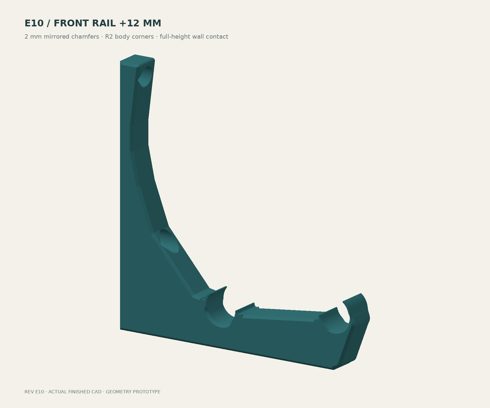

## E9 — raised-front running prototype

Adopted the +12 mm front rail as the current prototype. The rear center stays at (90, 0), front center becomes (190, 12), and both retainers rotate to the new contact directions. The back arm moves inward while retaining full-height wall contact; the front buttress meets the original base rather than leaving a stub.

Reduced both broad-face chamfers to 2 mm and verified them on nine structural edges using mirrored material-presence probes. Kept nominal R2 exposed wall-facet blends and smooth chamfer runouts before small features. The 322-case 180–220 mm spool sweep gives 3.93 mm minimum nominal clearance. STEP, closed meshes and fastener access checks pass.

Rebuilt the analysis material domain from the finished E9 CAD, including matching chamfer reinforcement, four 1.2 mm plates and zero sparse-infill credit. New 2D/3D fields and a 500 N upper screw-landing submodel are under [analysis/e9](analysis/e9). The main README holds current calculated margins; the [E8 guide](E8-ENGINEERING-GUIDE.md) remains an explicitly archived level-rail baseline.

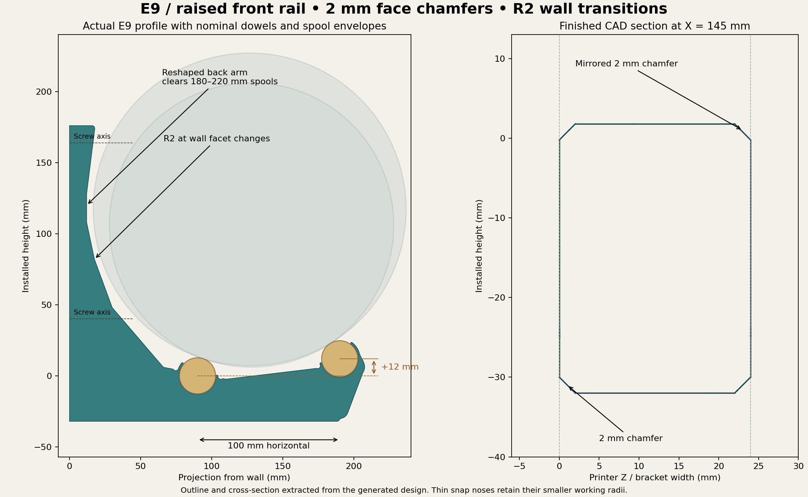

Physical slicing, fit and sustained/hot load qualification remain necessary before assigning lifetime spool ratings.

# Spool wall rack

A wall-mounted filament rack using nominal 1-inch wooden dowels. The bracket prints on its side so continuous L-shaped plates carry the principal bending load in the layer plane. Spools must slide across bracket locations without contacting the plastic.

**Current prototype: E8 — a solid STEP body with two helper solids for 100% infill modifiers.** The user chooses wall count and infill for the body. The slicer generates sparse support between the internal solid bands; no infill grid is modeled in CAD.

**[Download the STEP assembly with helpers](designs/closed-wall-e8/bracket-with-modifier-helpers.step)** · [Slicer setup and dimensions](designs/closed-wall-e8/README.md).

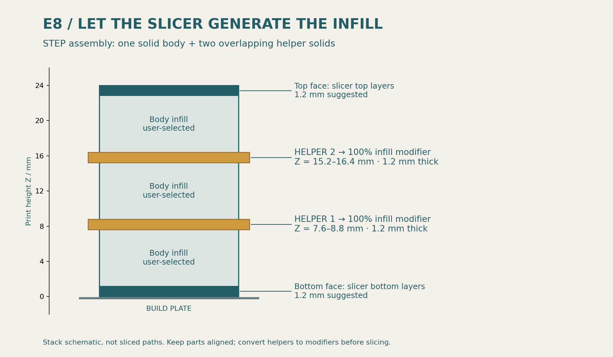

## Engineering analysis in progress

The full-bracket 2D/3D stress and creep study now includes the screw landings: rack pull/prying and washer compression from tightening are separate load cases. [Analysis checkpoint](analysis/e8/STATUS.md). The printable E8 geometry remains the current prototype while those results are checked.

## Design journal

Latest checkpoint: **Prototype wall-count starting points are 8 for PLA and 10 for PETG**, with both helpers at 100% infill. For the assumed 0.42/0.45 mm line widths and 0.2 mm layers, these correspond to approximately 3.3 and 4.1 mm perimeter thickness. They are test settings, not a verified load or creep rating.

### Wall counts — map the slicer setting to actual section

Six walls approximately recover the old 2.4 mm nominal perimeter; nine approximate the earlier 3.6 mm proposal. The current body still has the 28 mm arm depth. Selected 8 PLA / 10 PETG as starting settings with additional section margin. A simple local forearm comparison gives about 0.22 / 0.27 mm initial vertical movement respectively at the 12 kg bracket target, using typical reference moduli. That is not a whole-bracket or long-term prediction. Actual sliced thickness and the changed mounting connection still govern.

[Wall-count mapping, assumptions and limits](designs/closed-wall-e8/WALL-COUNTS.md).

### E8 — solid body plus modifier helpers

E7's compartment lattice recreated infill in CAD and increased modeled material by 42%. Replaced it with a solid exterior/functional body and two simple helper slabs at print Z = 7.6–8.8 and 15.2–16.4 mm. The user selects body wall count and infill percentage, then changes both helper parts to 100% infill modifiers. With 1.2 mm top/bottom settings, this retains the intended four solid planes while the slicer supplies sparse support between them.

The STEP preserves named component geometry and alignment. It does not carry modifier status or print settings. The helpers extend 2 mm beyond the body projection and must be converted to modifiers before slicing. The final package also includes three aligned STL files as an import fallback.

E7's fastener changes remain: 3.6 mm clamping lands, Ø5.2 mm shank clearance, Ø16 mm nominal access and the raised lower screw axis. The body no longer has a prescribed 2.4 mm CAD shell; actual wall thickness follows the user's slicer settings. Old hollow-section calculations do not establish the capacity of this print setup.

[STEP handoff and setup](designs/closed-wall-e8/README.md) · [Roundtrip and hardware checks](designs/closed-wall-e8/verification.json).

### E7 — compartment the voids and recess the fixings

Added 1.2 mm dividing walls within each air band, retaining all four continuous load-plane plates. Full cells have R2 corners and a 10 × 10 mm clear bounding box, limiting any straight geometric span to 14.14 mm. The three bands contain 106 / 97 / 106 cavities after local keepouts. This gives the internal plates short roofs to bridge; it does not establish actual sliced bridge direction or print quality.

Replaced the long screw bores with flat washer seats 3.6 mm from the wall. Ø5.2 mm clearance accommodates #8/#10 wood screws and nominal M5 shanks; M5 is the tighter printed fit. The Ø16 mm nominal access opening accommodates the checked Ø13 mm washer and a Ø15.8 mm straight driver envelope. Its 45-degree roof shoulders and short rounded cap avoid another long flat internal ceiling.

Raised the lower screw axis from Y = 12 to 40 mm to clear the rear dowel seat during installation. The upper stays at 164 mm. Removed the old projecting lower screw pad. Both washer landings support approximately 99.1% of the checked annulus. The full-height wall contact and compact exterior envelope remain.

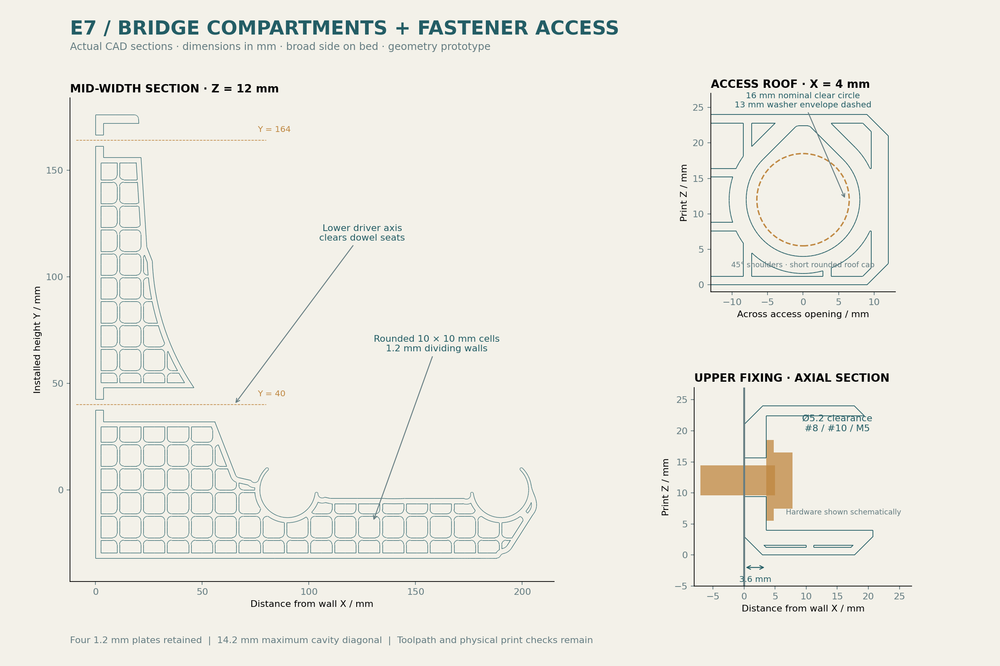

Solid volume increases from 94.3 to 133.8 cm³, approximately 42%, including the compartment walls and access reinforcement. The separate 34 mm arm-depth proposal is not incorporated. E6's load calculations do not validate the changed E7 connection, and the manufacturing dividers receive no assigned strength credit.

[DFM revision, dimensions and rebuild instructions](designs/closed-wall-e7/README.md) · [Actual geometry checks](designs/closed-wall-e7/dfm-verification.json).

### Additional section for PLA or PETG

A thicker perimeter alone gives a modest benefit: increasing 2.4 to 3.6 mm at the original arm depth increases ideal section I by 23%. Pairing that with a depth increase from 28 to 34 mm gives approximately 100% more I. Keep the spool bearing track and flexible fingers fixed, add depth below the arm, and carry the increase smoothly through the knee. The extra depth would cost approximately 6 mm of loaded rack height.

The current PETG reference needs 41% more I to match the original ASA initial bending stiffness. The proposed section exceeds that requirement. PLA already has similar reference stiffness to ASA; added section would reduce working stress and provide deformation margin. The required long-term creep allowance remains unestablished for both. These are section estimates, not whole-bracket stiffness or material-specific spool ratings.

[Sizing comparison, equations and limitations](designs/closed-wall-e6/MATERIAL-SIZING.md) · [Reproducible results](designs/closed-wall-e6/material-sizing.json).

### Material cases — PLA, PETG, ASA and PA6-GF

Expanded the final-CAD section check from the midpoint to ten knee/forearm stations and included outward seat forces for 180–220 mm spools. At the 12 kg design target the largest sampled nominal stress is **3.47 MPa**; linear scaling gives 6.93 MPa at the proposed 24 kg proof load. These are screening stresses, not local peaks or material allowables. The higher knee/near-seat demand supersedes relying on the earlier midpoint figure alone.

| Material | Decision for the 85°F / 100°F cases |
|---|---|
| PLA | Initially stiff; least thermal headroom among the reference grades. Monitored creep trial before any unattended full-row recommendation. |
| PETG | Candidate; lower reference bending stiffness. Sustained-load behavior needs measurement. |
| ASA | **First full-load prototype choice** for thermal headroom and the integrated unfilled snap geometry; not yet creep-qualified. |
| PA6-GF | Evaluate annealed dry and moisture-conditioned states. Reference wet bending stiffness is about one-third of dry; snap behavior needs separate qualification. |

The 12 kg target covers the 10.58 kg continuous-support estimate at 60 mm spool pitch with a 1.42 kg budget for self-weight and variation. This is a target, not a verified capacity or bound on arbitrary installations. Both temperature cases retain full load; the hot hours are not averaged away. The material study includes sourced reference data, a 1,000-hour screening trial, six-hour hot exposure and proposed movement criteria. It does not infer multi-year life or assign safe spool counts from tensile strengths or HDT.

[Full material assessment and qualification cases](designs/closed-wall-e6/MATERIAL-CASES.md) · [Computed cases](designs/closed-wall-e6/material-work-cases.json) · [Reference data and sources](designs/closed-wall-e6/material-reference-data.json).

### 16-inch support spacing — service load case, not a rating

E6 is not yet cleared for a fully loaded installation. For six full spools per 406.4 mm bay at an assumed gross mass of 1.25 kg each, the bay carries 7.5 kg. Six per bay requires a pitch no greater than 67.7 mm; spools can straddle bracket locations because the bracket does not interrupt the bearing track.

An interior support between simply supported bays carries about one bay's load. Continuous dowels across two equal, uniformly loaded bays place 1.25 times one bay's load on the middle bracket: **9.375 kg equivalent**, before dowel weight and handling loads. This factor describes that beam case; it is not a safety factor or a universal maximum. At 60–70 mm spool pitch, the same continuous-span estimate ranges from approximately 9.1 to 10.6 kg at the middle support.

The six-spool example produces approximately 12.9 N·m at the wall and an idealized 66 N upper-screw tension demand. A sampled arm midpoint has approximately 1.85 MPa nominal combined stress, including the outward seat force. Those numbers omit critical local concentrations, other sections and creep; they are not allowable loads. The 1-inch dowel calculation gives approximately 0.22 mm instantaneous resultant deflection using an explicitly assumed 8 GPa wood modulus. Purchased dowel properties remain unidentified.

The material study above now specifies the temperature envelope and four reference filament cases. Final grade, actual spool mass/pitch, wall fasteners and rail end conditions still need confirmation for an installation rating. Internal-roof printing remains unresolved. [Inputs, equations and limitations](designs/closed-wall-e6/check_16inch_loading.py) · [Calculated demands](designs/closed-wall-e6/loading-16inch.json).

### E6 — shorten the span, retain arm depth, use the upper spool envelope

Moved the rail centers from 76/226 mm to 90/190 mm from the wall, reducing their spacing from 150 to 100 mm. That lets the arm rise under the spool while retaining approximately 28 mm of depth. Rotated both retainers to match the new spool contact directions, keeping their rigid bearing sectors opposite the contact. Minimum nominal flange clearance is 3.48 mm across 180–220 mm spools.

The back now lies in one wall plane from the arm underside at −32 mm to the top at +176 mm. Small square lands at the wall-side ends remove the old clipped toe; the exposed edges keep their finishing treatments where space permits. Chamfers leave an 18 mm-wide central wall-bearing face, interrupted by the screw holes. Actual contact pressure will depend on wall flatness and fastening; geometric contact does not imply uniform bearing.

Raised the upper fixing from +138 to +164 mm. Screw spacing increases from 126 to 152 mm while the bracket remains below the top of even the 180 mm reference flange. This uses otherwise empty space beside the spool to preserve the mounting lever arm. The four continuous 1.2 mm plates and 2.4 mm modeled perimeter remain.

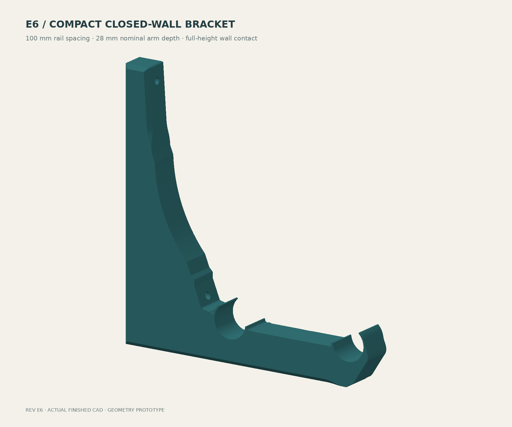

| Geometry | E4 | E6 |
|---|---:|---:|
| Rail spacing | 150 mm | 100 mm |
| Bracket height | 239 mm | 208 mm |
| Bracket projection | 244.24 mm | 206.73 mm |
| Extension below a 200 mm spool | 72.7 mm | 32.7 mm |
| Loaded envelope, 200 mm spool | 272.7 mm | 232.7 mm |
| Screw spacing | 126 mm | 152 mm |
| Midspan arm depth | 35.2 mm | 27.9 mm |

**Mechanical screening:** E6's midpoint section has 59% of E4's second moment of area, but the span falls to two-thirds. A uniform-beam estimate based on that midpoint section gives approximately twice the forearm stiffness through the `I/L³` relationship. This is a screening comparison, not a prediction of complete-bracket stiffness: the actual varying sections, snap roots, wall leg and mounting connection remain to be analyzed. An idealized upper-screw tension calculation gives approximately 4% lower tension for the same total vertical load.

**Handling tradeoff:** closer rods create a shallower cradle. For the 200 mm reference spool, the ideal center-of-mass rise to pass over one rod falls from approximately 29 to 12 mm. Spools will be easier to rock out fore/aft. The dowel snaps retain the rods, not the spools. Validate insertion, sliding and accidental bumps before accepting this rail spacing.

The final CAD is one valid solid and both delivered STL meshes pass edge-closure checks. [Envelope and section calculations](designs/closed-wall-e6/vertical-verification.json) · [Geometry check](designs/closed-wall-e6/verification.json) · [Finish check](designs/closed-wall-e6/finish-verification.json) · [Mesh check](designs/closed-wall-e6/mesh-verification.json).

### E5 — reject simple arm thinning as an equivalent replacement

First raised the underside by 45 mm while retaining the 150 mm span. That left only an 18 mm-deep arm. Its midspan second moment of area fell to approximately 18% of E4's, with no compensating span reduction. Kept this as an illustrated study and proceeded to E6. [E5 checkpoint](designs/closed-wall-e5/README.md).

### E4 — angular frame, chamfers that fade into the faces

Replaced the main body's sweeping outline with straight facets and R2 corner blends. Both broad faces receive 3 mm chamfers along the large structural edges. Before the retainers and small mounting features, the chamfer depth fades over 20 mm using a quintic curve with zero slope and curvature at both ends. The bevel also fades at the short upper-leg facet junction to avoid a hard termination there. The thin fingers and their small rounded noses keep their functional sections; a blanket R2 treatment would consume them. Integrated concave root blends increase to R2.

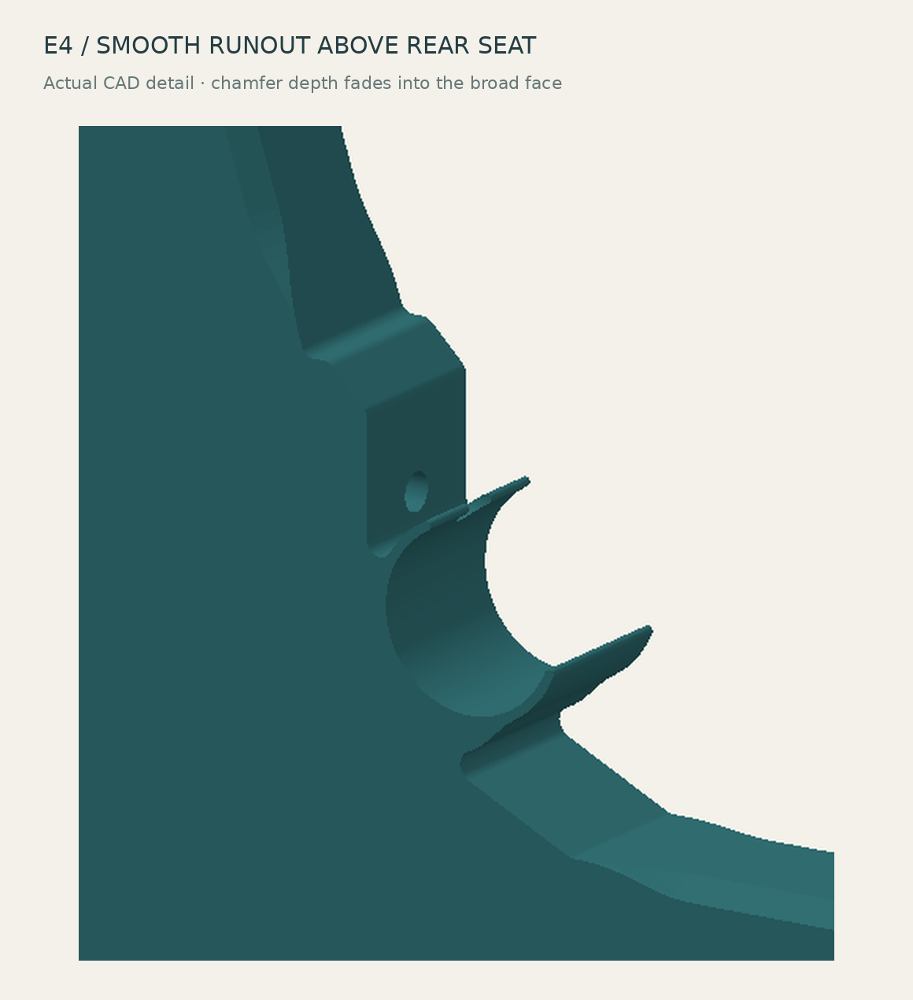

The bevels require extra solid material at the cavity rims. A 3 mm bevel over the original 1.2 mm face and 2.4 mm perimeter would leave an inadequate diagonal ligament. Local cavity setbacks now follow each bevel and its runout, preserving a design minimum of 1.2 mm behind the treated surface. The two continuous internal plates remain 1.2 mm, with three hollow bands. This local reinforcement does not solve unsupported internal-roof printing.

The final STEP is a valid single solid; the final bracket and coupon STL meshes have no boundary or nonmanifold edges. The nominal full-profile spool clearance sweep gives 5.34 mm minimum over 180–220 mm flanges; the 0.005 mm contour simplification tolerance is much smaller than the clearance margin. The finished chamfers only remove exterior material. These checks do not establish insertion force, strength, or creep life.

[Finished STEP](designs/closed-wall-e4/bracket.step) · [Final STL](designs/closed-wall-e4/bracket.stl) · [Finish verification](designs/closed-wall-e4/finish-verification.json) · [Mesh verification](designs/closed-wall-e4/mesh-verification.json) · [Seat drawing](designs/closed-wall-e4/retainer-engineering.png)

### E3 — remove the vestigial saddle prong

The small spur below the snap finger was leftover geometry from the original open saddle. Rounding it in E2 preserved a feature with no retaining function. Removed both the original saddle-lip sectors and their circular support nodes. Rebuilt each connection as a buttress between the arm and the rigid bearing sector, keeping the actual curved snap fingers.

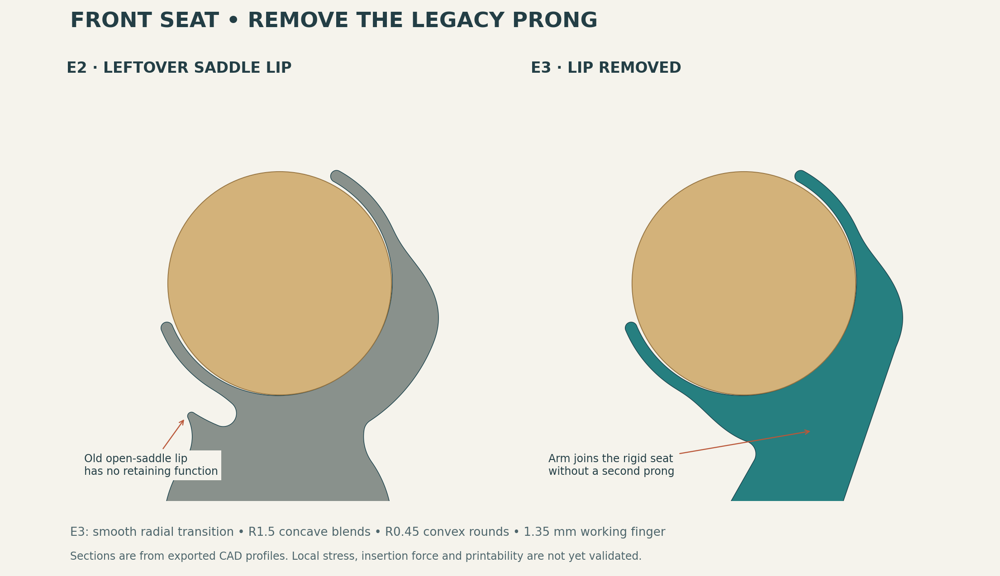

The snap opening, throat, thin finger dimensions and smooth root construction remain the same. The support beneath the retainer changes, so its effective compliance still needs evaluation in the integrated part. The existing 8 mm coupon remains a local retainer fit sample, not a stiffness match for the complete bracket.

The full-profile nominal clearance sweep still passes at 5.64 mm minimum over 180–220 mm flanges. The new outline is connected. [Geometric results](designs/closed-wall-e3/verification.json) · [Mesh checks](designs/closed-wall-e3/mesh-verification.json).

### E2 — replace abrupt snap roots with smooth transitions

The E1 root treatment was inadequate: adding circles to a stepped profile left abrupt shoulders, and the relief pockets ended in sharp notches. Replaced that construction with a continuous transition from the 1.35 mm finger to the thick bearing sector. The analytic transition matches radius, tangent, and curvature at both ends. Its minimum curvature radius is approximately 6.76 mm before integration into the bracket.

Added R1.5 concave blends at the integrated roots and relief-slot ends, plus R0.45 convex rounds. Enlarged the relief pocket to 17.75 mm radius and increased the local bearing thickness from 5 to 6 mm to preserve a substantial connection to the bracket. The nominal capture throat remains approximately 24.51 mm. The working fingers remain 1.35 mm thick; the thicker roots change their compliance, so insertion force still needs validation.

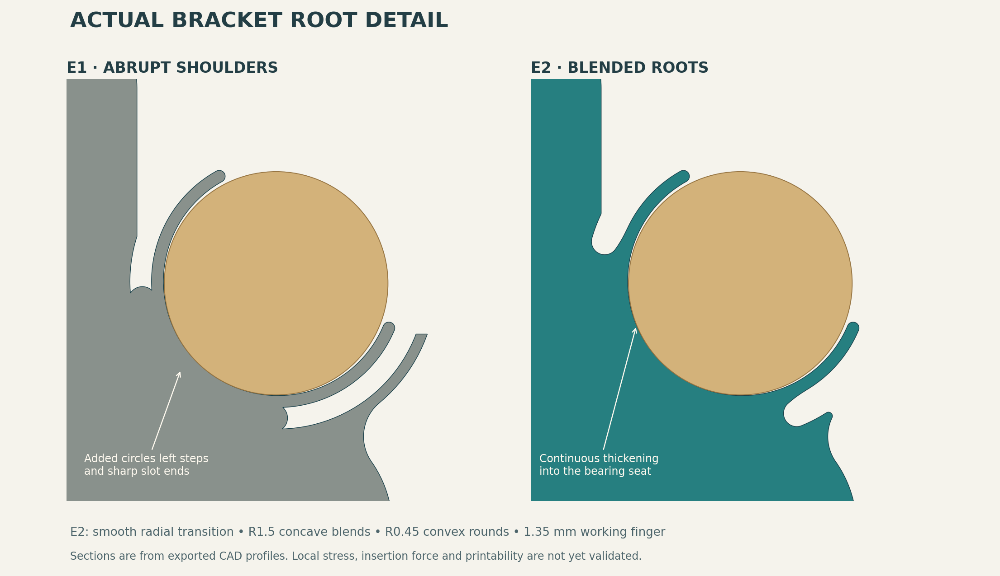

The nominal flange sweep passes with 5.64 mm minimum full-bracket clearance and 6.91 mm retainer clearance. A boundary-angle check around the rear seat found no large resolved direction jumps; the maximum was 2.36° after excluding microscopic tessellation edges. This is a geometric check, not a claim of zero stress concentration. [Root verification details](designs/closed-wall-e2/root-verification.json).

The rebuilt bracket and coupon also pass mesh edge-closure checks. [Mesh verification](designs/closed-wall-e2/mesh-verification.json).

Slicer paths and physical insertion behavior remain unverified. The full bracket still needs an internal-roof printing solution.

### E1 — align the snap opening with spool contact

Rotated each seat so its opening faces the spool contact and its rigid bearing sector lies directly opposite. Mirrored the two seats. This preserves the exposed track surface while directing the spool reaction into the thick bearing sector. Added separate 1.35 mm curved fingers and rounded noses, with a nominal 24.51 mm throat. A 185° concentric wrap was rejected because its capture disappears within the seat clearance.

The new profile passes the nominal 180–220 mm flange clearance sweep. Minimum retainer clearance is 6.91 mm; minimum full-profile clearance is 5.40 mm. These are seated geometric clearances, not insertion-path or tolerance validation. The thick bearing sector is 5 mm radially; the structural perimeter increases from 1.35 to 2.4 mm. Continuous side and internal plates remain 1.2 mm.

The drawing at the top of this page comes from the current CAD profile. The [8 mm coupon](designs/closed-wall-e1/snap-coupon-8mm.stl) makes the first fit trial smaller than a full bracket. It does not establish the 24 mm-wide bracket's insertion force.

### D — verify continuous internal planes

Established the upward wall leg and four full L-shaped plates. Rebuilt the delivered mesh, checked edge closure and all 120 layer-center sections, and independently checked nominal spool clearance. Found the main manufacturing issue: true empty cavities leave approximately 84 mm of unsupported region near the knee. A global infill percentage does not support those cavities.

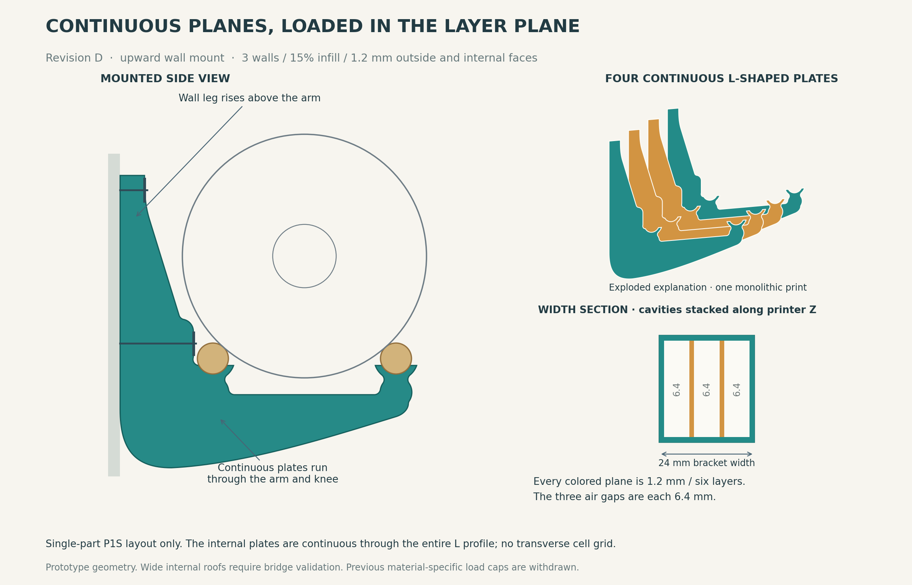

[Exterior](designs/closed-wall-d/progress-exterior.png) · [Arm cutaway](designs/closed-wall-d/progress-cutaway.png) · [Separated plate explanation](designs/closed-wall-d/progress-plates.png)

### Deferred — open-web alternative

Archived the separate reference concept. It has no shared geometry changes or load claims with the current closed-wall path.

## Current files

- [STEP assembly: body plus modifier helpers](designs/closed-wall-e8/bracket-with-modifier-helpers.step)
- [Body-only STEP](designs/closed-wall-e8/body-only.step)
- [Aligned body STL](designs/closed-wall-e8/body-only.stl), [helper 1](designs/closed-wall-e8/helper-1.stl) and [helper 2](designs/closed-wall-e8/helper-2.stl)
- [Setup instructions and rebuild](designs/closed-wall-e8/README.md)
- [Verification](designs/closed-wall-e8/verification.json)
- [Design decisions](DESIGN.md)
- [Separate future open-web reference](future/open-web/README.md)

## Geometry

| Feature | E8 value |
|---|---:|
| Nominal dowel diameter | 25.4 mm |
| Seat diameter / spacing | 26 / 100 mm |
| Single-part envelope | approximately 206.73 × 208 × 24 mm |
| Structural perimeter | User-selected slicer wall count and extrusion widths |
| Broad-face chamfer / body corner radius | 3 / 2 mm where features permit |
| Full-height wall land | 208 mm |
| Screw centers above rail datum | 164 and 40 mm |
| Clamping thickness / nominal access diameter | 3.6 / 16 mm |
| Screw clearance / washer envelope OD | 5.2 / 13 mm |
| Internal support | User-selected slicer infill; no modeled cell grid |
| Chamfer runout length | 20 mm |
| Exterior side plates | Slicer top/bottom layers; 1.2 mm suggested |
| Internal continuous plates | Two 1.2 mm helper solids converted to 100% infill modifiers |
| Intervening sparse-infill bands | 3 × 6.4 mm |
| Snap finger bending thickness | 1.35 mm |
| Rigid seat radial thickness | 6 mm |
| Nominal capture wrap / throat | 218° / approximately 24.51 mm |

The snap opening faces the spool contact. The thick seat lies 180° opposite that contact for the 200 mm reference spool. Front and rear retainers are mirrored. The contact direction varies with spool diameter; the nominal seated geometry was checked over 180–220 mm. Minimum computed clearance is 3.48 mm for the complete bracket and 7.45 mm for the rear retainer, with symmetry applying to the front retainer.

## Build and inspect

Follow the [E8 setup and rebuild instructions](designs/closed-wall-e8/README.md). Import the STEP as one object with three aligned parts. Choose body walls and infill, change the helper parts to modifiers, and set their infill to 100%. Keep the supplied broad-side-down orientation and inspect the two internal solid bands in the sliced preview.

## Verification limits

E8's STEP roundtrip preserves three valid solids, and hardware envelope checks pass. STEP does not encode slicer settings. The helper overlap is intentional and must not become extra printed slabs. Actual walls, solid-band formation, sparse-infill support and physical print quality need slicer/print checks. Previous E6 section properties do not rate arbitrary E8 print settings. Main bracket loads, fasteners, dowels, snaps, handling stability and long-term creep remain unqualified.
