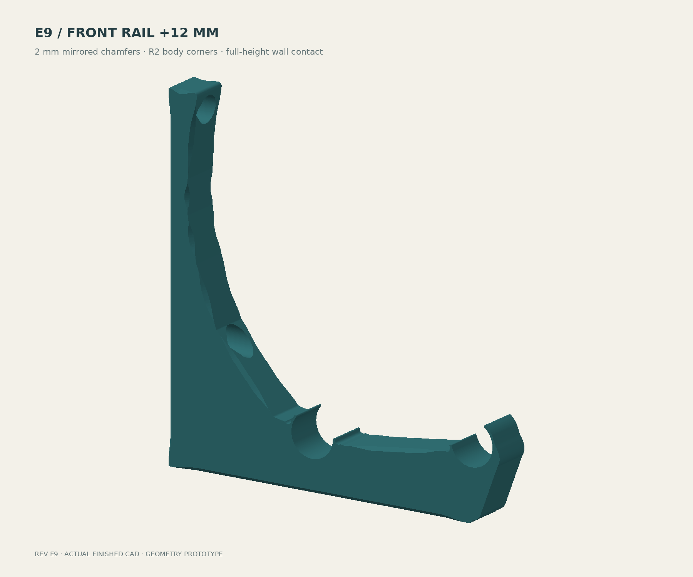
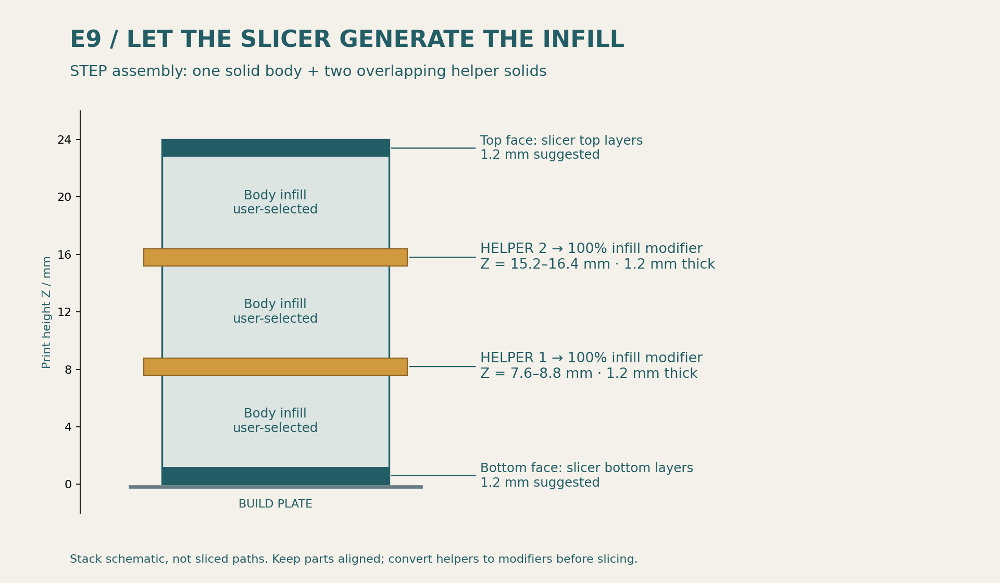
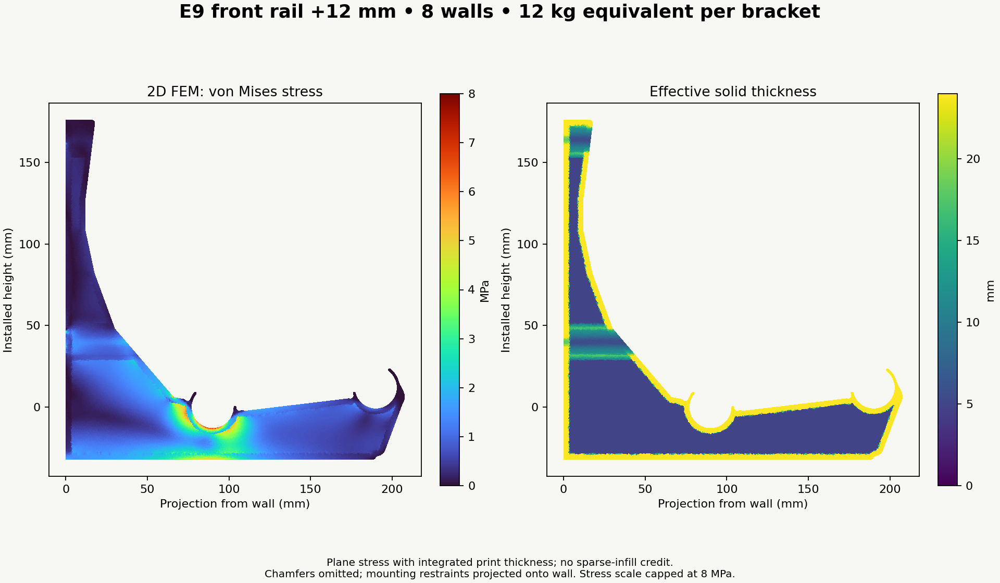
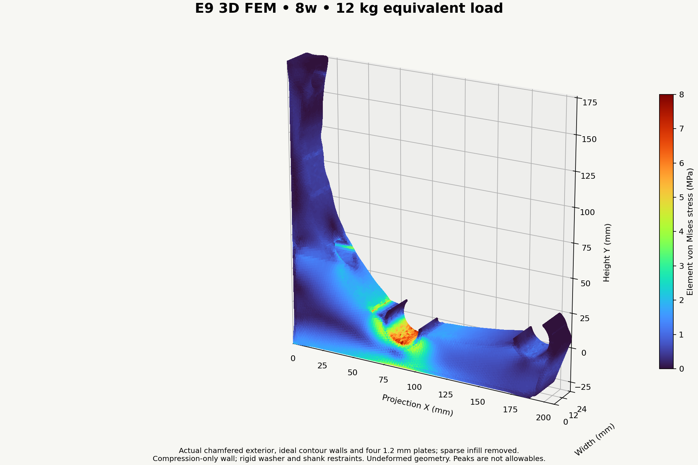
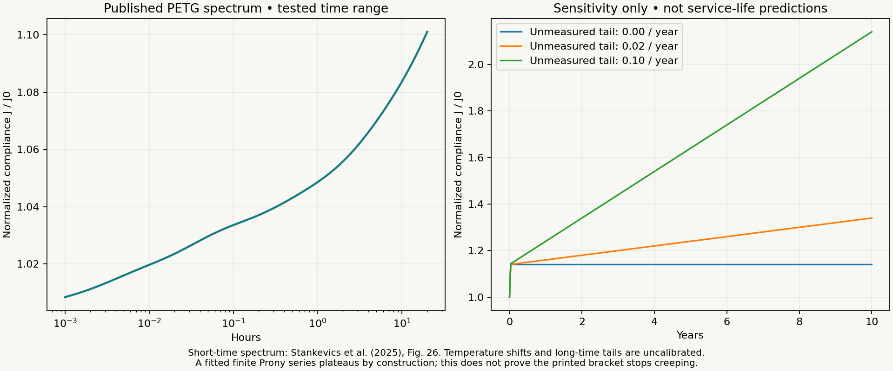
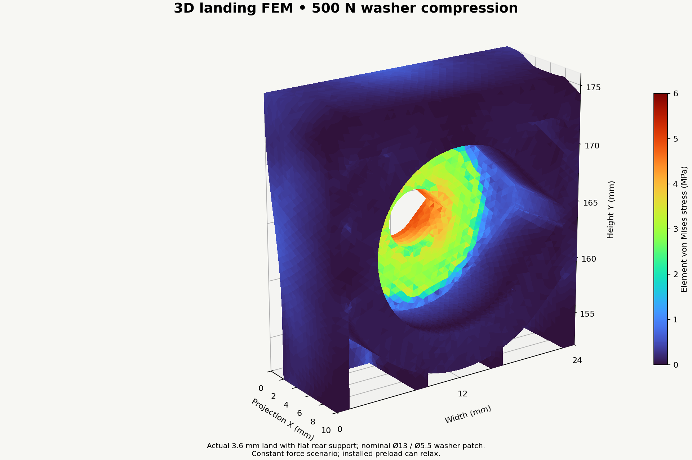
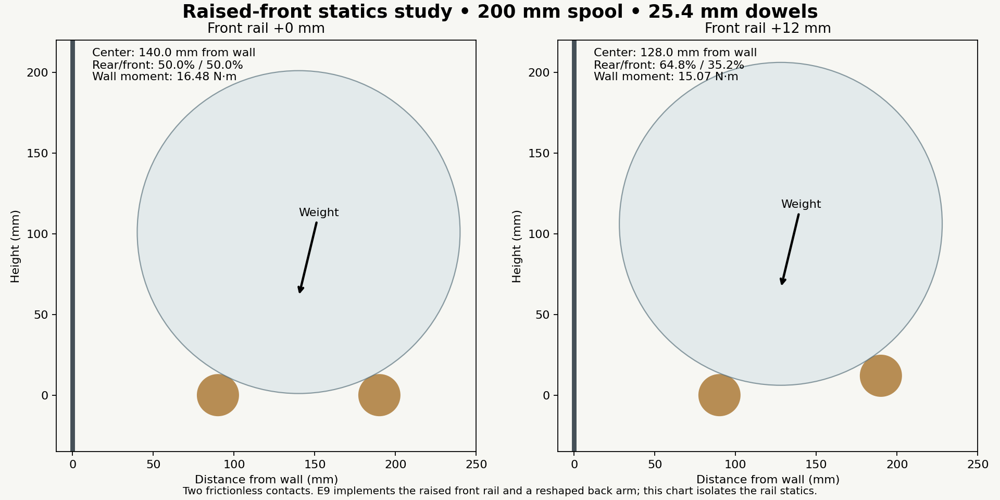

# Spool wall rack — print setup and engineering guide

**Current prototype: E9, with the front rail raised 12 mm. Both broad faces have 2 mm chamfers; exposed wall-facet direction changes have nominal R2 fillets.** Print on the broad side so principal bending loads stay in the layer plane. Two aligned helper solids create continuous internal plates through slicer modifiers.

**[Download the current STEP](designs/closed-wall-e9/bracket-with-modifier-helpers.step)** · [Aligned STL fallback and rebuild](designs/closed-wall-e9/README.md) · [Solved E9 stress fields and results](analysis/e9/RESULTS.md) · [Archived level-rail E8 guide](E8-ENGINEERING-GUIDE.md)

The back arm is reshaped inward for the rearward-shifted spool. A 322-case sweep across 180–220 mm spool diameters and two effective dowel radii gives **3.93 mm minimum nominal clearance**. Both retainers follow the new contact directions. The raised seat connects continuously to the original arm base.

Direct material-presence probes verify **2 mm chamfers on both faces of nine structural edges**. Chamfers smoothly fade before small features. Exposed wall facets use nominal R2 blends; sampled exported arcs differ from their nominal construction by less than 0.001 mm. Thin snap noses retain smaller working radii, and the wall-contact strip retains square end contact corners. [Finish verification](designs/closed-wall-e9/engineering-verification.json).

## Current engineering decision

Use **8 walls for the PLA prototype or 10 for the PETG prototype**, plus the four 1.2 mm solid plates described below. At the assumed extrusion widths, these provide about **3.27 and 4.08 mm** of contour wall. These are deliberate prototype settings; they are not material-independent lifetime ratings.

The initial whole-bracket calculations give approximately **1.01 mm front-seat movement for PLA and 1.37 mm for PETG** at the 12 kg equivalent bracket load. That initial flexibility is acceptable against the project serviceability criteria:

- **5 mm maximum total movement under full load**, including creep.
- **1 mm maximum change when adding or removing one full spool.**
- No cracking, loss of rod capture, fastener pull-through or progressive instability. Creep must remain within the movement budget over the chosen service life; an accelerating rate requires investigation.

Movement is measured from the unloaded geometry, relative to a stable wall reference. Decorative camber does not erase actual deformation. Measure at the bracket and between supports so dowel sag and wall/fastener movement are included.

**The remaining material question is creep and rupture over time, not whether 1.2 mm of elastic movement looks large.** No retrieved source establishes an indefinite-life rating for the exact printed grades at this rack's temperatures. The calculations below quantify how much compliance growth the design can tolerate instead of assigning an invented creep factor.

## Print setup

| Setting | Working value |
|---|---|
| Orientation | Supplied broad side down; bracket width is printer Z |
| Layer height | 0.20 mm, including the first layer for the stated band alignment |
| Nozzle used for wall-count mapping | 0.4 mm |
| Assumed outer / inner line width | 0.42 / 0.45 mm; explicit analysis inputs, not asserted slicer defaults |
| PLA contour walls | 8 |
| PETG contour walls | 10 |
| Body infill | 15%; **zero strength or stiffness credit** in the analysis |
| Body top / bottom solid thickness | 1.2 / 1.2 mm, six layers each |
| Helper 1 | 100% infill modifier, print Z = 7.6–8.8 mm |
| Helper 2 | 100% infill modifier, print Z = 15.2–16.4 mm |
| Solid infill | A pattern the slicer supports at 100%, with bonded adjoining lines |
| Filament profile | Exact grade's manufacturer profile, calibrated for the machine |
| Temperature, cooling and flow | Follow that grade's profile; verify bonding and flow before load testing |
| Print envelope | Approximately 206.73 × 208 × 24 mm; pair-print constraint removed |

1. Import the STEP as **one object with three aligned parts**. Do not arrange its components independently.
2. Keep `MAIN_BODY_SET_WALLS_AND_INFILL` as the printable body. Set its walls, 15% infill and six top/bottom layers.
3. Convert each named `MODIFIER_…` helper to **modifier geometry** and set its infill to **100%**. A helper is a finite 1.2 mm slab, not a zero-thickness STEP surface.
4. Inspect the toolpaths at each band. Confirm four continuous solid planes, contour thickness through the knee and beneath both seats, and uninterrupted solid plastic in the screw landings.
5. Confirm the helpers do not print as extra exterior slabs. Check driver tunnels, screw clearance, thin snap fingers and internal bridging over the sparse infill.
6. Save the configured slicer project with the filament identity and settings. The STEP itself stores geometry, not these settings.

The body is solid **in CAD** so the slicer can generate its internal structure. It is not an instruction to print the body at 100%. Sparse infill supports the internal bands during printing even though it receives no structural credit. Do not reintroduce modeled hollow bands or an internal grid into the printable STEP.

Use the supplied orientation for all mechanical comparisons. Standing the bracket upright changes the layer-load relationship. A 0.6 mm nozzle may suit abrasive filament, but the wall **count** must then be recalculated to achieve the modeled thickness. Do not silently carry over the 0.4 mm mapping.

### Walls versus millimetres

A rounded-rectangle bead-spacing estimate at 0.2 mm layers is:

`t(n) = 0.42 + (n − 1) × [0.45 − 0.2 × (1 − π/4)] mm`

| Walls | Approximate thickness |
|---:|---:|
| 3 | 1.23 mm |
| 5 | 2.05 mm |
| 6 | 2.46 mm |
| 8 | 3.27 mm |
| 9 | 3.68 mm |
| 10 | 4.08 mm |
| 12 | 4.90 mm |

Inspect the real slice; variable line width, thin-wall handling and local geometry alter this estimate. The two exterior and two interior plates stay 1.2 mm thick. More perimeters add material near bending-section edges and reduce working stress, but gains diminish. They do not establish a material's creep-rupture law. E9 keeps the underside at Y = −32 mm and raises the front seat center to Y = +12 mm, increasing depth toward the front; the rear-seat section still warrants particular attention.

## Material choice at 85°F sustained / 100°F for six hours per year

Both temperature cases retain full load. The following are **reference-grade comparisons**, not universal polymer properties. [Datasheet values, exact sources and hashes](designs/closed-wall-e6/material-reference-data.json).

| Material case | Prototype setup | Engineering implication |
|---|---|---|
| PLA | 8 walls; four 1.2 mm plates | Initially stiff. Least thermal headroom of these reference grades. Plausible candidate under the 5 mm criterion, with a grade-specific sustained/hot load trial. |
| PETG | 10 walls; same plates | More compliant initially, accommodated by thicker walls. A useful candidate; published short-time PETG creep evidence does not determine this grade's multi-year behavior. |
| ASA | Start with 8-wall geometry for comparison | First higher-temperature prototype choice. Thermal headroom is useful, but ASA is not automatically creep-qualified. |
| PA6-GF, annealed/dry | Compare the 8-wall effective thickness | High dry stiffness; match the datasheet's conditioning and annealing before using its properties. Integrated snaps need their own insertion/retention check. |
| PA6-GF, moisture-conditioned | Same geometry, conditioned properties | The reference Young's modulus falls from about 5.36 to 1.79 GPa. Treat this as a separate case, not as dry nylon with a small correction. |

The PA6-GF source specifies 100°C / 16-hour annealing for its reported properties. Its water-conditioned specimens are a deliberate sensitivity case, not a claim about equilibrium moisture in a particular room. Annealing can change fit. Use suitable abrasion-resistant extrusion hardware for glass-filled material and recheck the dowel and screw coupons after conditioning.

HDT and glass-transition temperature help compare thermal sensitivity; neither is a sustained-load allowable. Generic tensile strength divided by a convenient factor is not a creep design method. “PLA+”, “PETG HF” and other modified products need their own data.

## Loads and spool count

The design case uses 406.4 mm (16-inch) support spacing and an assumed **1.25 kg gross mass per full spool**, including the empty spool.

Six spools per bay weigh 7.5 kg and require pitch no greater than 67.7 mm. An interior support between simple spans receives about one bay's load. For two equal continuous spans under uniform load, the middle reaction is **1.25 times one bay's load**, or 9.375 kg equivalent before self-weight. At a continuous 60 mm spool pitch, that estimate becomes about 10.58 kg. The **12 kg equivalent / 117.72 N per bracket** analysis target allows additional demand for that example. It is not a universal bound on uneven loading, overhangs or arbitrary continuous spans.

For E9's 180 mm spool load case, the rear seat receives **75.12 N downward** and the front **42.60 N downward**, with **31.29 N outward at each seat**. The applied FEM moment about the wall is approximately **15.24 N·m**. Loads act over bearing arcs, not at thin finger tips. The structural load case uses an effective 12.4 mm rail radius; the illustrative 200 mm spool statics below uses nominal 12.7 mm. Both are documented inputs.

**Six per bay is the full-row test arrangement, not a released safe count.** No maximum safe spool count is yet assigned for PLA, PETG, ASA or PA6-GF. A capacity must satisfy the printed bracket, snaps, dowels, screws and wall, including creep and the specified serviceability limits.

For a tested material with usable creep compliance, scale bracket movement linearly within this small-deflection model:

`δ(m,t,T) = δ(12 kg,t,T) × m / 12 kg`

Then check the actual support reactions for the installation. Do not equate “six spools per bay” with “six spools carried solely by one bracket.”

## What the FEM resolves

The **2D plane-stress model** integrates the ideal printed material across the width. It includes contour walls, the four solid bands and fastener opening effects. It omits broad-face chamfers and projects the mounting restraints onto the wall, so it is a reduced comparison model.

The **3D model** starts with the actual chamfered E9 exterior and functional holes, then removes an analysis-only sparse core. It retains the ideal contour walls, four continuous plates and tunnel surrounds. These analysis cavities are not printable CAD changes.

Both models use compression-only wall contact. Rigid washer patches restrain outward movement and ideal screw shanks carry shear. The wall cannot pull the bracket inward. The 3D material is small-strain, homogeneous and isotropic with Poisson ratio 0.35; the reference solve uses E = 1,000 MPa and scales displacement to each grade's published XY Young's modulus. This does not resolve actual FFF orthotropy, bead defects, layer adhesion, screw/stud compliance or changing snap contact.

**Takeaways:** the rear-seat region remains important, but the raised-front geometry reduces front movement relative to the level-rail E8 baseline by approximately **18.0% for 8 walls and 17.7% for 10 walls**. This compares complete revisions: the load split, back arm, front depth and chamfers all changed. It is not an isolated rail-height stiffness experiment.

Refined rear-seat regional volume-p99 von Mises stresses are **6.04 MPa for 8 walls and 5.60 MPa for 10 walls**. The lower fixing attracts significant outward reaction, so treating the upper screw alone as the overturning restraint misses this model's connection behavior.

- 8 walls: 108,604 → 183,495 tetrahedra; front movement changes 4.50%; rear-seat regional p99 changes from 5.21 to 6.04 MPa.
- 10 walls: 103,938 → 186,126 tetrahedra; front movement changes 6.44%; rear-seat regional p99 changes from 5.05 to 5.60 MPa.

These comparisons do not establish asymptotic convergence. Raw maxima are **11.2/19.8 MPa** for the 8/10-wall meshes. Sharp analysis-core transitions, tiny cells and ideal restraint edges affect local peaks; actual printed radii, bead anisotropy and defects are not resolved. **Neither raw peaks nor percentile summaries are material allowables.** See [E9 results](analysis/e9/RESULTS.md) for the actual fields, reactions and residuals.

The 8-wall 2D refinement changes front movement by 0.69%; its refined coefficient is about 2.1% below the 3D value. Agreement between these related models is a comparison, not independent physical validation.

The initial 8-wall mesh contained numerically zero-volume cells and failed the independent residual check. That result was rejected. Removing one coarse and six fine degenerate cells removed less than 1.4e-12 mm³ of nominal volume; the corrected solves have relative free residuals below 4e-9 and pass force/moment balance checks. Finite-volume cells were retained. The coarse 8-wall raw peak of 63 MPa falls to 11.2 MPa on refinement and moves from a microscopic tunnel-mouth cell to an inner transition beneath the rear seat—further reason not to interpret raw peaks as rupture allowables. [Mesh audits and reproduction](analysis/e9/README.md).

An affine uniaxial patch test checks stiffness assembly, recovered stress and strain energy. Whole-bracket force/moment balance, residuals and refinement checks accompany the result files. A mesh comparison supports numerical interpretation; it does not validate years of service.

## Creep calculation and available margin

For a constant load and a common linear-viscoelastic compliance throughout a model with unchanged contact state:

`δ(t,T) = K × J(t,T) = K / Ec(t,T)`

Here K is the geometry/load coefficient in MPa·mm, J is creep compliance in MPa⁻¹ and Ec is the **secant creep modulus**, not the instantaneous unloading modulus. For the refined E9 raised-front solves:

| Case | K (MPa·mm) | Initial front movement | Ec for 5 mm bracket-only | Compliance growth limit |
|---|---:|---:|---:|---:|
| PLA, 8 walls | 3466 | 1.01 mm | 693 MPa | 4.94× |
| PETG, 10 walls | 3160 | 1.37 mm | 632 MPa | 3.66× |
| ASA, 8 walls | 3466 | 1.46 mm | 693 MPa | 3.43× |
| PA6-GF dry, 8 walls | 3466 | 0.65 mm | 693 MPa | 7.73× |
| PA6-GF wet, 8 walls | 3466 | 1.93 mm | 693 MPa | 2.59× |

Refinement updates live in [RESULTS.md](analysis/e9/RESULTS.md). These thresholds spend the full 5 mm on the bracket. For the complete rack, use **Ec ≥ K / (5 mm − dowel movement − wall/fastener movement)**. The earlier 1-inch wood-rail example gave about 0.22 mm instantaneous sag with an assumed 8 GPa modulus; wood grade, moisture, defects and long-term behavior remain installation inputs.

For a material-data screening target, use **at least 1.0 GPa effective creep modulus at the intended age and loaded temperature history**. This rounds above the bracket-only thresholds and preserves some movement budget for the dowels, mounting and reaction redistribution. It is a project screening target, not a published grade allowable or a rupture criterion.

The correspondence calculation keeps the original seat reactions. Relative seat sag reduces the initial 12 mm height advantage and redistributes load toward the front. For a nominal 200 mm spool, lowering the front 5 mm relative to the rear changes its vertical share from about 35.2% to 41.3%. This is a sensitivity case, not the predicted differential movement. A deformed-contact check is needed near the movement limit; the linear threshold is not an exact nonlinear capacity.

A one-roll change assigning an entire 1.25 kg reaction to one bracket gives approximately **0.11 mm for PLA and 0.14 mm for PETG** with the reference instantaneous modulus. For simple spans and the stated two-equal-span geometry, a single point load's reaction at the relevant support does not exceed the whole load. This estimate excludes overhangs, unusual continuity and handling impact. Fast removal of a roll depends on the aged unloading modulus; it is not correctly modeled by simply reversing all accumulated creep.

Even a settled, linear response at the full 5 mm limit gives a proportional one-roll change of about 0.52 mm for this load assumption. The 5 mm full-load criterion is therefore more restrictive than the 1 mm per-roll criterion in that simplified case.

### Published creep evidence and its limit

[Stankevics et al., 2025](https://doi.org/10.3390/polym17152075) tested unidirectional, 100%-filled Devil Design PETG at approximately 21.3°C, with tests extending to 20 hours. Its Figure 26 Prony spectrum provides a short-time benchmark. Graphically transcribed amplitudes are approximately 0.005, 0.010, 0.015, 0.010, 0.020 and 0.080 at time constants 1 through 100,000 seconds in decades.

`J(t)/J0 = 1 + Σ Ai[1 − exp(−t/τi)]`

That spectrum gives roughly 1.07 at five hours, 1.10 at 20 hours and a formal asymptote of 1.14. **The asymptote is a property of the fitted finite series, not proof that a rack at 85°F stops creeping.** Longer-time mechanisms were not calibrated by that experiment.

[Fischbach and Weinberg, 2023](https://arxiv.org/abs/2302.11240) tested a different printed PLA at room temperature. After approximately one week, measured flexural creep modulus was 1,040 MPa, about 56% of its 1,860 MPa datasheet flexural modulus, and deformation was still increasing. That demonstrates meaningful sub-Tg creep; it cannot be transferred unchanged to this PLA grade, temperature or service life.

The [calculation file](analysis/e9/engineering-summary.json) reports one-, five- and ten-year **sensitivity cases**, including unmeasured long-time compliance tails of 0, 0.02 and 0.10 per year. These are explicitly assumed continuations of a short-time example, not claimed PLA/PETG forecasts.

A long-time viscous tail can be almost invisible in a 20-hour test yet add appreciable deformation over ten years. Conversely, slow creep that remains inside the movement budget need not make the rack unusable. The release question is whether the grade's measured compliance and creep-rupture behavior support the intended life.

### Six hot hours each year

With 85°F as the reference temperature, reduced annual time is:

`ξyear = 8,754 + 6 × Ahot hours`

Ahot is the material's creep-rate shift at 100°F relative to 85°F. It is not known for these print/grade combinations. An **assumed Arrhenius sensitivity**, using activation energies of 50, 100 and 200 kJ/mol, gives Ahot about 1.70, 2.90 and 8.42. The six hot hours then add about 0.048%, 0.130% or 0.508% to annual equivalent time.

Those small percentages do not establish thermal adequacy: the shift law is uncalibrated, reversible hot softening still occurs during the excursion, and nonlinear creep or damage may invalidate simple time shifting. Check loaded movement during the actual hot exposure. Do not replace the cycle with an average temperature or use a universal WLF constant as grade data.

## Screw landings and installation

| Feature | Current design |
|---|---:|
| Screw clearance | Nominal Ø5.2 mm with small printable roof relief |
| Compatible shank envelopes | #8, #10 and nominal M5; printed M5 fit needs confirmation |
| Washer face to wall | **3.6 mm** |
| Nominal driver access | Ø16 mm with sloping roof |
| Checked straight driver envelope | Ø15.8 mm |
| Analysis washer | Ø13 OD / Ø5.5 ID; 1.2 mm thick for geometric fit |
| Screw axes | Y = 164 and 40 mm; Z = 12 mm |

Use flat-bearing heads and washers. A countersunk head introduces wedging that these models do not cover. Do not assume every washer sold for M5 has the analyzed outside diameter. For a different washer, check fit and recalculate bearing area.

The actual CAD supports approximately 99.1% of the specified washer annulus. The small loss comes from the printable roof relief in the screw hole. The available bearing area is about **108 mm²**:

`A ≈ 0.991 × π/4 × (13² − 5.5²)`

| Assumed clamp force per screw | Mean pressure on supported annulus |
|---:|---:|
| 250 N | 2.3 MPa |
| 500 N | 4.6 MPa |
| 1,000 N | 9.3 MPa |

These forces are scenarios. Driving torque into wood does not reliably determine the clamp force because thread cutting and friction consume torque.

The local 3D submodel uses the actual **upper 3.6 mm land**, 500 N distributed washer force and flat rear support. E9's 85,567-tetrahedron solve gives **0.01200 mm** mean axial washer movement at E = 1,000 MPa and **4.96 MPa** raw von Mises peak. At the reference PLA/PETG moduli, axial movement is about 0.0035/0.0052 mm. The earlier E8 landing refinement provides a useful numerical baseline; this is a new E9 coupon result, not a newly repeated E9 mesh-convergence study. These are constant-force calculations, not installed clamp-force-retention predictions.

**Retain the 3.6 mm land for now.** The backed compression case does not justify making it thicker. More thickness would add creep compression travel and violate the compact clamp intent without addressing the governing bracket region. This is a reasoned decision to retain the geometry, not a claim that every washer, tightening force or wall surface is acceptable.

The whole-bracket service model checks both fixings. The refined 8-wall solve attracts approximately **210 N outward demand at the lower washer and 15 N at the upper**. Those demands depend on wall contact and connection stiffness. They do not include arbitrary tightening preload, and maxima from separate cases cannot simply be added as scalar von Mises stresses.

Mount against a flat, firm surface with full back contact. A gap behind a landing changes it into a bending/punching problem and invalidates the backed compression case. Seat the washer firmly without crushing the print; inspect for embedment and loosening. The load path does not rely on sustained clamp friction alone.

Use screws intended for the actual stud substrate, with manufacturer-specified pilot drilling and embedment. Required length includes the 3.6 mm plastic, washer, wall finish and required stud engagement. M5 **shank clearance** does not mean an M5 machine screw can be driven directly into wood. Install the screws before loading the rack. The checked tool is a straight cylindrical envelope, not an arbitrary drill body.

## Current rail geometry: +12 mm front lift

Raising the front rail changes support geometry and reactions; it is more than cosmetic camber. For nominal 25.4 mm dowels, 100 mm horizontal spacing, frictionless contacts and a 200 mm spool:

| Quantity | Level rails | Front rail +12 mm |
|---|---:|---:|
| Spool center from wall | 140.0 mm | 128.0 mm |
| Rear / front vertical load fractions | 50% / 50% | 64.8% / 35.2% |
| Wall moment at 12 kg equivalent | 16.48 N·m | 15.07 N·m |
| Net moment about rear rail | 5.89 N·m | 4.47 N·m |

This reduces wall moment about **8.6%** and the net moment about the rear rail about **24%**. The front rail still carries roughly 35% of the weight. Across 180–220 mm spools, the wall-moment reduction is about 7.6–9.5%. The front rail also presents a higher obstacle to forward roll-out.

**E9 incorporates the necessary back-arm reshaping and independently reoriented retainers.** The old E8 profile interfered with a 220 mm spool when its front rail was simply lifted. E9's renewed 180–220 mm sweep clears by at least 3.93 mm over the evaluated nominal cases. This resolves the geometric issue; printed tolerances and actual spool/dowel sizes still need fit checks.

The rear seat carries greater vertical load, which is included in the new FEM. Cosmetic camber remains a separate possible adjustment based on a defensible one-year front-minus-rear sag estimate; the present 12 mm lift is a structural support-geometry choice.

## Qualification before assigning a lifetime spool rating

Record the actual filament grade, print settings, dry/conditioned state, washer, screws, dowel diameter/grade, spool mass/pitch and support arrangement. Confirm the slice matches the structural assumptions.

Measure unloaded position, immediate loaded movement and loaded drift at increasing elapsed times, including a sustained 85°F trial and a six-hour loaded 100°F exposure. Log the temperature at the bracket. Track the rear and front seats, span-center rail sag, washer embedment and any movement relative to the wall.

Use **5 mm total full-load movement and 1 mm per-roll change** as the project limits. Compare creep rates over equal time intervals; a plateau should emerge from measurements, not from forcing a finite Prony fit. Inspect for cracks, whitening, layer separation, permanent snap opening, loss of capture and increasing screw embedment. A 24 kg brief proof case is a proposed separate test; passing it does not establish long-term creep life.

A 1,000-hour trial is useful screening and model calibration. It is not automatically a ten-year rating. Extrapolation requires justified temperature/time shifts, the grade's creep behavior and a rupture check.

## Reproduction and design history

[E9 analysis scripts and reproduction commands](analysis/e9/README.md) include material-domain construction, 2D/3D solvers, known-solution verification, stress rendering and conditional creep calculations. The existing [GitHub Actions workflow](.github/workflows/engineering-analysis.yml) reproduces the archived E8 baseline; E9 results shown here were generated with the checked-in E9 scripts. Result JSON files retain force/moment balance, residuals and mesh details. Analysis-only BREP files and base meshes are regenerated, not print deliverables.

The CAD geometry verification is separate: [E9 STEP and hardware checks](designs/closed-wall-e9/verification.json). Physical printing and mechanical tests have not been performed in this repository.

[Design journal and superseded calculations](DESIGN-JOURNAL.md) · [Design decisions](DESIGN.md) · [Separate future open-web exploration](future/open-web/README.md)
