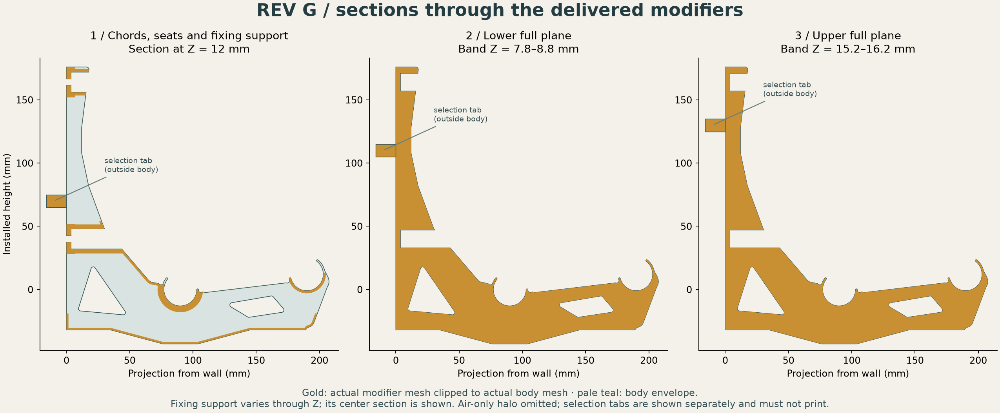
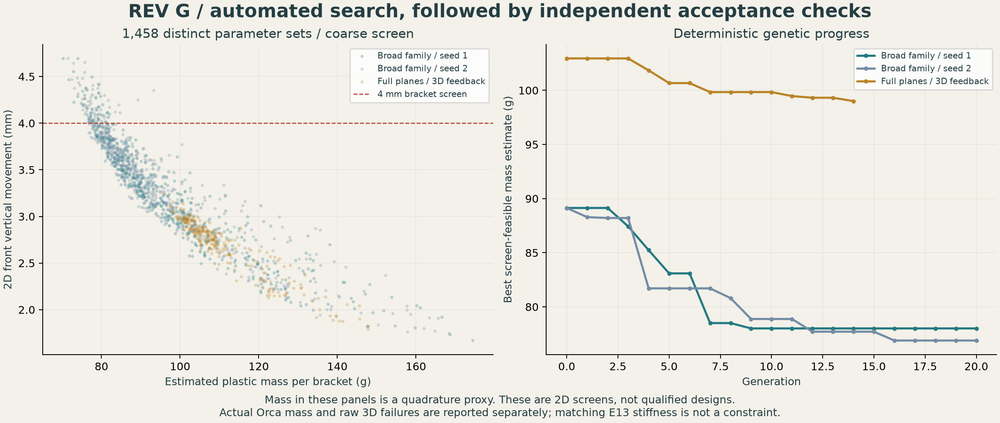
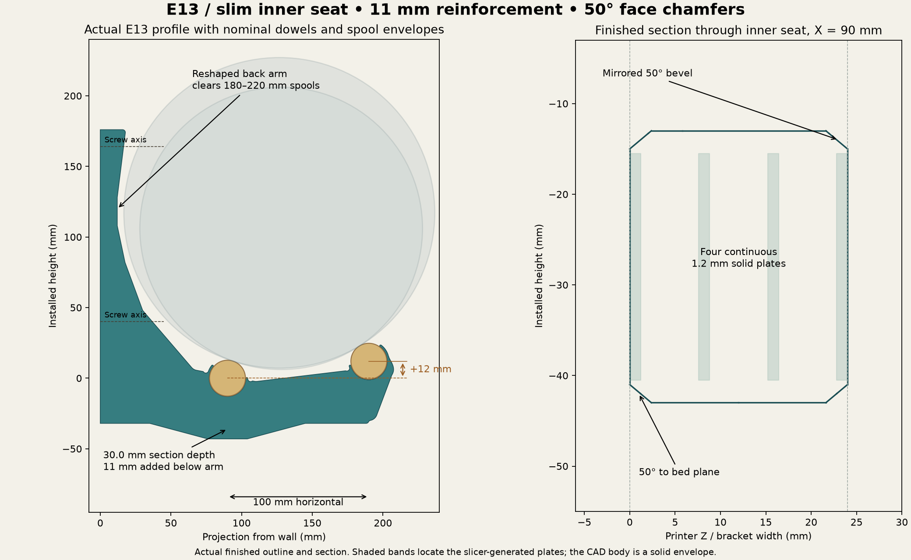
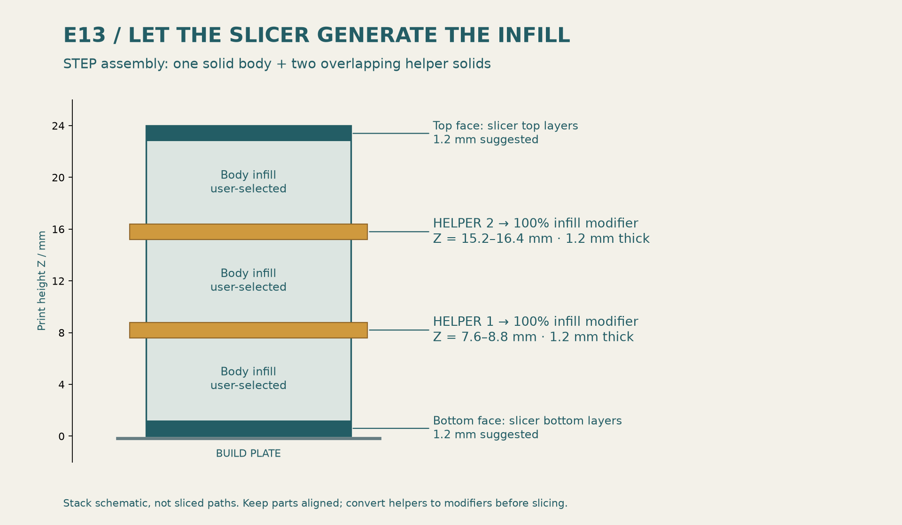
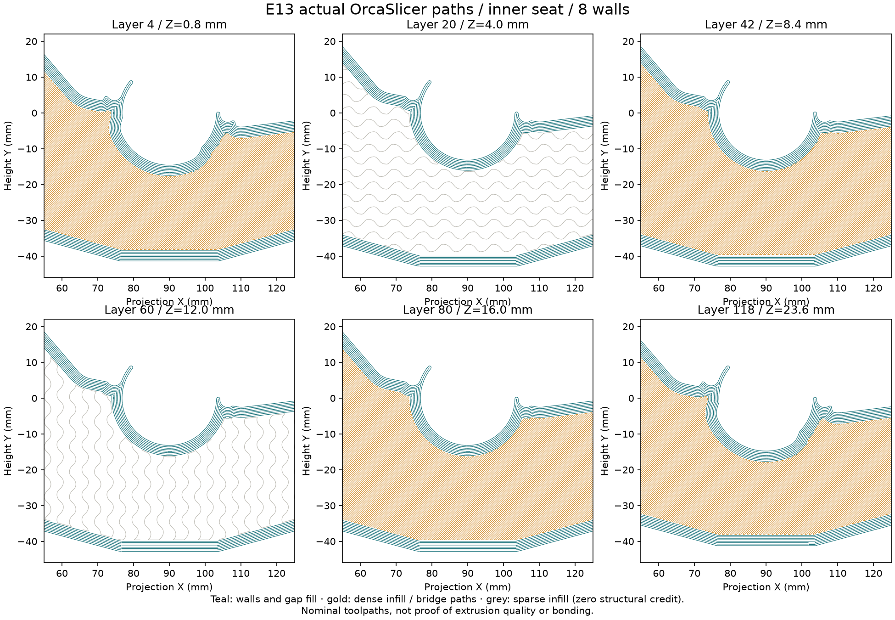
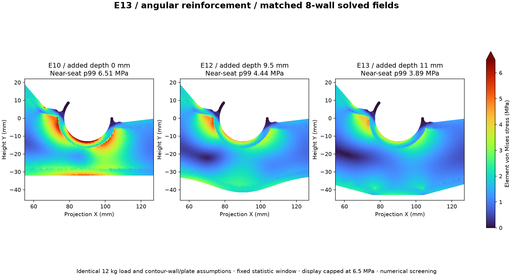
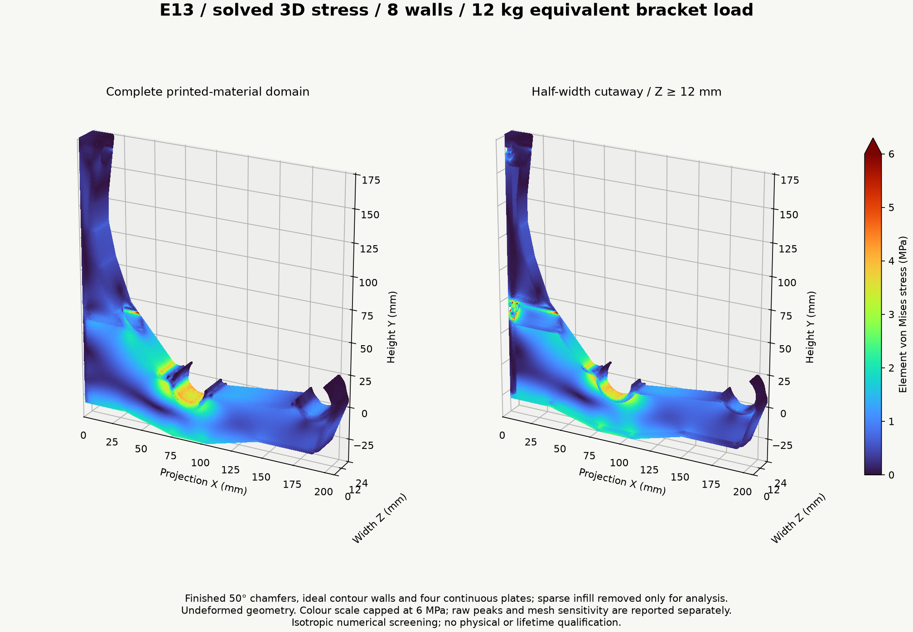
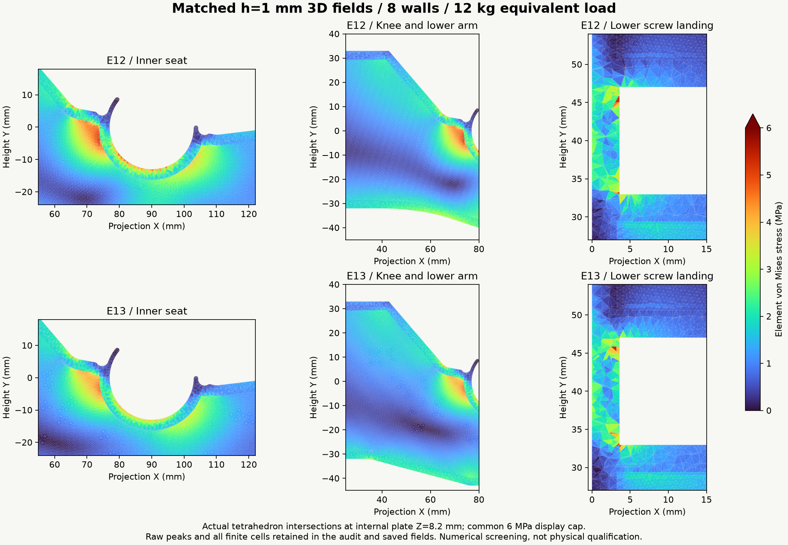

# Spool wall rack — G material-model correction and G2

**September 11, 2026: correcting the structural material model before G2.**
G's finalist is being rechecked against actual Orca paths with at least two
walls, 0% base infill and the existing 100% helpers. The wall/skin validation
matrix includes eight walls with two top/bottom layers and the reverse.
Thick 0.4 mm bridge extrusion counts toward plastic use but receives no
structural or bonded-connection credit. No corrected mechanical result or
preferred G2 prototype is established yet.

The reusable path-backed shape tool has passed independent occupancy and
thickness checks across all five schedules: 50,000 occupancy samples, with
zero mismatches outside the stated 0.005 mm polygonization band. The two-wall,
1 mm skin reference uses 77.920 cm³ of plastic, of which 6.940 cm³ is excluded
sacrificial bridge extrusion. A boundary-only volume mesh matches the
reconstructed continuum volume but fails topology/quality review. Better
meshing is in progress; no corrected stress result is claimed.

[G2 scope and acceptance gates](G2-BRIEF.md) ·
[Shape validation, slice evidence and reproduction](analysis/rev-g2/README.md) ·
[Slicer-backed shape tool](analysis/rev-g2/plastic_shape.py) ·
[Meshing progress and sources](analysis/rev-g2/MESHING-NOTES.md)

The new study may change the actual architecture, rail/fixing positions and
density strategy. It retains compact spool-relative elevation and permits up
to 8 mm useful additional downward extension. P1S, 0.4 mm nozzle; PETG or ASA.

## Preserved Rev G numerical study

**September 10, 2026: Rev G's evolutionary-search sprint is complete.
1,458 distinct parameter sets were evaluated. No tested finalist demonstrates
the requested 4× fracture margin; no qualified minimum-mass winner is selected.**
E13 remains the established prototype handoff, with its existing validation limits.

The results below belong to G's former material approximation. They are
preserved as regression evidence while the slice-to-FEM mapping is corrected;
they do not establish failure of the actual printed bracket.

[Current Rev G research CAD](designs/rev-g/README.md) ·
[Search, 3D results and limiting mechanism](analysis/rev-g/README.md) ·
[Next study](NEXT-SPRINT.md) · [Preserved F checkpoint](REV-F-CHECKPOINT.md) ·
[E13 guide](E13-ENGINEERING-GUIDE.md) · [Design journal](DESIGN-JOURNAL.md)

The full-plane search finalist slices to **103.76 g per bracket: 37.9% less
plastic than E13**. On matched fine meshes it is 51.1% more flexible and has
**6.6% better stiffness per gram**. Its 3.306 mm mean seat translation leaves
1.694 mm of the 5 mm total movement budget for other contributors at the
1 GPa planning modulus. Its raw tensile peak still fails the strength screen.

| Tested design | Actual Orca mass | Front vertical movement at 12 kg, E = 1 GPa | Outcome |
|---|---:|---:|---|
| E13, 8 walls | 167.11 g | 2.148 mm, h1 | Preserved reference prototype |
| G, thin shaped seed-1 candidate | 84.35 g | 4.930 mm, h2 | Movement, strength and dense-path coverage failures |
| G, full-plane search finalist | **103.76 g** | **3.246 mm, h1** | CAD/toolpaths pass; all three meshes fail fracture screen |
| G, wider inner-seat support | 108.03 g | 2.988 mm, h2 | Improves coarse result; fracture screen still fails |

Masses use the same neutral density of 1.24 g/cm³. Movements are modeled,
not measured. Mesh levels differ where stated; no physical print or sustained
load qualification is claimed.

The genetic optimizer is implemented. Two broad-family seeds and a second
family informed by 3D failures were run; two cached search replays reproduced
the complete ledgers exactly. Four uncached physics cases match the canonical
solver. Actual Orca checks verify modifier roles, alignment and nonprinting
tabs. [Full evidence and reproduction commands](analysis/rev-g/README.md).

**What limits the design:** the full-plane candidate's raw tensile peak rises
from 32.29 to 55.05 MPa with mesh refinement, above the 10.125 MPa nominal
screen. The fine peak is adjacent to a preserved exterior forearm chamfer.
All finite cells are retained; this is not a converged rupture prediction.
The next study addresses that local geometry/material-model uncertainty before
further mass optimization. [Stress evidence](analysis/rev-g/README.md#mesh-refinement-and-the-limiting-mechanism)
· [Next study scope](NEXT-SPRINT.md).

---

## Preserved E13 print and engineering guide

**Established prototype handoff: E13 — an 11 mm deep reinforcement with straight angled
flanks and a short flat bottom.** It is 1.5 mm deeper than E12 and remains
below the 12.67 mm maximum. Small corner blends preserve the angular shape.

**[Download E13 STEP with aligned helpers](designs/closed-wall-e13/bracket-with-modifier-helpers.step)** ·
[CAD and print checks](designs/closed-wall-e13/README.md) ·
[Refined stress and material results](analysis/e13/RESULTS.md) ·
[Hotspot audit](analysis/e13/HOTSPOTS.md) · [Design journal](DESIGN-JOURNAL.md)

## Angular shape and preserved fit

The underside has two straight 41 mm horizontal runs into a 28 mm flat. Each
flank changes height by 11 mm, about **15° to horizontal**. Small corner
blends join the facets. The inner-center section is **30 mm deep**, and the
body envelope is approximately **207.51 × 219.00 × 24 mm**.

The longer tapers spread the reinforcement into the adjoining knee and arm.
The matched reduced model gives **40–41% lower near-seat stress than E10**,
and **12–13% lower than E12**, with about **16% less front movement than E12**.
The outer-rod-only stress statistic is about **43% lower than E10**.
[Exact comparisons](analysis/e13/COMPARISON.md).

The finished ideal printed section has at least **3.15× E10's minimum
seat-band bending I** and **2.00× its elastic section modulus**. It does
not exceed both adjacent reference sections. The depth cap supersedes that
E11 target; adjacent arms have not been weakened to improve the ratio.
[Section audit](designs/closed-wall-e13/section-verification.json).

The R6 rigid shoulder blends, fingers and relief pockets remain. Both broad
faces have **2 mm chamfer inset, 2.384 mm rise and 50° above the bed**. Only thin
retainers receive bevel runouts. Actual STEP boundary probes confirm the
straight flanks, flat underside and mirrored angles.

[Inner-seat close-up](designs/closed-wall-e13/finish-inner-front.png) ·
[Reverse face](designs/closed-wall-e13/finish-inner-reverse.png) ·
[Outer fingers](designs/closed-wall-e13/finish-outer-front.png).

Rear/front rail centers stay at (90,0)/(190,12) mm. The 322-case nominal
180–220 mm spool sweep retains **3.927 mm minimum clearance**. All four flexible
sectors match E10 at nine print depths. Physical rod fit and insertion force
remain untested.

## Print setup

Print on the supplied broad side. Import the STEP as **one object with three
aligned parts**, so the main bending load stays in the layer plane.

| Setting | Working value |
|---|---|
| Body footprint / height | **207.51 × 219.00 × 24 mm**; check bed exclusions |
| Layer / first layer | **0.20 / 0.20 mm** |
| Reference nozzle | 0.4 mm |
| Outer / inner nominal line widths | 0.42 / 0.45 mm |
| Wall generator / solid-region gap fill | **Arachne / Everywhere** |
| PLA prototype walls | **8**, about 3.27 mm ideal contour thickness |
| PETG prototype walls | **10**, about 4.08 mm ideal contour thickness |
| Body infill | **15%**, zero structural credit |
| Exterior top / bottom | **1.2 / 1.2 mm**, six layers each |
| Helper 1 | **100% infill modifier**, Z=7.6–8.8 mm |
| Helper 2 | **100% infill modifier**, Z=15.2–16.4 mm |
| Filament process | Exact grade's calibrated temperature, cooling, flow and bonding |

1. Keep the main body printable with the selected walls, 15% infill and six
   top/bottom layers.
2. Convert both named helpers to **100% infill modifiers** in their supplied
   positions. They must not print as extra exterior slabs.
3. Inspect all four solid bands, seat perimeters, fingers, screw lands and
   access roofs; then save the configured machine/filament project.

STEP stores geometry and alignment, not modifier status or print settings.
[STL fallback and detailed handoff](designs/closed-wall-e13/README.md).

**Both OrcaSlicer 2.4.2 audits pass:** 120 layers, all 24 intended solid-band
layers checked around the inner seat, plus sampled full L-planes, walls and
fingers. Minimum nominal footprint coverage is **99.82% in the seat bands,
99.99% in sampled seat walls and 99.84% in sampled fingers**, with a
0.03 mm tessellation/rounding allowance. These neutral slices do not qualify
bonding, bridging, curling or an actual filament process.
[Toolpath evidence](designs/closed-wall-e13/toolpath-verification.json).

The contour estimate remains
`t(n) = 0.42 + (n − 1) × [0.45 − 0.2 × (1 − π/4)] mm`.
Arachne varies thin-feature widths; actual paths govern. Keep the four 1.2 mm
plates if changing nozzle or wall count. Sparse infill supports the plates
during printing while receiving zero structural credit in the analysis.

## Finer meshes and remaining stress concentrations

The full 3D model includes the finished chamfers, ideal contour walls, four
continuous plates, screw tunnels, compression-only wall contact and rigid
washer/shank restraints. Sparse infill receives zero structural credit.

Both wall counts now have **three global mesh levels: h=2, 1.5 and 1 mm**.
E12 was also re-solved at h=1 mm for the matched hotspot comparison. Two further
meshes check the 500 N upper screw landing. All ten new 3D fields pass independent
free-residual, force and moment gates below 1e-6.

| Walls | Tetrahedra at h=2 / 1.5 / 1 mm | Last movement change | Last near-seat p99 change |
|---:|---:|---:|---:|
| 8 | 192,633 / 323,629 / 757,028 | +1.84% | -0.34% |
| 10 | 195,838 / 328,179 / 787,137 | +1.90% | -1.09% |

The table below compares volume-weighted p99 stress in fixed regions at the
same h=1 mm mesh size. Negative means lower stress in E13.

| Region | 8-wall stress change vs E12 | 10-wall stress change vs E12 |
|---|---:|---:|
| Inner seat | -13.28% | -13.22% |
| Knee | -9.31% | -10.37% |
| Outer arm | -19.41% | -20.24% |
| Lower landing | -0.17% | +0.93% |
| Upper landing | +1.17% | -1.12% |

The large isolated raw peaks do **not** all disappear. Some change substantially
with refinement at chamfer, plate and restraint intersections. The audit keeps
their locations, cell volumes and every finite element; small cell size alone
does not establish that a peak is an artifact. The common 6 MPa figure cap
does not alter the saved stress field. No rupture allowable is inferred.
[Raw peaks and refinement](analysis/e13/HOTSPOTS.md) ·
[Full engineering results](analysis/e13/RESULTS.md).

## Current movement and material cases

The criteria remain **5 mm total loaded movement**, including dowels and
mounts, and **1 mm change per full spool**. At the 12 kg reference load, the
refined front coefficients are **K=2148.0 MPa·mm for 8 walls** and
**1936.6 for 10 walls**.

| Reference material | Walls | Initial front movement | One 1.25 kg roll | Ec for 5 mm bracket-only |
|---|---:|---:|---:|---:|
| PLA | 8 | 0.627 mm | 0.065 mm | 430 MPa |
| PETG | 10 | 0.838 mm | 0.087 mm | 387 MPa |
| ASA | 8 | 0.903 mm | 0.094 mm | 430 MPa |
| PA6-GF dry | 8 | 0.401 mm | 0.042 mm | 430 MPa |
| PA6-GF wet | 8 | 1.198 mm | 0.125 mm | 430 MPa |

These use the retained grade-specific room-temperature XY moduli, not measured
hot or aged properties. [Exact grades, conditions, sources and hashes](designs/closed-wall-e6/material-reference-data.json).
The [material report](analysis/e13/RESULTS.md) includes 24 kg linear proof
scaling and one-, five- and ten-year creep sensitivities. No lifetime safe
spool count is assigned.

For common linear-viscoelastic compliance with unchanged contact,
`δ(t,T) = K × J(t,T) = K / Ec(t,T)`.
The complete rack requires **Ec ≥ K / (5 mm − dowel movement − mount movement)**.
Retain the project screening target of **at least 1.0 GPa effective creep
modulus** at the intended age and temperature history. It is not a grade allowable.

The service envelope stays **85°F sustained and 100°F for six loaded hours/year**.
Short-time creep examples, assumed long-time tails, HDT and generic tensile
strength do not establish multi-year performance. PA6-GF dry/wet conditioning
and annealing remain separate. Fast spool unloading uses aged instantaneous
modulus rather than reversal of accumulated creep.

## Loads, rods and installation

The analysis target is **12 kg equivalent / 117.72 N per bracket**. For the
documented 180 mm spool contact case, the rear/front seats receive **75.12 / 42.60 N
downward**, plus **31.29 N outward each**. The front rail remains 12 mm higher;
the back arm accommodates the rearward-shifted spool. The retained
[rail-statics explanation](E10-ENGINEERING-GUIDE.md#current-rail-geometry-12-mm-front-lift)
describes that load split.

At 406.4 mm (16-inch) support spacing and 1.25 kg gross per spool, six spools per
bay weigh 7.5 kg and need pitch ≤67.7 mm. An interior support between simple
spans carries about one bay; the stated two-equal-span continuous example gives
1.25 times the bay load, or 9.375 kg before self-weight. The 12 kg target includes
margin for that example, not every loading pattern. **Six per bay is a proposed
test arrangement, not a released safe count.**

The **24 kg brief proof scenario** doubles the linear fields with unchanged
contact; it is neither a damage simulation nor a performed proof test.

| Hardware feature | E13 geometry |
|---|---:|
| Nominal screw clearance | Ø5.2 mm, with printable roof relief |
| Washer face to wall | 3.6 mm |
| Nominal driver access / checked straight envelope | Ø16 / Ø15.8 mm |
| Checked washer | Ø13 OD / Ø5.5 ID |
| Screw axes in installed coordinates | Y = 164 / 40 mm, Z = 12 mm |

The refined global model gives **211–213 N outward demand at the lower
washer** and about **15 N at the upper**, excluding tightening
preload. The 500 N upper-landing submodel gives **0.01208 mm** mean
compression at E1000 and a **4.95 MPa** raw peak; washer movement
changes **1.61%** on refinement.

Retain the backed 3.6 mm land. Mount against a flat, firm surface; a gap changes
the land into a bending/punching problem. Use flat-bearing heads and washers,
substrate-appropriate screws, and the manufacturer's pilot/embedment guidance.
M5 shank clearance does not make an M5 machine screw suitable for wood. Driving
torque does not reliably establish clamp force. Service and preload von Mises
maxima cannot simply be added as scalars.

**Rod fit remains provisional.** The 26.0 mm seat assumes nominal 25.4 mm stock.
The checked retail listings specify 1-inch actual diameter but no numeric
production/ovality tolerance. Measure the rods and use the
[full-width fit coupons and measurement plan](fit/README.md).

## Qualification and reproduction

The remaining print checks are physical: fit, snap insertion/retention, bonded
layers, supported internal bands and the actual filament process. Measure
immediate loaded movement and drift, rear/front seat positions, dowel sag and
wall/washer movement. Include the sustained 85°F condition and a six-hour loaded
100°F exposure; inspect for cracking, whitening, layer separation, permanent
snap opening and progressive embedment. A proof test or 1,000-hour trial alone
does not establish ten-year creep-rupture life.

[CAD rebuild and verification](designs/closed-wall-e13/README.md) ·
[Analysis reproduction and solver checks](analysis/e13/README.md) ·
[Machine-readable engineering summary](analysis/e13/engineering-summary.json).

The [curved E12 guide](E12-ENGINEERING-GUIDE.md), [deeper E11 guide](E11-ENGINEERING-GUIDE.md), [E10 guide](E10-ENGINEERING-GUIDE.md), [E9 analysis](analysis/e9/RESULTS.md)
and [level-rail E8 guide](E8-ENGINEERING-GUIDE.md) are preserved as earlier
baselines. [Design journal](DESIGN-JOURNAL.md) · [Design decisions](DESIGN.md) ·
[Separate future open-web exploration](future/open-web/README.md).
