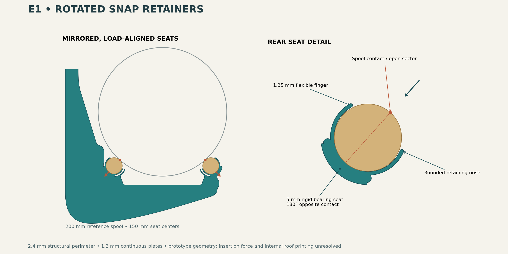

# Spool wall rack

A wall-mounted filament rack using nominal 1-inch wooden dowels. The bracket prints on its side so continuous L-shaped plates carry the principal bending load in the layer plane. Spools must slide across bracket locations without contacting the plastic.

**Current prototype: E1 — rotated snap retainers and a 2.4 mm structural perimeter.** Geometry checked; internal roof printing, snap insertion behavior, and structural/creep capacity remain unresolved. No safe spool count is assigned.



## Current files

- [Parametric bracket CAD](designs/closed-wall-e1/bracket.scad)
- [Bracket STL — prototype](designs/closed-wall-e1/bracket.stl)
- [Snap retainer CAD](designs/closed-wall-e1/retainer.scad)
- [8 mm wide snap coupon STL](designs/closed-wall-e1/snap-coupon-8mm.stl) — fit/behavior sample; the full bracket is 24 mm wide.
- [Geometric verification](designs/closed-wall-e1/verification.json)
- [Design decisions and pending work](DESIGN.md)
- [Revision D checkpoint and independent audit](designs/closed-wall-d/audit/VERIFICATION.md)
- [Separate future open-web reference](future/open-web/README.md)

## Geometry

| Feature | E1 value |
|---|---:|
| Nominal dowel diameter | 25.4 mm |
| Seat diameter / spacing | 26 / 150 mm |
| Single-part envelope | approximately 243.82 × 240 × 24 mm |
| Structural perimeter in print XY | 2.4 mm |
| Exterior side plates | 2 × 1.2 mm |
| Internal continuous plates | 2 × 1.2 mm |
| Intervening air-band height | 3 × 6.4 mm |
| Snap finger bending thickness | 1.35 mm |
| Rigid seat radial thickness | 5 mm |
| Nominal capture wrap / throat | 218° / approximately 24.51 mm |

The snap opening faces the spool contact. The thick seat lies 180° opposite that contact for the 200 mm reference spool. Front and rear retainers are mirrored. The contact direction varies with spool diameter; the nominal seated geometry was checked over 180–220 mm. Minimum computed clearance is 5.40 mm for the complete bracket and 6.91 mm for the rear retainer, with symmetry applying to the front retainer.

## Build and inspect

Install OpenSCAD and Python with NumPy and Matplotlib. Revision D's independent mesh audit also uses VTK and SciPy.

```sh
openscad -o designs/closed-wall-e1/bracket.stl designs/closed-wall-e1/bracket.scad
openscad -o designs/closed-wall-e1/profile.svg -D 'part="profile"' designs/closed-wall-e1/bracket.scad
openscad -o designs/closed-wall-e1/retainer-profile.svg -D 'part="profile"' designs/closed-wall-e1/retainer.scad
openscad -o designs/closed-wall-e1/snap-coupon-8mm.stl designs/closed-wall-e1/retainer.scad
python designs/closed-wall-e1/check_and_draw.py
```

The exported STL already lies broad-side-down. The coupon prints in a different, convenient flat orientation with the same in-plane flexure direction. A 3MF in the D checkpoint contains geometry only.

## Verification limits

Empty CAD cavities do not receive global slicer infill. Revision D's cavity includes an unsupported region approximately 84 mm across; E1's slightly thicker perimeter does not resolve this manufacturing problem. Internal plates need a validated printing method before the full bracket is released for printing.

Clearance checks use rigid nominal rods and concentric flanges. They exclude wood tolerances, rod sag, spool wobble, screw heads, and deflected fingers. No slicer or physical insertion test has verified the snap features. Main bracket loads, wall fixings, dowel spans, and long-term polymer creep still require analysis and testing.
