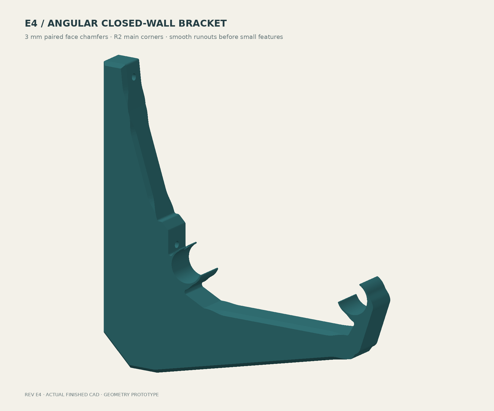

# Spool wall rack

A wall-mounted filament rack using nominal 1-inch wooden dowels. The bracket prints on its side so continuous L-shaped plates carry the principal bending load in the layer plane. Spools must slide across bracket locations without contacting the plastic.

**Current prototype: E4 — angular body, paired 3 mm face chamfers and smooth runouts before small features.** The finished CAD is one valid solid and its STL passes edge-closure checks. Internal roof printing, snap insertion behavior, and structural/creep capacity remain unresolved. No safe spool count is assigned.



## Design journal

Latest checkpoint: **E4 completes the angular outline and broad-face edge treatment.** Next: validate curved-finger insertion and resolve the unsupported internal roofs. This remains a geometry prototype.

### E4 — angular frame, chamfers that fade into the faces

Replaced the main body's sweeping outline with straight facets and R2 corner blends. Both broad faces receive 3 mm chamfers along the large structural edges. Before the retainers and small mounting features, the chamfer depth fades over 20 mm using a quintic curve with zero slope and curvature at both ends. The bevel also fades at the short upper-leg facet junction to avoid a hard termination there. The thin fingers and their small rounded noses keep their functional sections; a blanket R2 treatment would consume them. Integrated concave root blends increase to R2.


The bevels require extra solid material at the cavity rims. A 3 mm bevel over the original 1.2 mm face and 2.4 mm perimeter would leave an inadequate diagonal ligament. Local cavity setbacks now follow each bevel and its runout, preserving a design minimum of 1.2 mm behind the treated surface. The two continuous internal plates remain 1.2 mm, with three hollow bands. This local reinforcement does not solve unsupported internal-roof printing.

The final STEP is a valid single solid; the final bracket and coupon STL meshes have no boundary or nonmanifold edges. The nominal full-profile spool clearance sweep gives 5.34 mm minimum over 180–220 mm flanges; the 0.005 mm contour simplification tolerance is much smaller than the clearance margin. The finished chamfers only remove exterior material. These checks do not establish insertion force, strength, or creep life.

[Finished STEP](designs/closed-wall-e4/bracket.step) · [Final STL](designs/closed-wall-e4/bracket.stl) · [Finish verification](designs/closed-wall-e4/finish-verification.json) · [Mesh verification](designs/closed-wall-e4/mesh-verification.json) · [Seat drawing](designs/closed-wall-e4/retainer-engineering.png)

### E3 — remove the vestigial saddle prong

The small spur below the snap finger was leftover geometry from the original open saddle. Rounding it in E2 preserved a feature with no retaining function. Removed both the original saddle-lip sectors and their circular support nodes. Rebuilt each connection as a buttress between the arm and the rigid bearing sector, keeping the actual curved snap fingers.


The snap opening, throat, thin finger dimensions and smooth root construction remain the same. The support beneath the retainer changes, so its effective compliance still needs evaluation in the integrated part. The existing 8 mm coupon remains a local retainer fit sample, not a stiffness match for the complete bracket.

The full-profile nominal clearance sweep still passes at 5.64 mm minimum over 180–220 mm flanges. The new outline is connected. [Geometric results](designs/closed-wall-e3/verification.json) · [Mesh checks](designs/closed-wall-e3/mesh-verification.json).

### E2 — replace abrupt snap roots with smooth transitions

The E1 root treatment was inadequate: adding circles to a stepped profile left abrupt shoulders, and the relief pockets ended in sharp notches. Replaced that construction with a continuous transition from the 1.35 mm finger to the thick bearing sector. The analytic transition matches radius, tangent, and curvature at both ends. Its minimum curvature radius is approximately 6.76 mm before integration into the bracket.

Added R1.5 concave blends at the integrated roots and relief-slot ends, plus R0.45 convex rounds. Enlarged the relief pocket to 17.75 mm radius and increased the local bearing thickness from 5 to 6 mm to preserve a substantial connection to the bracket. The nominal capture throat remains approximately 24.51 mm. The working fingers remain 1.35 mm thick; the thicker roots change their compliance, so insertion force still needs validation.


The nominal flange sweep passes with 5.64 mm minimum full-bracket clearance and 6.91 mm retainer clearance. A boundary-angle check around the rear seat found no large resolved direction jumps; the maximum was 2.36° after excluding microscopic tessellation edges. This is a geometric check, not a claim of zero stress concentration. [Root verification details](designs/closed-wall-e2/root-verification.json).

The rebuilt bracket and coupon also pass mesh edge-closure checks. [Mesh verification](designs/closed-wall-e2/mesh-verification.json).

Slicer paths and physical insertion behavior remain unverified. The full bracket still needs an internal-roof printing solution.

### E1 — align the snap opening with spool contact

Rotated each seat so its opening faces the spool contact and its rigid bearing sector lies directly opposite. Mirrored the two seats. This preserves the exposed track surface while directing the spool reaction into the thick bearing sector. Added separate 1.35 mm curved fingers and rounded noses, with a nominal 24.51 mm throat. A 185° concentric wrap was rejected because its capture disappears within the seat clearance.

The new profile passes the nominal 180–220 mm flange clearance sweep. Minimum retainer clearance is 6.91 mm; minimum full-profile clearance is 5.40 mm. These are seated geometric clearances, not insertion-path or tolerance validation. The thick bearing sector is 5 mm radially; the structural perimeter increases from 1.35 to 2.4 mm. Continuous side and internal plates remain 1.2 mm.

The drawing at the top of this page comes from the current CAD profile. The [8 mm coupon](designs/closed-wall-e1/snap-coupon-8mm.stl) makes the first fit trial smaller than a full bracket. It does not establish the 24 mm-wide bracket's insertion force.

### D — verify continuous internal planes

Established the upward wall leg and four full L-shaped plates. Rebuilt the delivered mesh, checked edge closure and all 120 layer-center sections, and independently checked nominal spool clearance. Found the main manufacturing issue: true empty cavities leave approximately 84 mm of unsupported region near the knee. A global infill percentage does not support those cavities.


[Exterior](designs/closed-wall-d/progress-exterior.png) · [Arm cutaway](designs/closed-wall-d/progress-cutaway.png) · [Separated plate explanation](designs/closed-wall-d/progress-plates.png)

### Deferred — open-web alternative

Archived the separate reference concept. It has no shared geometry changes or load claims with the current closed-wall path.

## Current files

- [Parametric profile source](designs/closed-wall-e4/bracket.scad) and [CAD finishing script](designs/closed-wall-e4/finish_cad.py)
- [Finished bracket STEP](designs/closed-wall-e4/bracket.step)
- [Bracket STL — prototype](designs/closed-wall-e4/bracket.stl)
- [Snap retainer CAD](designs/closed-wall-e4/retainer.scad)
- [8 mm wide snap coupon STL](designs/closed-wall-e4/snap-coupon-8mm.stl) — fit/behavior sample; the full bracket is 24 mm wide.
- [Geometric verification](designs/closed-wall-e4/verification.json)
- [Design decisions and pending work](DESIGN.md)
- [Revision D checkpoint and independent audit](designs/closed-wall-d/audit/VERIFICATION.md)
- [Separate future open-web reference](future/open-web/README.md)

## Geometry

| Feature | E4 value |
|---|---:|
| Nominal dowel diameter | 25.4 mm |
| Seat diameter / spacing | 26 / 150 mm |
| Single-part envelope | approximately 244.24 × 239 × 24 mm |
| Structural perimeter in print XY | 2.4 mm; locally reinforced behind bevels |
| Broad-face chamfer / body corner radius | 3 / 2 mm |
| Chamfer runout length | 20 mm |
| Exterior side plates | 2 × 1.2 mm |
| Internal continuous plates | 2 × 1.2 mm |
| Intervening air-band height | 3 × 6.4 mm |
| Snap finger bending thickness | 1.35 mm |
| Rigid seat radial thickness | 6 mm |
| Nominal capture wrap / throat | 218° / approximately 24.51 mm |

The snap opening faces the spool contact. The thick seat lies 180° opposite that contact for the 200 mm reference spool. Front and rear retainers are mirrored. The contact direction varies with spool diameter; the nominal seated geometry was checked over 180–220 mm. Minimum computed clearance is 5.34 mm for the complete bracket and 6.91 mm for the rear retainer, with symmetry applying to the front retainer.

## Build and inspect

Install OpenSCAD and Python with CadQuery 2.7, NumPy, Matplotlib, Pillow and VTK. Run from the repository root:

```sh
openscad -o designs/closed-wall-e4/profile.svg -D 'part="profile"' designs/closed-wall-e4/bracket.scad
openscad -o designs/closed-wall-e4/cavity-profile.svg -D 'part="cavity_profile"' designs/closed-wall-e4/bracket.scad
openscad -o designs/closed-wall-e4/retainer-profile.svg -D 'part="profile"' designs/closed-wall-e4/retainer.scad
openscad -o designs/closed-wall-e4/snap-coupon-8mm.stl designs/closed-wall-e4/retainer.scad
python designs/closed-wall-e4/finish_cad.py
python designs/closed-wall-e4/check_and_draw.py
python designs/closed-wall-e4/check_mesh.py
python designs/closed-wall-e4/render_cpu.py
```

`finish_cad.py` creates the authoritative E4 STEP and STL, including the variable chamfers and reinforced cavity rims. Direct bracket STL export from OpenSCAD produces an **unchamfered intermediate**, not finished E4. The script approximates the OpenSCAD contours within 0.005 mm before creating the solid; the chamfer runouts are native Bezier surfaces.

The final STL lies broad-side-down in a single-part envelope of approximately 244.24 × 239 × 24 mm. Printer exclusion zones, brim clearance and actual toolpaths still require slicer inspection. The coupon prints flat with the same in-plane flexure direction. A 3MF in the D checkpoint contains geometry only.

## Verification limits

Empty CAD cavities do not receive global slicer infill. Revision D's cavity includes an unsupported region approximately 84 mm across; the thicker perimeter does not resolve this manufacturing problem. Internal plates need a validated printing method before the full bracket is released for printing.

Clearance checks use rigid nominal rods and concentric flanges. They exclude wood tolerances, rod sag, spool wobble, screw heads, and deflected fingers. No slicer or physical insertion test has verified the snap features. Main bracket loads, wall fixings, dowel spans, and long-term polymer creep still require analysis and testing.
