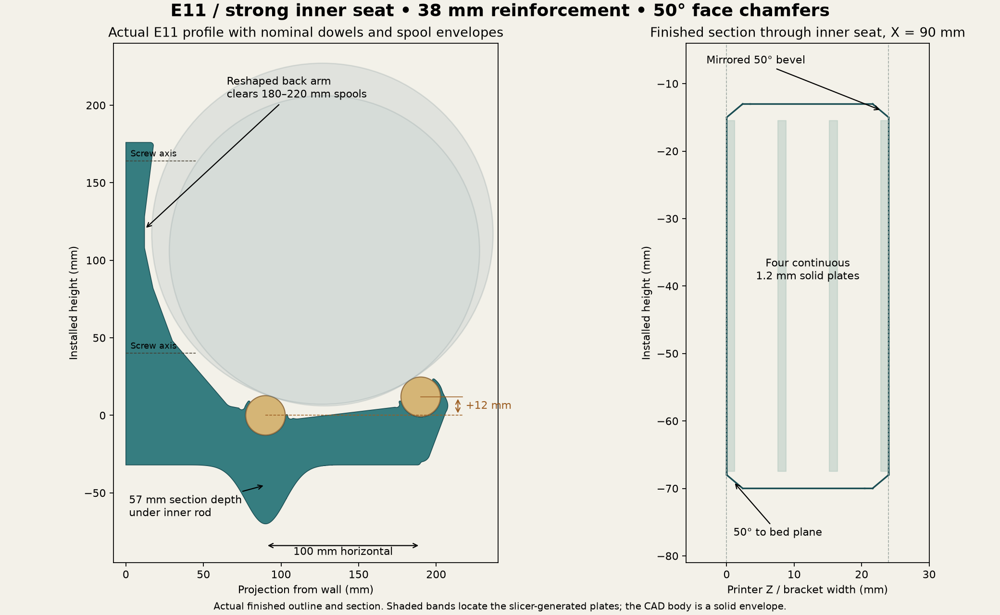
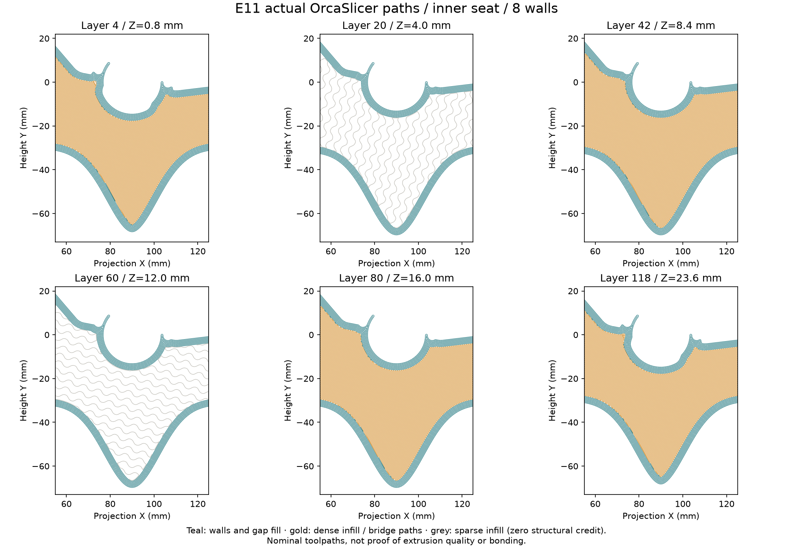
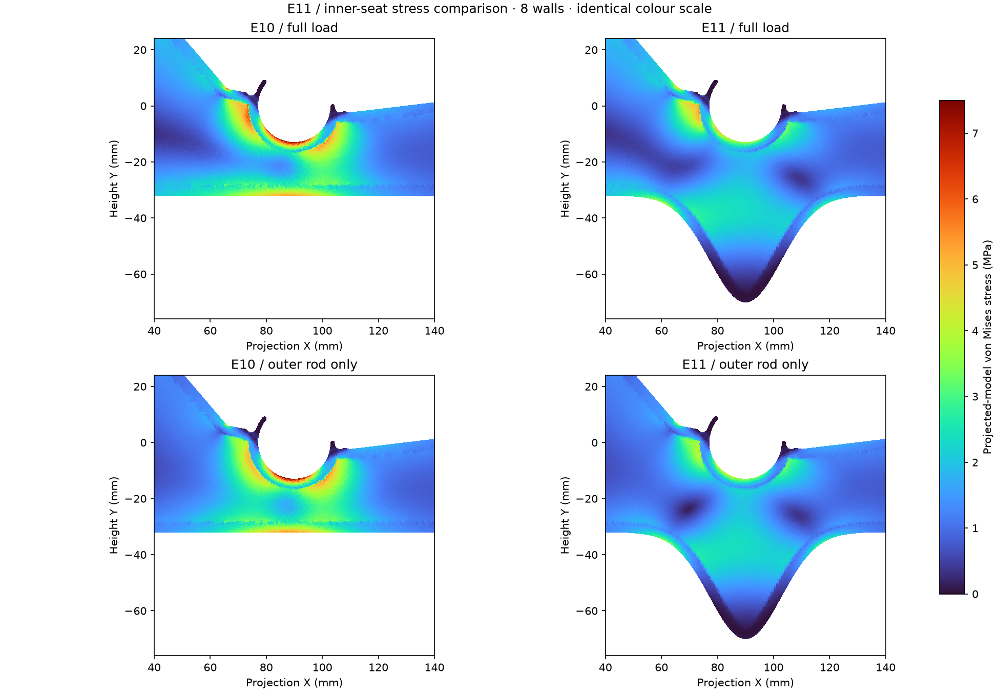
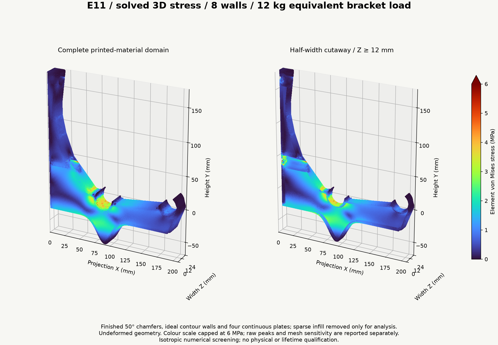
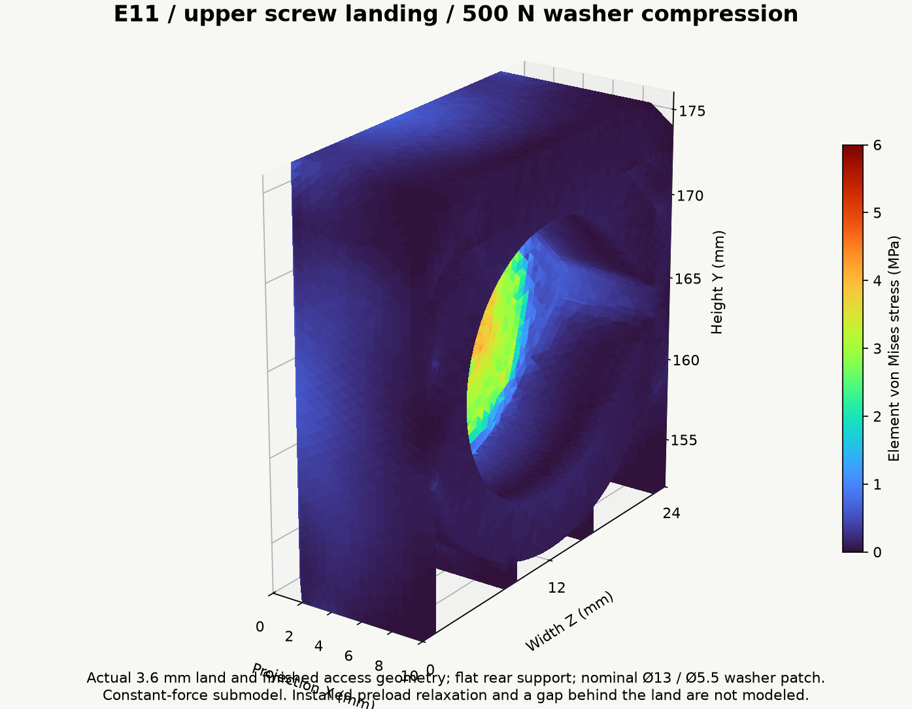

# Spool wall rack — E11 print and engineering guide

**Current prototype: E11 — reinforced inner seat, smooth rigid-shoulder blends,
and mirrored 50° broad-face chamfers.** The inner-seat section now exceeds both
adjacent plain-arm reference bands in local bending stiffness and elastic
section modulus. The flexible fingers, rail centers and hardware geometry are
preserved.

**[Download E11 STEP with aligned helpers](designs/closed-wall-e11/bracket-with-modifier-helpers.step)** ·
[STL fallback and CAD checks](designs/closed-wall-e11/README.md) ·
[New E11 FEA and material results](analysis/e11/RESULTS.md) ·
[Design journal](DESIGN-JOURNAL.md)

## What E11 improves

- Added **38 mm of smoothly blended underside depth** beneath the inner rod.
  The center section is approximately **57 mm deep**, up from 19 mm in E10.
- Across the seat band, the finished ideal printed section has at least
  **54% more bending I and 28% more elastic section modulus** than the stronger
  adjacent plain-arm reference band. The comparison includes the new runouts
  in those adjacent bands; it is not a solid-envelope-only calculation.
- Applied **R6 blends to the rigid rear shoulders**, retaining the relief
  pockets, functional finger roots and smaller nose radii. Other exposed
  body-facet joins keep their nominal R2 finish.
- Kept the **2 mm face inset** and changed the chamfer rise to **2.384 mm**:
  **50° above the bed plane**, mirrored on the opposite face. At 0.2 mm layers,
  nominal lateral growth is 0.168 mm per layer. Runouts occur only near the
  thin retainers.

[Section-property comparison](designs/closed-wall-e11/section-comparison.png) ·
[Inner-seat close-up](designs/closed-wall-e11/finish-inner-front.png) ·
[Opposite face](designs/closed-wall-e11/finish-inner-reverse.png) ·
[Outer retainer](designs/closed-wall-e11/finish-outer-front.png)

The rear/front rail centers remain **(90, 0) / (190, 12) mm**. The nominal
180–220 mm spool sweep retains **3.93 mm minimum clearance** across 322 cases.
Complete flexible-finger sectors match E10 at nine depths through the exported
part. This preserves geometry; physical insertion and retention still need
the measured rods and intended filament.

## Print setup

Print on the supplied broad side so the principal bending load stays in the
layer plane. Import the STEP as **one object with three aligned parts**.

| Setting | Working value |
|---|---|
| Body footprint / height | Approximately **207.51 × 246.00 × 24 mm**; check bed exclusions |
| Layer height, including first | **0.20 mm** |
| Reference nozzle | 0.4 mm |
| Outer / inner line-width assumptions | 0.42 / 0.45 mm |
| Wall generator / solid-region gap fill | **Arachne / Everywhere** |
| PLA prototype walls | **8**, approximately 3.27 mm contour thickness |
| PETG prototype walls | **10**, approximately 4.08 mm contour thickness |
| Body infill | **15%**, with zero stiffness/strength credit in analysis |
| Exterior top / bottom | **1.2 / 1.2 mm**, six layers each |
| Helper 1 | **100% infill modifier**, Z = 7.6–8.8 mm |
| Helper 2 | **100% infill modifier**, Z = 15.2–16.4 mm |
| Solid infill | A bonded, fully dense pattern supported by the slicer |
| Filament process | Exact grade's calibrated temperature, cooling, flow and bonding settings |

1. Keep the main body printable and set its walls, 15% infill and six top/bottom layers.
2. Convert both named helper parts to **modifiers** and set their infill to 100%.
   Keep their supplied positions. They must not print as extra exterior slabs.
3. Inspect all four solid bands, the continuous perimeter below the inner seat,
   both fingers, the screw landings and the printable access roofs.
4. Save the configured project with the actual machine and filament identity.
   STEP stores geometry and alignment, not modifier status or print settings.

**Actual OrcaSlicer 2.4.2 audits pass for 8 and 10 walls.** Both slices have 120
layers. Every intended solid-band layer passes the inner-seat footprint check;
the minimum nominal coverage is **99.79%**, and sampled seat-wall coverage is
above **99.99%**, using a documented 0.03 mm geometry/rounding allowance. Sampled
full L-planes exceed 99.96% coverage, and sampled flexible fingers exceed 99.84%.
The final audit uses Arachne variable-width walls: the initial classic-wall
slice left a small pocket inside one finger nose on an exterior solid layer.
[Toolpath evidence](designs/closed-wall-e11/toolpath-verification.json).
These are neutral geometry audits, not calibrated print profiles or proof of
bonding, bridge quality or absence of curling.

The contour estimate is
`t(n) = 0.42 + (n − 1) × [0.45 − 0.2 × (1 − π/4)] mm`.
Actual line width and thin-wall handling govern the slice. Recalculate the wall
count for another nozzle; keep the four 1.2 mm plates. Sparse infill supports
those plates during printing even though it receives no structural credit.

## New stress results

The matched E10/E11 reduced-model comparison gives **37.4–37.6% lower near-seat
stress** and **35.1–35.5% less front movement** at the same load and wall count.
With **only the outer rod loaded**, near-seat stress falls **43.5%**, supporting
the reduced-section bending diagnosis. The same fixed stress window is used
in both designs, so added underside volume does not dilute that statistic.
[Matched comparison and mesh checks](analysis/e11/COMPARISON.md).

The **new E11 3D solves** include the actual finished exterior, ideal contour
walls, four continuous plates, fastener openings, compression-only wall contact,
rigid washer axial restraints and rigid shank shear restraints. Sparse core
material is removed only in the analysis domain. No clamp friction or arbitrary
preload is credited.

[10-wall 3D stress view](analysis/e11/fem-3d-10w.png).

| Walls | Tetrahedra, coarse → fine | Front movement refinement change | Near-seat p99, coarse → fine |
|---:|---:|---:|---:|
| 8 | 180,806 → 235,089 | 2.56% | 3.56 → 3.79 MPa |
| 10 | 149,156 → 242,810 | 2.27% | 3.79 → 3.79 MPa |

All published 3D fields pass independently recomputed residual, force and moment
balance gates below 1e-6. The refined 2D/3D front-movement coefficients agree
within 0.55%. This is numerical screening, not independent physical validation.
The meshes do not establish asymptotic convergence. **Raw refined peaks are
37.9 / 51.1 MPa** for 8/10 walls and remain sensitive to small cells at geometric
and analysis-core intersections; neither those peaks nor percentiles are
allowables. [Raw fields, peak locations, rejected runs and numerical audits](analysis/e11/RESULTS.md).

## Material movement and creep margin

The project criteria remain **5 mm total loaded movement**, including creep,
dowels and mounts, and **1 mm change when adding/removing one full spool**.
The new refined geometry coefficients are **K = 2306.3 MPa·mm for 8 walls** and
**2098.2 MPa·mm for 10 walls**, at 12 kg equivalent load per bracket.

| Reference material | Walls | Initial front movement | One 1.25 kg roll | Ec for 5 mm bracket-only | Compliance growth limit |
|---|---:|---:|---:|---:|---:|
| PLA | 8 | 0.673 mm | 0.070 mm | 461 MPa | 7.43× |
| PETG | 10 | 0.908 mm | 0.095 mm | 420 MPa | 5.51× |
| ASA | 8 | 0.969 mm | 0.101 mm | 461 MPa | 5.16× |
| PA6-GF annealed/dry | 8 | 0.431 mm | 0.045 mm | 461 MPa | 11.61× |
| PA6-GF water-conditioned | 8 | 1.286 mm | 0.134 mm | 461 MPa | 3.89× |

These use the retained grade-specific room-temperature XY moduli, not measured
hot or aged properties. [Exact reference grades, conditions, sources and hashes](designs/closed-wall-e6/material-reference-data.json).
PLA/PETG remain prototype options; ASA is the higher-temperature comparison.
PA6-GF conditioning and annealing must match its source, and can alter fit.
HDT and generic tensile strength do not establish a sustained-load rating.

For common linear-viscoelastic compliance with unchanged contact:
`δ(t,T) = K × J(t,T) = K / Ec(t,T)`.
For the complete rack use **Ec ≥ K / (5 mm − dowel movement − wall/fastener movement)**.
Retain the project screening target of **at least 1.0 GPa effective creep modulus**
at the intended age and loaded temperature history; this is not a grade allowable.

The service envelope is **85°F sustained, plus 100°F for six loaded hours/year**.
The [updated material report](analysis/e11/RESULTS.md) recalculates one-, five-
and ten-year sensitivity cases using E11's coefficients. Published short-time
creep examples do not establish a multi-year law for the printed grades. Thermal
shifts and long-time tails remain explicit assumptions. Fast spool removal uses
aged instantaneous unloading modulus, not reversed accumulated creep.

## Loads, rods and installation

The analysis target is **12 kg equivalent / 117.72 N per bracket**. For the
documented 180 mm spool contact case, the rear/front seats receive **75.12 / 42.60 N
downward**, plus **31.29 N outward each**. The front rail remains 12 mm higher;
the back arm accommodates the rearward-shifted spool. The retained
[rail-statics explanation](E10-ENGINEERING-GUIDE.md#current-rail-geometry-12-mm-front-lift)
describes that load split.

At 406.4 mm (16-inch) support spacing and 1.25 kg gross per spool, six spools per
bay weigh 7.5 kg and need pitch ≤67.7 mm. An interior support between simple
spans carries about one bay; the stated two-equal-span continuous example gives
1.25 times the bay load, or 9.375 kg before self-weight. The 12 kg target includes
margin for that example, not every loading pattern. **Six per bay is a proposed
test arrangement, not a released safe count.**

The **24 kg brief proof scenario** doubles the linear fields with unchanged
contact; it is neither a damage simulation nor a performed proof test.

| Hardware feature | E11 geometry |
|---|---:|
| Nominal screw clearance | Ø5.2 mm, with printable roof relief |
| Washer face to wall | 3.6 mm |
| Nominal driver access / checked straight envelope | Ø16 / Ø15.8 mm |
| Checked washer | Ø13 OD / Ø5.5 ID |
| Screw axes in installed coordinates | Y = 164 / 40 mm, Z = 12 mm |

The global model attracts about **208 N outward demand at the lower washer**
and **15–16 N at the upper**, excluding tightening preload. The new 500 N
upper-landing submodel gives **0.01207 mm** mean compression at E1000 and a
**5.00 MPa** raw peak; its movement changes 1.66% on refinement.

Retain the backed 3.6 mm land. Mount against a flat, firm surface; a gap changes
the land into a bending/punching problem. Use flat-bearing heads and washers,
substrate-appropriate screws, and the manufacturer's pilot/embedment guidance.
M5 shank clearance does not make an M5 machine screw suitable for wood. Driving
torque does not reliably establish clamp force. Service and preload von Mises
maxima cannot simply be added as scalars.

**Rod fit remains provisional.** The 26.0 mm seat assumes nominal 25.4 mm stock.
The checked retail listings specify 1-inch actual diameter but no numeric
production/ovality tolerance. Measure the rods and use the
[full-width fit coupons and measurement plan](fit/README.md).

## Qualification and reproduction

The remaining print checks are physical: fit, snap insertion/retention, bonded
layers, supported internal bands and the actual filament process. Measure
immediate loaded movement and drift, rear/front seat positions, dowel sag and
wall/washer movement. Include the sustained 85°F condition and a six-hour loaded
100°F exposure; inspect for cracking, whitening, layer separation, permanent
snap opening and progressive embedment. A proof test or 1,000-hour trial alone
does not establish ten-year creep-rupture life.

[CAD rebuild and verification](designs/closed-wall-e11/README.md) ·
[Analysis reproduction and solver checks](analysis/e11/README.md) ·
[Machine-readable engineering summary](analysis/e11/engineering-summary.json).

The [E10 guide](E10-ENGINEERING-GUIDE.md), [E9 analysis](analysis/e9/RESULTS.md)
and [level-rail E8 guide](E8-ENGINEERING-GUIDE.md) are preserved as earlier
baselines. [Design journal](DESIGN-JOURNAL.md) · [Design decisions](DESIGN.md) ·
[Separate future open-web exploration](future/open-web/README.md).
