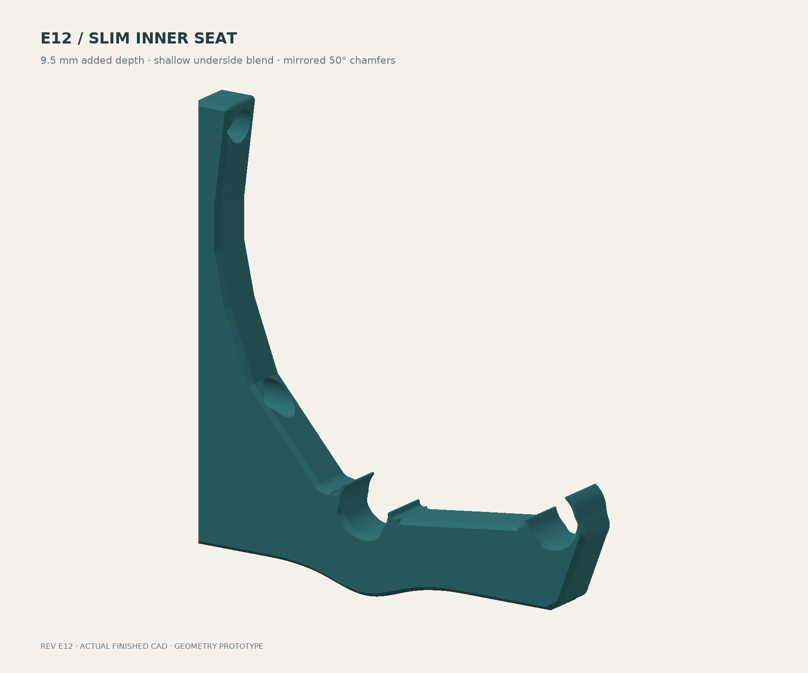
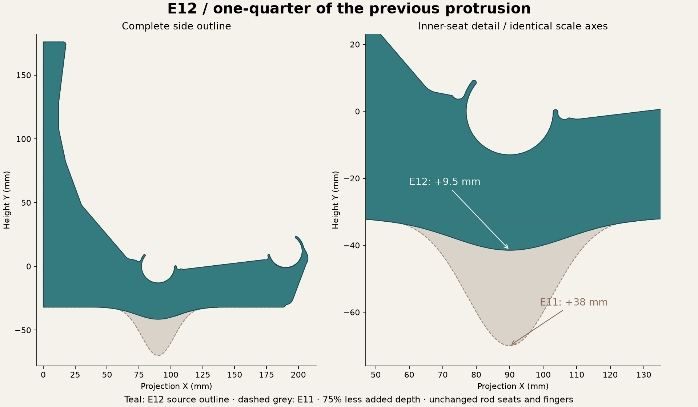
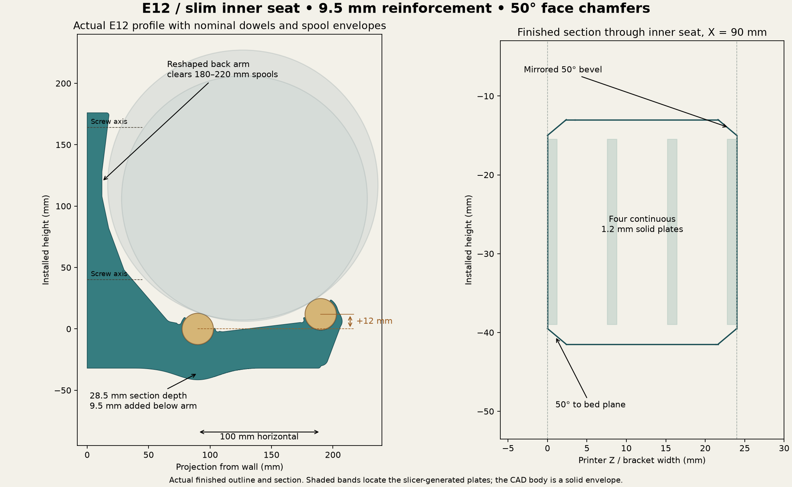
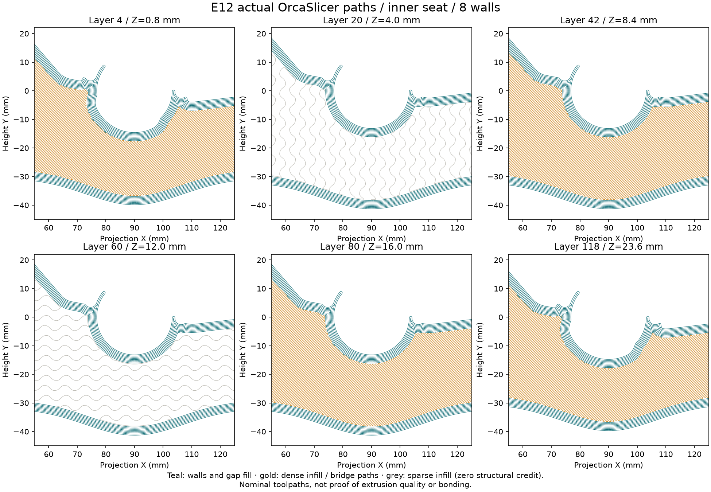
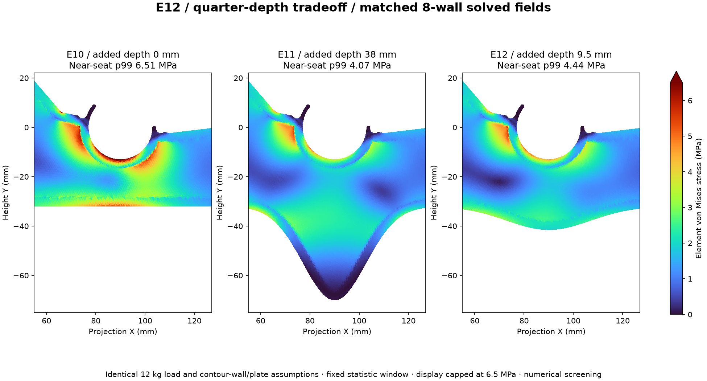
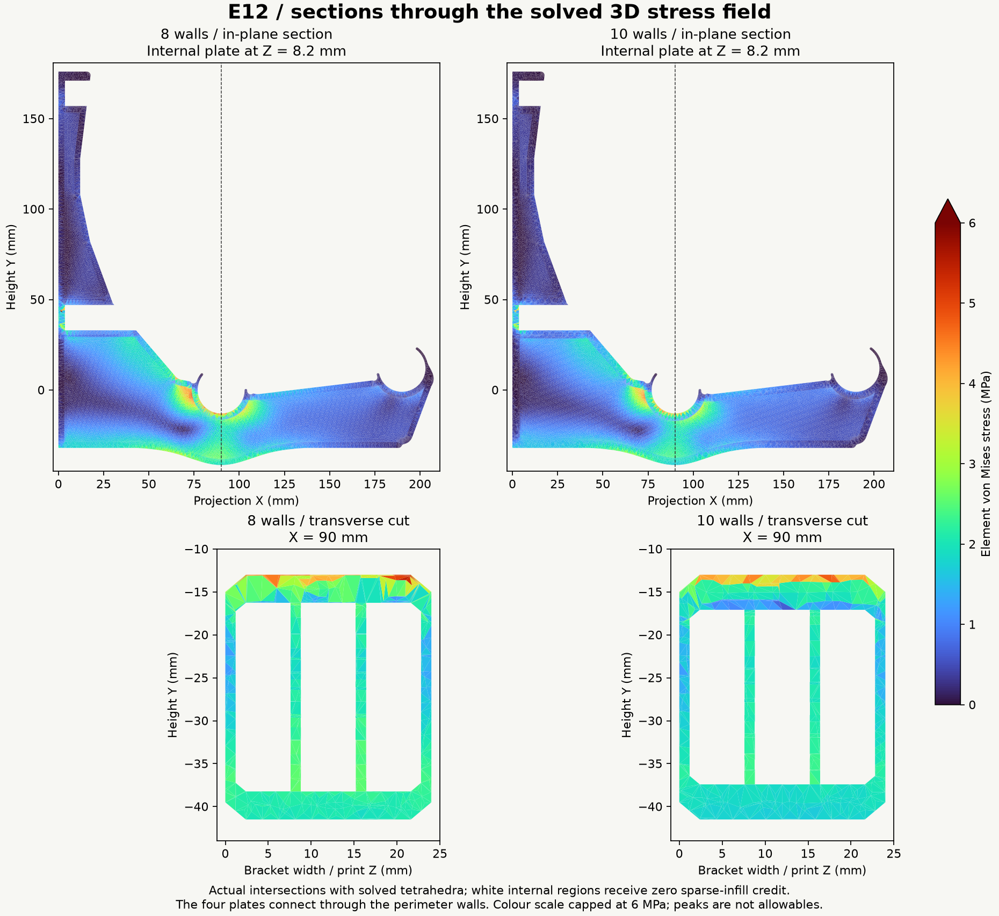

# Spool wall rack — E12 print and engineering guide

**Current prototype: E12 — a shallow, smooth inner-seat reinforcement with
one-quarter of E11's protrusion.** Added depth is **9.5 mm**, down from 38 mm,
meeting the preferred quarter-depth target and the 12.67 mm maximum.

**[Download E12 STEP with aligned helpers](designs/closed-wall-e12/bracket-with-modifier-helpers.step)** ·
[CAD and print checks](designs/closed-wall-e12/README.md) ·
[Updated FEA and material results](analysis/e12/RESULTS.md) · [Design journal](DESIGN-JOURNAL.md)

## Smaller shape, measured tradeoff

The added underside depth is **75% smaller**, blended across a broader span.
The inner center section is approximately **28.5 mm deep**, compared with 19 mm
in E10 and 57 mm in E11. The finished body envelope is now approximately
**207.51 × 217.50 × 24 mm**.

The matched reduced-model comparison gives **31.7–32.5% lower near-seat stress
than E10**, compared with E11's 37.4–37.6%. Front movement is only **5.6–7.1%
higher than E11**. With only the outer rod loaded, E12's near-seat stress
statistic is about **35% lower than E10**. No relief holes were added: the
continuous shallow blend already retains most of the measured benefit.
[Exact three-revision comparison](analysis/e12/COMPARISON.md).

The finished ideal printed section has at least **2.77× E10's minimum
seat-band bending I** and **1.85× its elastic section modulus**. It **does
not exceed both adjacent arms**. The explicit depth cap supersedes that E11
margin target; the adjacent arms were not weakened to force a favorable ratio.
[Section comparison and ratios](designs/closed-wall-e12/section-verification.json).

The R6 rigid shoulder blends, functional fingers and relief pockets are
preserved. Both broad-face chamfers retain **2 mm face inset, 2.384 mm rise and
50° above the bed**, mirrored on the reverse face. Other exposed body corners
retain their smaller finish, with smooth chamfer runouts at thin retainers.

[Inner-seat close-up](designs/closed-wall-e12/finish-inner-front.png) ·
[Reverse face](designs/closed-wall-e12/finish-inner-reverse.png) ·
[Outer fingers](designs/closed-wall-e12/finish-outer-front.png).

The rear/front rail centers stay at (90,0)/(190,12) mm. The 322-case nominal
180–220 mm spool sweep retains **3.927 mm minimum clearance**. All four flexible
finger sectors match E10 at nine print depths; this checks geometry, not
physical insertion force, fatigue or rod tolerance.

## Print setup

Print on the supplied broad side. Import the STEP as **one object with three
aligned parts**, so the main bending load stays in the layer plane.

| Setting | Working value |
|---|---|
| Body footprint / height | **207.51 × 217.50 × 24 mm**; check bed exclusions |
| Layer / first layer | **0.20 / 0.20 mm** |
| Reference nozzle | 0.4 mm |
| Outer / inner nominal line widths | 0.42 / 0.45 mm |
| Wall generator / solid-region gap fill | **Arachne / Everywhere** |
| PLA prototype walls | **8**, about 3.27 mm ideal contour thickness |
| PETG prototype walls | **10**, about 4.08 mm ideal contour thickness |
| Body infill | **15%**, zero structural credit |
| Exterior top / bottom | **1.2 / 1.2 mm**, six layers each |
| Helper 1 | **100% infill modifier**, Z=7.6–8.8 mm |
| Helper 2 | **100% infill modifier**, Z=15.2–16.4 mm |
| Filament process | Exact grade's calibrated temperature, cooling, flow and bonding |

1. Keep the main body printable with the selected walls, 15% infill and six
   top/bottom layers.
2. Convert both named helpers to **100% infill modifiers** in their supplied
   positions. They must not print as extra exterior slabs.
3. Inspect all four solid bands, seat perimeters, fingers, screw lands and
   access roofs; then save the configured machine/filament project.

STEP stores geometry and alignment, not modifier status or print settings.
[STL fallback and detailed handoff](designs/closed-wall-e12/README.md).

**Both OrcaSlicer 2.4.2 audits pass:** 120 layers, all 24 intended solid-band
layers checked around the inner seat, plus sampled full L-planes, walls and
fingers. Minimum nominal footprint coverage is **99.82% in the seat bands,
99.99% in sampled seat walls and 99.84% in sampled fingers**, with a
0.03 mm tessellation/rounding allowance. These neutral slices do not qualify
bonding, bridging, curling or an actual filament process.
[Toolpath evidence](designs/closed-wall-e12/toolpath-verification.json).

The contour estimate remains
`t(n) = 0.42 + (n − 1) × [0.45 − 0.2 × (1 − π/4)] mm`.
Arachne varies thin-feature widths; actual paths govern. Keep the four 1.2 mm
plates if changing nozzle or wall count. Sparse infill supports the plates
during printing while receiving zero structural credit in the analysis.

## Updated stress and material results

New E12 3D solves include the finished exterior, ideal contour walls, four
continuous plates, fastener openings, compression-only wall contact, rigid
washer axial restraints and rigid shank shear restraints. No clamp friction or
arbitrary preload is credited. Sparse core is removed only in the analysis.

| Walls | Tetrahedra, coarse → fine | Movement refinement change | Near-seat p99, coarse → fine |
|---:|---:|---:|---:|
| 8 | 136,844 → 209,627 | 2.35% | 3.99 → 4.34 MPa |
| 10 | 159,490 → 211,444 | 1.43% | 3.94 → 4.10 MPa |

All six published 3D fields pass independently recomputed residual, force and
moment balance below 1e-6. The refined reduced and 3D movement coefficients
agree within 0.85%. These are numerical checks, not independent physical
validation or proof of asymptotic convergence. Raw refined peaks are
**35.2 / 38.9 MPa** for 8/10 walls and are not rupture allowables.
[Raw fields, rejected mesh attempts and full results](analysis/e12/RESULTS.md).

The criteria remain **5 mm total loaded movement**, including dowels and
mounts, and **1 mm change when adding/removing one full spool**. At the 12 kg
reference load, the new front coefficients are **K=2472.5 MPa·mm for 8 walls**
and **2241.9 for 10 walls**.

| Reference material | Walls | Initial front movement | One 1.25 kg roll | Ec for 5 mm bracket-only |
|---|---:|---:|---:|---:|
| PLA | 8 | 0.722 mm | 0.075 mm | 495 MPa |
| PETG | 10 | 0.970 mm | 0.101 mm | 448 MPa |
| ASA | 8 | 1.039 mm | 0.108 mm | 495 MPa |
| PA6-GF dry | 8 | 0.462 mm | 0.048 mm | 495 MPa |
| PA6-GF wet | 8 | 1.379 mm | 0.144 mm | 495 MPa |

These are retained grade-specific room-temperature XY moduli, not measured hot
or aged properties. [Exact grades, conditions, sources and hashes](designs/closed-wall-e6/material-reference-data.json).
The [updated material report](analysis/e12/RESULTS.md) includes 24 kg linear
proof scaling, landing checks and explicit one-, five- and ten-year creep
sensitivities. No lifetime safe spool count is assigned.

For common linear-viscoelastic compliance with unchanged contact,
`δ(t,T) = K × J(t,T) = K / Ec(t,T)`.
The complete rack requires **Ec ≥ K / (5 mm − dowel movement − mount movement)**.
Keep the project screening target of **at least 1.0 GPa effective creep modulus**
at the intended age and temperature history. It is not a grade allowable.

The service envelope stays **85°F sustained and 100°F for six loaded hours/year**.
Short-time creep examples, assumed long-time tails, HDT and generic tensile
strength do not establish multi-year performance. PA6-GF dry/wet conditioning
and annealing remain separate; fast spool unloading uses aged instantaneous
modulus rather than reversal of accumulated creep.

## Loads, rods and installation

The analysis target is **12 kg equivalent / 117.72 N per bracket**. For the
documented 180 mm spool contact case, the rear/front seats receive **75.12 / 42.60 N
downward**, plus **31.29 N outward each**. The front rail remains 12 mm higher;
the back arm accommodates the rearward-shifted spool. The retained
[rail-statics explanation](E10-ENGINEERING-GUIDE.md#current-rail-geometry-12-mm-front-lift)
describes that load split.

At 406.4 mm (16-inch) support spacing and 1.25 kg gross per spool, six spools per
bay weigh 7.5 kg and need pitch ≤67.7 mm. An interior support between simple
spans carries about one bay; the stated two-equal-span continuous example gives
1.25 times the bay load, or 9.375 kg before self-weight. The 12 kg target includes
margin for that example, not every loading pattern. **Six per bay is a proposed
test arrangement, not a released safe count.**

The **24 kg brief proof scenario** doubles the linear fields with unchanged
contact; it is neither a damage simulation nor a performed proof test.

| Hardware feature | E12 geometry |
|---|---:|
| Nominal screw clearance | Ø5.2 mm, with printable roof relief |
| Washer face to wall | 3.6 mm |
| Nominal driver access / checked straight envelope | Ø16 / Ø15.8 mm |
| Checked washer | Ø13 OD / Ø5.5 ID |
| Screw axes in installed coordinates | Y = 164 / 40 mm, Z = 12 mm |

The global model attracts about **203–208 N outward demand at the lower washer**
and **15 N at the upper**, excluding tightening preload. The new 500 N
upper-landing submodel gives **0.01207 mm** mean compression at E1000 and a
**5.00 MPa** raw peak; its movement changes 1.68% on refinement.

Retain the backed 3.6 mm land. Mount against a flat, firm surface; a gap changes
the land into a bending/punching problem. Use flat-bearing heads and washers,
substrate-appropriate screws, and the manufacturer's pilot/embedment guidance.
M5 shank clearance does not make an M5 machine screw suitable for wood. Driving
torque does not reliably establish clamp force. Service and preload von Mises
maxima cannot simply be added as scalars.

**Rod fit remains provisional.** The 26.0 mm seat assumes nominal 25.4 mm stock.
The checked retail listings specify 1-inch actual diameter but no numeric
production/ovality tolerance. Measure the rods and use the
[full-width fit coupons and measurement plan](fit/README.md).

## Qualification and reproduction

The remaining print checks are physical: fit, snap insertion/retention, bonded
layers, supported internal bands and the actual filament process. Measure
immediate loaded movement and drift, rear/front seat positions, dowel sag and
wall/washer movement. Include the sustained 85°F condition and a six-hour loaded
100°F exposure; inspect for cracking, whitening, layer separation, permanent
snap opening and progressive embedment. A proof test or 1,000-hour trial alone
does not establish ten-year creep-rupture life.

[CAD rebuild and verification](designs/closed-wall-e12/README.md) ·
[Analysis reproduction and solver checks](analysis/e12/README.md) ·
[Machine-readable engineering summary](analysis/e12/engineering-summary.json).

The [deeper E11 guide](E11-ENGINEERING-GUIDE.md), [E10 guide](E10-ENGINEERING-GUIDE.md), [E9 analysis](analysis/e9/RESULTS.md)
and [level-rail E8 guide](E8-ENGINEERING-GUIDE.md) are preserved as earlier
baselines. [Design journal](DESIGN-JOURNAL.md) · [Design decisions](DESIGN.md) ·
[Separate future open-web exploration](future/open-web/README.md).
