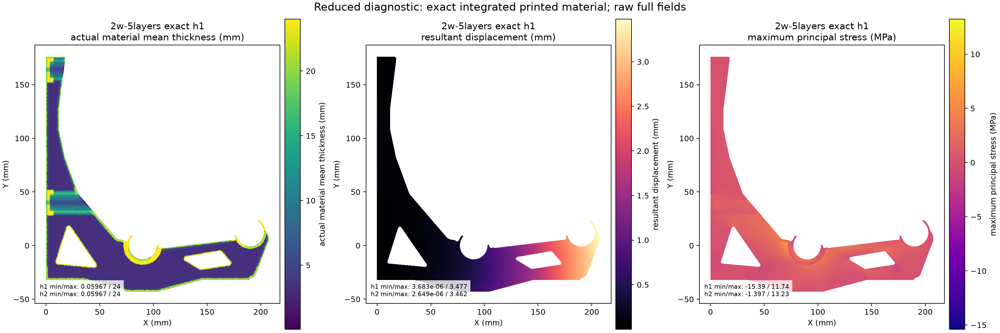

# Restart handoff: tested GPU backend and unresolved G material fidelity

This is the current restart checkpoint. The long whole-part CPU meshing route
has been stopped. Preserve the current working tree, including untracked raw
attempts and ignored runtime caches. Do not restart the old fTetWild jobs.

**Latest continuation:** [GPU validation and reproduction](analysis/rev-g2/GPU-VALIDATION.md).
Warp 1.17.0 is installed and tested on the RTX 3080 Ti. The upstream elasticity
comparison, independent 3D hollow-material/contact fixtures and manufactured
patch tests on G's actual raw slice crop pass. Conservative voxel geometry
still removes 4.31% of that crop at 0.1 mm XY / 0.2 mm Z spacing. This is not
an accepted whole-G material mapping, load solution or strength result.

## Current candidates and decisions

[STEP/helper download index](PRINT-CANDIDATES.md) lists all implemented recent ideas and the five current G recheck schedules. Every future idea checkpoint must include aligned body/helper STEP files and notes. G2 concept-family CAD and helper exports are required unfinished work after restart.

- [Rev G research finalist and CAD](designs/rev-g/README.md): latest implemented
  research geometry. It is not a qualified design. Its original structural
  approximation is superseded for interpreting actual printed material.
- [E13 handoff](designs/closed-wall-e13/README.md): preserved earlier prototype evidence;
  it does not acquire new qualification from G2 work.
- [G2 architecture worksheet](designs/rev-g2/ARCHITECTURE-WORKSHEET.md): seven
  preparatory families, not seven completed CAD candidates. No G2 architecture
  has been built, ranked, or accepted.
- [G2 requirements](G2-BRIEF.md) govern the new study. Existing outlines,
  rail/fixing positions and helper count/shape are soft, subject to rechecking
  function. The extra 8 mm downward allowance is spool-relative, not a fixed
  local silhouette floor.
- [GPU execution checkpoint](analysis/rev-g2/GPU-VALIDATION.md) follows the
  [software review](analysis/rev-g2/GPU-FEM-REVIEW.md). Warp's Apache-2.0 license,
  tagged example hash and wheel/JIT CUDA execution are verified. DTU reuse
  permission was not established and its code was not incorporated. The tested
  GPU backend is a starting point; its current full-cell material approximation
  and diagonal preconditioner are not qualified for a whole-G solve.

## Preserved requirements

P1S, 0.4 mm nozzle, PETG or ASA, at least two walls, 0% base infill and 100%
helper regions. Sacrificial 0.4 mm bridge extrusion counts toward spent plastic
but receives zero stiffness, strength or bonded-connection credit. Keep all
finite stress cells and raw peaks. No percentile substitution.

Reference load is 12 kg / 117.72 N per bracket. Total loaded movement limit is
5 mm; the provisional rail/mount reserve is 1 mm, leaving 4 mm for bracket
resultant movement. Adding/removing a 1.25 kg spool requires a new contact solve
and at most 1 mm total movement change. The effective 1 GPa modulus is a
planning assumption, not measured lifetime behavior. Sustained 85 F and brief
loaded 100 F exposure, nominal fracture factor four, rail sag, mount slip,
creep, fit and print-process qualification remain explicit gates.

## Completed sliced-material work

[Analysis overview and reproduction](analysis/rev-g2/README.md) links the raw
slice archives, independent validation, process audit and reference shape cache.
Five schedules were actually sliced: 2w/2 skins, 2w/5 skins, 2w/8 skins,
8w/2 skins and 8w/8 skins; each skin layer is 0.2 mm. G's body and three original
helpers were copied without geometry changes. All five effective process
settings and P1S bed/exclusion checks passed.

The independent 50,000-sample shape check passed outside the stated 0.005 mm
polygonization uncertainty. It uses analytical distances to variable-width
paths rather than querying the same polygon union twice. Thick bridges are
excluded before connectivity and geometry queries.

| Schedule | Credited E volume, mm3 | Sacrificial E volume, mm3 | Nominal structural union, mm3 |
|---|---:|---:|---:|
| 2w / 2 skins | 60373.785 | 6901.280 | 61393.747 |
| 2w / 5 skins | 70979.802 | 6940.469 | 71890.970 |
| 2w / 8 skins | 81247.882 | 6928.297 | 82057.762 |
| 8w / 2 skins | 103417.432 | 5060.135 | 104686.248 |
| 8w / 8 skins | 119735.998 | 5089.798 | 120769.740 |

Nominal footprint volume is a separate continuum quantity from extrusion E.
Do not erase the difference or call them equal. The reference cache loads in
about 1.6 s; 10,000 occupancy queries took about 0.06 s on this machine.

`PlasticShape.integrated_volume(regions)` integrates exact polygon intersections
through all layers. Independent analytic slab fixtures pass for raw/continuum,
empty, disjoint and overlapping queries, with one/four workers. The whole
reference projection agrees with nominal volume within about 2.1e-8 mm3.

## Latest completed mechanical diagnostic

The final reduced reference uses exact material-volume integration per P1
triangle. All finite triangles are retained, and no stiffness is inserted at
empty quadrature samples. The two runs are:

| Mesh | Triangles | Front mean vertical movement, mm | Global maximum resultant, mm | Raw tensile peak, MPa |
|---|---:|---:|---:|---:|
| h2 | 37985 | 3.097760 | 3.462327 | 13.230930 |
| h1 | 70035 | 3.111314 | 3.477636 | 11.741875 |

Front movement changes about 0.44%. Both retain nonzero wall gaps and pass free
residual, force, moment, nonpenetration and active-reaction checks. The full
finite displacement, stress, material-volume, force and reaction fields are in
[reduced-plastic](analysis/rev-g2/reduced-plastic). Use only the filenames with
`-exact-h1` or `-exact-h2` for the current reference.

This is plane stress with displacement uniform through bracket width and
fixings projected to the wall boundary. It collapses the actual 3.6 mm washer
plane and through-width response. It is not a 3D strength result. Raw peak
stress is not converged. No corrected 4x fracture margin is established.

The attempted extension to the other schedules is unfinished: 2w/2 skins hit
the positive integrated-element-volume assertion, and 2w/8 skins exited during
integration without a result. Neither eight-wall reduced run was completed.
Investigate these failures before claiming a complete reduced matrix. Earlier
quadrature-based beta outputs remain local historical attempts and are not the
accepted diagnostic.

The actual production contact kernel passes analytic opening, closing,
touching and release fixtures. Affine elasticity/stress and rigid motions also
pass. [Fixture report](analysis/rev-g2/validation/mechanics-fixtures.json).

## 3D failures and why the route changed

[Meshing notes](analysis/rev-g2/MESHING-NOTES.md) retain the attempt history.
The reference continuum uses 0.03 mm closing, pore areas below 0.16 mm2,
0.02 mm XY simplification and a 0.01 mm coordinate grid. Its volume is
71949.034 mm3, with a 206.314 mm3 symmetric difference from raw footprints.
Raw nominal layers remain separately preserved.

TetGen recovered the boundary and 39 enclosed voids, but quality refinement
failed. Its boundary-only mesh has 662332 retained tetrahedra after auditing
268 numerically collapsed cells. The cleanup introduces 67 nonmanifold boundary
edges and artificial internal faces as far as 0.4 mm from the intended surface.
It is rejected despite nearly exact total volume. Netgen optimization crashed;
rounding and T-junction repair did not produce an accepted quality mesh.

Both fTetWild G jobs remained CPU-active for over an hour without returning a
mesh. They were explicitly terminated and process absence verified. No G 3D
solve was accepted. Small hollow-box meshing/refinement fixtures do not prove
the bracket is solved.

## Local evidence and tools to preserve

The active branch is `codex/rev-g2-architecture`; the public delivery branch is
`main`. This checkout was created independently of the earlier Rev G worktree.
Do not reset/clean either worktree, delete raw attempts, or modify E13/G records.

Current scripts and outputs are under `analysis/rev-g2` and `designs/rev-g2`.
The established native worker is `analysis/rev-g/run_native.py`; the Python
environment and installed Orca application are outside the repository. Base
dependencies are in `analysis/e13/requirements.txt`, with additional isolated
packages listed in `analysis/rev-g2/requirements-extra.txt`.

The new GPU runtime is separate from that native CAD environment. Its pinned
dependencies are in `analysis/rev-g2/requirements-gpu.txt`; instructions are in
the GPU checkpoint. `gpu_benchmark.py`, `gpu_hex.py`, `validate_gpu_hex.py` and
`gpu_material_probe.py` reproduce the new backend, numerical fixtures and slice
crop tests. Accepted and rejected numerical fields are in
`analysis/rev-g2/gpu-validation`, including its `failures` and `refinement`
directories. The latter contains the complete finer crop fields, not a G solve.

Keep these local runtime/evidence locations, even when they are not published:

- `analysis/rev-g2/.work/python`: isolated native meshing dependencies.
- `analysis/rev-g2/.work/integrated-thickness`: exact-integration caches.
- `analysis/rev-g2/.work/*gpu*research.md`: supplementary software research.
- `analysis/rev-g2/.work/gpu-route`: runtime discovery snapshots and raw GPU
  logs, including initial failed comparisons and the fixture count correction.
- `analysis/rev-g2/g-recheck/2w-5layers/fallback-investigation`: raw failed
  repair/refinement experiments and their reports. Some exploratory scripts
  still need review before redistribution or reuse.
- Other local continuum/decimation attempts, original uncompressed layer JSON,
  duplicate G CAD copies and untracked native debug STL files. They are not new
  accepted designs. The published slice ZIPs preserve the canonical raw inputs.

No analysis worker from the latest G jobs needs to survive the restart. Do not
terminate unrelated historical processes merely because their names are Python.

## Resume sequence

1. Read this handoff, `AGENTS.md`, `G2-BRIEF.md`, the analysis README and GPU
   review. Verify the current git state; preserve uncommitted work.
2. Continue from the tested Warp backend. Upstream default-tolerance stress
   comparisons failed; the explicitly tighter default-case comparison passes
   the original gate. Independent affine/rigid, hollow-wall, 3D bar contact,
   edge/corner bond and sacrificial-connector fixtures pass. Preserve all raw
   results; these checks do not establish whole-bracket mechanics.
3. Resolve the measured voxel boundary loss and full-part bond representation
   with a bounded adaptive/cut-cell or sufficiently converged full-cell study.
   The current crop loses 17.12%, 8.37% and 4.31% at successively finer XY grids.
   Check long thin bending and practical preconditioning before full-G scale;
   the current solver has Jacobi CG, without multigrid. Avoid returning to
   unbounded whole-part tetrahedral meshing.
4. Adapt and verify the actual seat loads, washer plane, bore restraints and
   nonzero-gap wall interfaces. Recheck G with corrected 3D material and mesh
   sensitivity, then the changed spool load. Repair the unfinished reduced
   matrix application as needed.
5. Only then build and compare the six-or-more G2 architecture families, obtain
   early 3D feedback, optimize survivors, and publish the complete candidate
   ledger. No preferred prototype until all computational gates pass.

Physical qualification and measured dowel dimensions remain outstanding. A
simulation result alone must never become a released spool rating.
