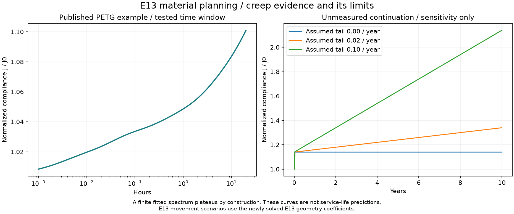

# E13 solved engineering results

The reinforced inner seat and mirrored 50° finish have been re-solved in 2D and
3D. The printable body stays solid CAD with two separate modifier helpers; only
the analysis domains remove sparse core material.

## Angular reinforcement and stress concentrations

E13 uses **11 mm added underside depth** and straight tapers into a short flat
bottom. It is 1.5 mm deeper than E12 and remains below the 12.67 mm cap. Small
corner blends, rigid shoulder transitions, fingers, plates, hardware and
mirrored 50° chamfers remain. The adjacent arms are not weakened.

[Matched E10/E12/E13 comparison](COMPARISON.md) and
[finished section properties](../../designs/closed-wall-e13/section-verification.json)
record the measured changes. [The hotspot audit](HOTSPOTS.md) compares every
region and retains raw peaks, locations, cell volumes and mesh sensitivity.
These comparisons cannot establish that every local peak is a numerical artifact.

## Current 3D solution and refinement

12 kg equivalent per bracket; E = 1,000 MPa and ν = 0.35. The near-seat window is
X = 75–110 mm, Y = −24–0 mm, over the full width.

| Walls | Tetrahedra, coarse → fine | Front movement at E1000 (mm) | Movement change | Near-seat p99, coarse → fine (MPa) | p99 change |
|---:|---:|---:|---:|---:|---:|
| 8 | 323,629 → 757,028 | 2.148 | 1.84% | 3.82 → 3.80 | -0.34% |
| 10 | 328,179 → 787,137 | 1.937 | 1.90% | 3.60 → 3.57 | -1.09% |

[10-wall 3D view](fem-3d-10w.png). The 6 MPa colour cap makes the working field
visible; saved fields retain every solved value. Percentiles and raw peaks are
not stress allowables. These meshes do not establish asymptotic convergence,
printed orthotropy, layer adhesion, snap insertion, rupture or lifetime strength.

| Walls | Raw peak, coarse (MPa) | Raw peak, fine (MPa) | Fine free residual | 2D front coefficient relative to 3D |
|---:|---:|---:|---:|---:|
| 8 | 17.5 | 25.5 | 6.80e-09 | -4.36% |
| 10 | 15.1 | 24.2 | 5.46e-09 | -4.18% |

Raw peaks remain sensitive to small cells at chamfer, tunnel and analysis-core
intersections. Their locations and volumes are in `engineering-summary.json`.
All published 3D fields pass independently recomputed free residual, force and
moment balance below 1e-6. The affine test checks displacement, recovered stress
and strain energy; PARDISO agrees with an independent SuperLU patch solution.
The reduced solver has separate affine and beam checks.

All current and baseline global domains use audited same-domain CAD face cleanup. The
current summary compares h1.5/h1 for both wall counts; the hotspot audit
also retains h2 as the third mesh level and new h1 E12 baselines. No finite cells are deleted
for their stress values. `analysis-topology-cleanup.json` and mesh audits
record CAD volumes and any numerically zero-volume removal.

## Material movement and creep margin

The retained grade-specific room-temperature XY moduli are applied to E13's new
coefficients. They are not measured hot or aged properties.

| Material | Walls | E (MPa) | K (MPa·mm) | Initial front (mm) | One 1.25 kg roll (mm) | Ec for 5 mm bracket-only (MPa) | Compliance growth limit |
|---|---:|---:|---:|---:|---:|---:|---:|
| PLA | 8 | 3427 | 2148.0 | 0.627 | 0.065 | 430 | 7.98× |
| PETG | 10 | 2311 | 1936.6 | 0.838 | 0.087 | 387 | 5.97× |
| ASA | 8 | 2379 | 2148.0 | 0.903 | 0.094 | 430 | 5.54× |
| PA6-GF dry | 8 | 5357 | 2148.0 | 0.401 | 0.042 | 430 | 12.47× |
| PA6-GF wet | 8 | 1794 | 2148.0 | 1.198 | 0.125 | 430 | 4.18× |

`δ(t,T) = K × J(t,T) = K / Ec(t,T)` assumes common linear-viscoelastic compliance
and an unchanged load/contact state. For the whole rack use **Ec ≥ K / (5 mm −
dowel movement − wall/fastener movement)**. Retain the project screening target
of at least 1.0 GPa effective creep modulus at the intended age and loaded
temperature history; it is not a published allowable or rupture criterion.

The one-roll calculation assigns its entire reaction to one bracket for the
stated simple/two-equal-span case. Fast unloading uses aged instantaneous
modulus, not reversal of accumulated creep. Other support arrangements,
overhangs and impact need their actual reactions.

PLA/PETG remain prototype choices; ASA is the higher-temperature comparison.
PA6-GF dry and water-conditioned cases stay separate. Match the source's
100°C/16-hour annealing and conditioning before using its properties, and
recheck fit. [Exact grades, source URLs and hashes](../../designs/closed-wall-e6/material-reference-data.json).

## 24 kg brief proof scenario

Elastic stress and movement double at 24 kg with the same load pattern and
active contact. This is linear scaling, not a damage simulation or a performed
physical proof test.

| Walls | Near-seat p99 at 24 kg (MPa) | Front movement at E1000 (mm) |
|---:|---:|---:|
| 8 | 7.61 | 4.296 |
| 10 | 7.13 | 3.873 |

## Screw landings and contact

The global model uses compression-only wall contact, rigid washer axial
restraints and rigid shank shear restraints. No tightening friction or arbitrary
preload is credited. The lower washer carries substantial outward demand.

| Walls | Upper washer outward demand (N) | Lower washer outward demand (N) |
|---:|---:|---:|
| 8 | 15.2 | 213.5 |
| 10 | 15.4 | 211.0 |

The separate **500 N upper-landing submodel** uses the actual 3.6 mm land and flat rear support. Its 33,764 → 83,814 tetrahedron refinement changes washer movement by 1.61%. Fine mean movement is **0.01208 mm at E1000**, with a **4.95 MPa** raw peak. This constant-force scenario does not predict installed clamp-force retention.

Retain the backed 3.6 mm land. A gap behind it creates bending/punching conditions
outside this submodel. Use the checked washer dimensions and substrate-appropriate
fixings. Separate scalar von Mises maxima from service and tightening cannot be
added as if they were stress tensors.

## Creep sensitivity with E13 coefficients

The retained [PETG study](https://doi.org/10.3390/polym17152075) supplies a short-time
example at about 21.3°C, tested to 20 hours. Its approximate Figure 26 spectrum
gives compliance multipliers near 1.07 at five hours and 1.10 at twenty hours.
The formal 1.14 plateau is built into the finite fit and does not prove years of
behavior at 85°F for these bracket grades.

These deliberately different long-time tails use E13's new movement coefficients.
They are **not PLA/PETG service-life forecasts**.

| Years | Assumed extra compliance / year | Multiplier | PLA front (mm) | PETG front (mm) |
|---:|---:|---:|---:|---:|
| 1 | 0.00 | 1.14 | 0.71 | 0.96 |
| 1 | 0.02 | 1.16 | 0.73 | 0.97 |
| 1 | 0.10 | 1.24 | 0.78 | 1.04 |
| 5 | 0.00 | 1.14 | 0.71 | 0.96 |
| 5 | 0.02 | 1.24 | 0.78 | 1.04 |
| 5 | 0.10 | 1.64 | 1.03 | 1.37 |
| 10 | 0.00 | 1.14 | 0.71 | 0.96 |
| 10 | 0.02 | 1.34 | 0.84 | 1.12 |
| 10 | 0.10 | 2.14 | 1.34 | 1.79 |

At 85°F sustained and 100°F for six loaded hours/year, the uncalibrated Arrhenius
sensitivity assumes 50/100/200 kJ/mol activation energy. Hot-rate factors are
1.70/2.90/8.42, adding 0.048%/0.130%/0.508% to annual equivalent time. This does
not prove thermal adequacy; actual hot softening, nonlinear creep and rupture
remain unqualified. Full numerical values are in `engineering-summary.json`.

## Print evidence and qualification boundary

The delivered STEP contains one valid body and two aligned helpers. Both faces
measure 50°. Complete flexible-finger sectors match E10 at nine print depths;
hardware and nominal spool-clearance checks pass. Actual OrcaSlicer 8/10-wall
G-code verifies the four solid bands and seat-wall footprints.
[CAD and toolpath evidence](../../designs/closed-wall-e13/README.md).

The 5 mm total loaded-movement and 1 mm per-roll-change limits include dowels and
mounts. Rod fit, snap behavior, extrusion quality, sustained/hot movement and
creep rupture still need physical qualification. No lifetime safe spool count
is assigned by this revision.

[Reproduce](README.md) · [Current print and engineering guide](../../README.md).
