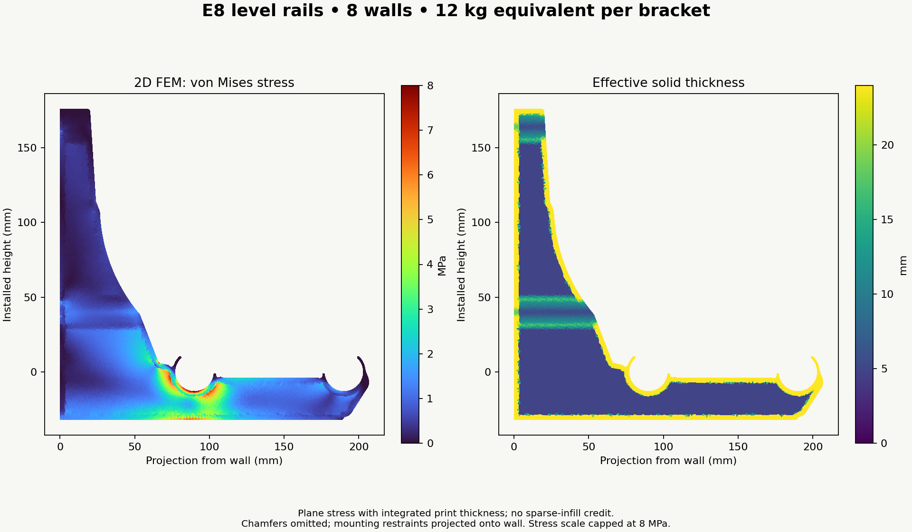
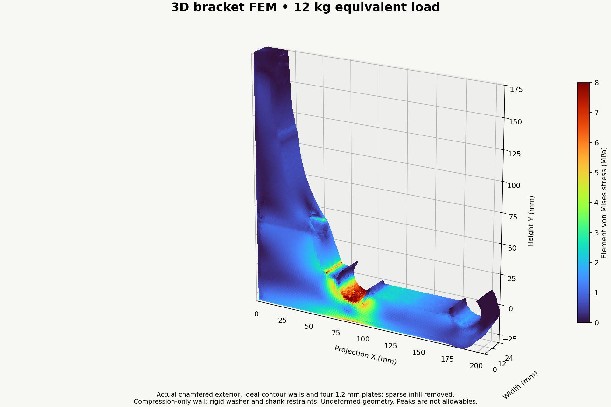
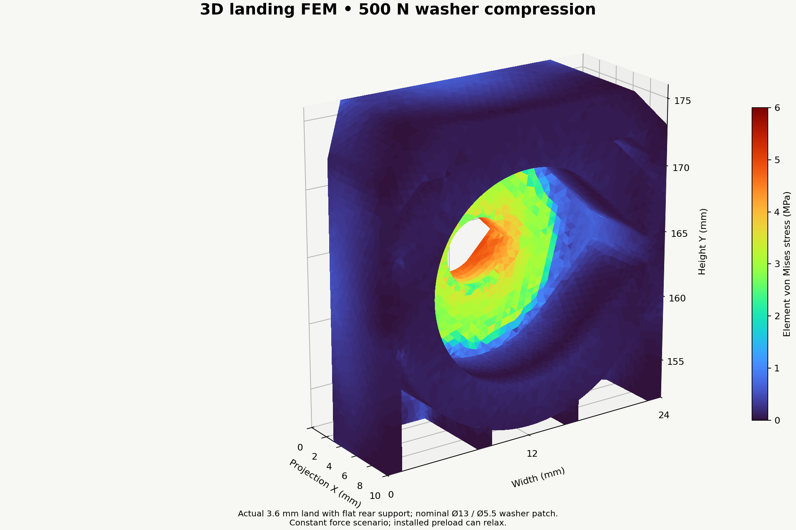
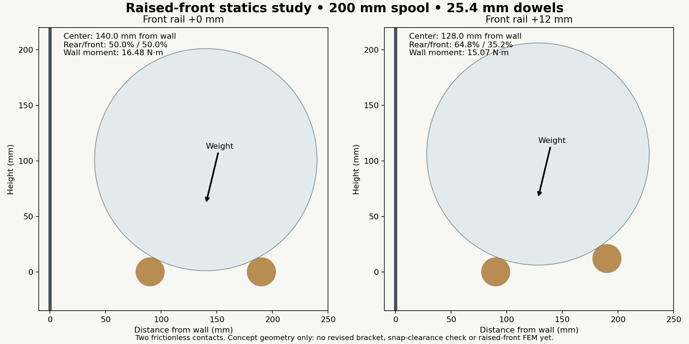

# Solved E8 engineering results

These results apply to the level-rail E8 prototype. Raised-front statics are a separate study.

| Material | Walls | Reference E (MPa) | Initial front movement (mm) | One 1.25 kg roll (mm) | Creep modulus needed for 5 mm (MPa) | Compliance limit |
|---|---:|---:|---:|---:|---:|---:|
| PLA | 8 | 3427 | 1.23 | 0.128 | 845 | 4.05× |
| PETG | 10 | 2311 | 1.66 | 0.173 | 768 | 3.01× |
| ASA | 8 | 2379 | 1.78 | 0.185 | 845 | 2.81× |
| PA6-GF dry | 8 | 5357 | 0.79 | 0.082 | 845 | 6.34× |
| PA6-GF wet | 8 | 1794 | 2.36 | 0.245 | 845 | 2.12× |

Moduli are room-temperature reference values. The creep-modulus limits apply to bracket movement alone; subtract dowel and wall movement from the 5 mm system allowance. The one-roll column assigns the entire roll reaction to one bracket, for the stated simple/two-equal-span arrangement, and uses the reference instantaneous modulus. It is not a measured aged unloading modulus.

## Numerical checks

- 8 walls: 119,893 → 203,934 tetrahedra; front movement changes 4.92%. Volume p99 stress: 5.18 → 5.25 MPa. Raw peak: 21.79 → 25.45 MPa.
- 10 walls: 116,335 → 203,893 tetrahedra; front movement changes 6.07%. Volume p99 stress: 4.56 → 4.61 MPa. Raw peak: 11.57 → 27.26 MPa.

A percentile is a field summary, not a stress allowable. Global displacement changes by about 5–6% in this comparison; this is not proof of asymptotic convergence. Rear-seat regional p99 stresses change more than global percentiles. Tiny cells at tunnel/chamfer intersections, sharp analysis-core transitions and restraint edges affect peaks; actual sliced radii and FFF anisotropy require separate interpretation. See individual result JSON files for force/moment balance, residuals, patch movements and regional stresses.

## Conditional one-, five- and ten-year calculation

| Years | Assumed extra compliance / year | Total compliance multiplier | PLA movement (mm) | PETG movement (mm) |
|---:|---:|---:|---:|---:|
| 1 | 0.00 | 1.14 | 1.41 | 1.89 |
| 1 | 0.02 | 1.16 | 1.43 | 1.93 |
| 1 | 0.10 | 1.24 | 1.53 | 2.06 |
| 5 | 0.00 | 1.14 | 1.41 | 1.89 |
| 5 | 0.02 | 1.24 | 1.53 | 2.06 |
| 5 | 0.10 | 1.64 | 2.02 | 2.72 |
| 10 | 0.00 | 1.14 | 1.41 | 1.89 |
| 10 | 0.02 | 1.34 | 1.65 | 2.23 |
| 10 | 0.10 | 2.14 | 2.64 | 3.56 |

These curves intentionally demonstrate different long-term continuations that a short test cannot distinguish. They are neither PLA nor PETG life predictions at 85°F. No creep-rupture allowable is inferred.
