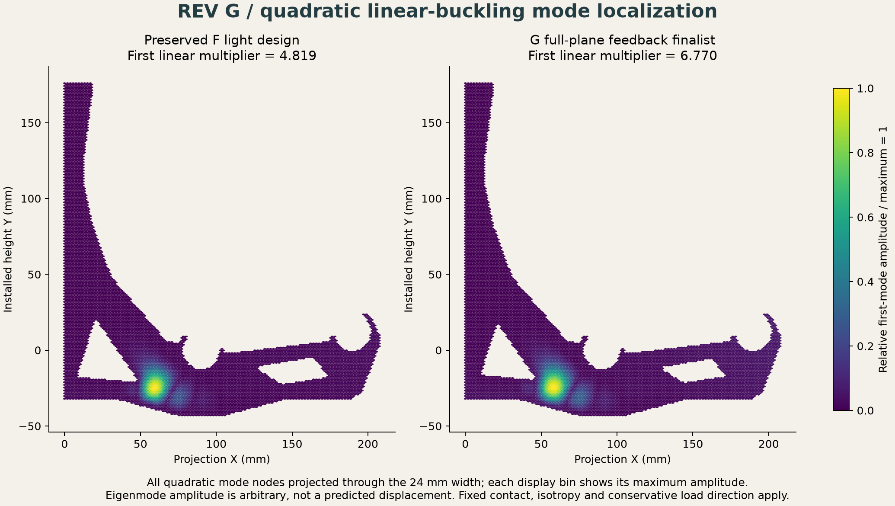

# Rev G — linear buckling screen

The full-plane G candidate has a first positive quadratic linear-buckling
multiplier of **6.7703** relative to the 12 kg reference load at
E = 1 GPa. The preserved F light candidate gives **4.8189**.
Both exceed one in this model. These are linear bifurcation multipliers,
not physical safe-load factors or the requested fracture margin. Both
designs remain rejected by their raw tensile-principal-stress screen.

## Formulation and benchmark

[buckling.py](buckling.py) solves `(K + lambda Kg) phi = 0` using
the complete saved constant-strain tetrahedral prestress. The geometric
form is the volume integral of `sigma_ij v_k,i u_k,j`. It solves the
equivalent inverse-load eigenproblem with the elastic matrix as the
positive-definite metric. Diagonal congruence scaling and residual-corrected
factor solves improve numerical accuracy without changing material.

The quadratic displacement basis uses degree-two integration, exact for
products of its affine-tetrahedron gradients with cellwise constant prestress.
All finite prestress cells are retained. The converged wall-contact set is
held fixed; washer/bore constraints follow the static model. Quadratic wall
nodes inherit the nearest static wall-node contact state.

A 20 × 1 × 1 mm simply supported beam at E = 1,000 MPa, nu = 0 and unit
axial compression has an Euler reference of 2.05617 N. First-order models
overpredict it by 14.77%, 6.19% and 3.18% as their mesh is refined. The
quadratic model is within 0.69%; the small difference includes continuum
shear compliance. [Benchmark and residuals](buckling-validation.json).

The actual F light design changes from **14.0409 with P1**
to **4.8189 with P2** on the same tetrahedral geometry
and prestress. That large difference is why the P1 rack value is not used
as the reported stability result. The benchmark establishes the formulation
and exposes locking; it does not establish whole-rack mesh convergence.

## Saved complete results

| Design and order | Eigenvalues/residuals | All mode nodes and vectors |
|---|---|---|
| F light, P1 | [JSON](studies/repaired-f-light/buckling-p1-h2.json) | [NPZ](studies/repaired-f-light/buckling-p1-h2.npz) |
| F light, P2 | [JSON](studies/repaired-f-light/buckling-p2-h2.json) | [NPZ](studies/repaired-f-light/buckling-p2-h2.npz) |
| G full planes, P2 | [JSON](studies/full-plane-best/buckling-p2-h2.json) | [NPZ](studies/full-plane-best/buckling-p2-h2.npz) |

Every recorded physical eigenpair residual is below 10⁻⁵. The G factor
has about 1.25 million free degrees of freedom and 86.9 million nonzeros;
the recorded solve takes about 10.5 minutes on the reference workstation.
Source field hashes tie the prestress to the preserved static solutions.

## Limits

This is one quadratic whole-rack mesh level with h2 static prestress. It
does not prove a converged nonlinear buckling load. Geometric imperfections,
orthotropic printed behavior, contact-set changes, load-direction changes,
creep evolution and postbuckling are not resolved. The mode images show
arbitrary normalized eigenvectors, not deflection under service load.

The derivation follows the primary
[3D solid buckling formulation](https://bleyerj.github.io/comet-fenicsx/tours/eigenvalue_problems/buckling_3d_solid/buckling_3d_solid.html).
The implementation uses the documented
[SciPy symmetric generalized eigensolver](https://docs.scipy.org/doc/scipy/reference/generated/scipy.sparse.linalg.eigsh.html)
and [scikit-fem finite-element API](https://scikit-fem.readthedocs.io/en/stable/api.html).

[Return to the mechanical study](README.md).
