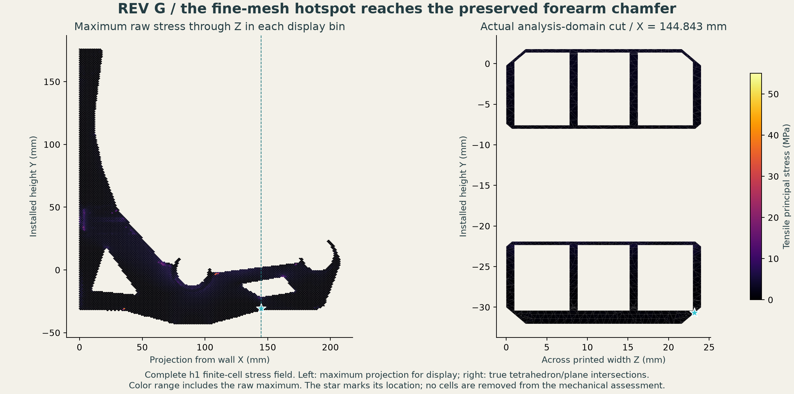

# Rev G — completed evolutionary-search study

**No tested finalist passes every computational gate. The requested 4×
fracture margin remains unverified, and no qualified minimum-mass design is
selected.** The completed sprint implements and verifies the search, examines
real sliced candidates, feeds 3D failures back into a second family, and
publishes the limiting evidence. It does not establish a global optimum or
prove that every untested candidate is infeasible.

[Current CAD and actual toolpaths](../../designs/rev-g/README.md) ·
[Machine-readable search results](search-summary.json) ·
[Complete mechanical metrics](mechanics-summary.json) ·
[Publication integrity audit](publication-verification.json) ·
[Original sprint brief](../../REV-G-SPRINT-BRIEF.md)


## Objective and limits

Minimize actual printed plastic mass within 5 mm total loaded movement,
including rails, mounting and creep, and 1 mm change per 1.25 kg spool. Use
the 12 kg / 117.72 N reference load and a requested nominal fracture factor
of at least four. Matching E13 stiffness is not a constraint.

The search uses E = 1,000 MPa and Poisson ratio 0.35 as an isotropic effective
creep-planning model. A provisional 1 mm rail/mount reserve gives a 4 mm
bracket screen. The final table also reports the magnitude of the mean seat
translation, which is slightly larger than vertical movement. The per-spool
number scales the same load pattern by 1.25/12; it is not a measured
whole-rack increment or a substitute for the rail/mount assessment.

The nominal tensile-principal-stress limit is **40.5 / 4 = 10.125 MPa**,
using the printed-Z typical tensile value in the
[official PolyLite PLA TDS](https://polymaker.com/wp-content/uploads/lana-downloads/PolyLite-PLA_TDS_EN_V5.4.pdf).
This scalar coupon screen is not a part allowable, a generic safe spool count,
or proof of ASA, PETG or conditioned PA6-GF lifetime performance. The existing
hot/sustained qualification envelope remains in the
[E13 material guide](../../E13-ENGINEERING-GUIDE.md). All finite raw 3D peaks
are retained; percentiles cannot pass the fracture gate.

## Implemented search and repeatability

[fast_screen.py](fast_screen.py) caches meshes, finished-layer membership,
wall masks and load patches while preserving the canonical plane-stress
equations and contact solve. Four cases reproduce canonical E13/F full
displacement and stress fields to below 1.2 × 10⁻¹⁰ mm and 3 × 10⁻¹⁰ MPa.
Each also repeats without its result cache.
[Exact validation records](fast-screen-validation.json).

[search.py](search.py) implements seeded integer genomes, tournament
selection, uniform crossover, bounded mutation, elitism and periodic
immigration. Candidate keys and run signatures include parameters, source,
input layers, dependency versions and screening limits. Numerical failures
are rejected. The saved population ledger contains every generation.

| Run | Population × generations | Distinct evaluations in run | 2D feasible / rejected | Best mass proxy |
|---|---:|---:|---:|---:|
| Seed 20260910, broad family | 32 × 20 | 590 | 455 / 135 | 78.01 g |
| Seed 20260911, broad family | 32 × 20 | 584 | 442 / 142 | 76.89 g |
| Seed 20260912, full-plane feedback | 24 × 14 | 291 | 245 / 46 | 99.01 g |

There are **1,458 distinct parameter sets overall**; seven broad-family
candidates occur in both seeds. The initial population is generation zero.
The first broad run and feedback run were each replayed from the numerical
cache; complete population ledgers, selections and summaries match exactly.
This verifies optimizer replay. The separate uncached four-case check verifies
the numerical evaluator. It is not a second uncached solve of all 1,458 cases.
[Replay evidence](repeatability-verification.json) · [Runs](runs/)
· [Every evaluated candidate](search-evidence/).

The broad family varies 1–8 walls, 0.6–1.2 mm skins and planes, full/shaped
planes, chord widths, seat support, tunnel collars and 0.9/1.0/1.1 window
scales. Sparse infill is fixed at 5% in this sprint and receives no structural
credit. Reduced-model mass is a quadrature proxy. Only actually sliced
finalists receive an Orca mass. The search is bounded and has no global
optimality certificate.

## 3D feedback and real candidates

The first seed's coarse best, `82e88fcf29749880c5c3`, moves 4.001 mm in the
fine 2D screen, narrowly outside the planning limit. It was examined in 3D
as a diagnostic candidate, not accepted. Its 3D movement is 4.930 mm vertical
and 5.034 mm resultant; its raw tensile peak is 120.46 MPa. Its actual dense
toolpath coverage also fails. The second seed's coarse best is preserved in
the ledger but was not claimed to have passed 3D or slicing.

[search_3d_feedback.py](search_3d_feedback.py) then restricts the family to
full planes, 1.0–1.2 mm skins/planes and stronger seat/tunnel support. It adds
2D screening reserve: 3.6 mm movement and 7 MPa stress. Final 3D limits remain
4 mm and 10.125 MPa. The resulting finalist is
`213f8c56151ddee40d51`; its fine 2D result is 3.054 mm and 6.889 MPa.
[Changed family and rationale](3d-feedback-search.json).

| Actual candidate | Orca mass at 1.24 g/cm³ | 3D mesh | Front vertical movement | Max mean seat translation | Raw tensile peak | 40.5 MPa / raw peak |
|---|---:|---:|---:|---:|---:|---:|
| Thin shaped seed 1 | 84.35 g | h2 | 4.930 mm | 5.034 mm | 120.46 MPa | 0.34 |
| Full-plane feedback | 103.76 g | h2 | 3.128 mm | 3.186 mm | 32.29 MPa | 1.25 |
| Full-plane feedback | 103.76 g | h1.5 | 3.167 mm | 3.225 mm | 37.99 MPa | 1.07 |
| Full-plane feedback | 103.76 g | h1 | 3.246 mm | 3.306 mm | 55.05 MPa | 0.74 |
| Wider inner-seat support | 108.03 g | h2 | 2.988 mm | 3.042 mm | 21.25 MPa | 1.91 |

The last row is a targeted 3D-feedback perturbation, increasing only the
inner-seat support width from 5 to 8 mm. It is not a new genetic optimum.
It improves the coarse result but remains rejected; no fine-mesh acceptance
is claimed for it. [Rationale](studies/seat-support/design-rationale.json).

At h1, the 103.76 g full-plane candidate is **37.91% lighter** than E13's
167.11 g reference and about **51.11% more flexible vertically**. Its
reference-load stiffness per gram is approximately **6.58% higher** on the
matched h1 comparison. This is a useful tradeoff inside the movement budget,
but the strength failure prevents selection. The remaining resultant-motion
budget is **1.694 mm** for other contributors; the proportional one-spool
bracket proxy is **0.344 mm**. These remain model-based planning quantities.

## Mesh refinement and the limiting mechanism


The full-plane meshes contain 214,688, 322,730 and 691,297 finite tetrahedra.
Every saved solution passes independently recomputed free residual, force
balance and moment balance below 10⁻⁶, with converged unilateral wall contact.
Only numerically zero-volume mesh cells may be excluded under the recorded
determinant gate; no finite cells are removed for their stress values.

Raw peak stress rises from 32.29 to 55.05 MPa, while the volume above the
10.125 MPa screen rises from 0.00879 to 0.20154 mm³. The global peak migrates
from the inner-seat neighborhood to the lower forearm. These peaks do not
converge to a usable rupture prediction. Small stressed volumes do not, by
themselves, establish numerical artifacts.



The fine-mesh peak cell is at approximately (144.843, −30.697, 23.200) mm.
An independent comparison with both delivered G and source E13 STEP files
places its center about **0.00162 mm from a preserved exterior chamfer face**.
This is not solely an internal density-transition hotspot.
[CAD-face evidence and source hashes](hotspot-geometry-verification.json).
Changing reinforcement alone has not demonstrated a solution. The next study
needs to separate actual exterior geometry, emitted bead geometry and local
material behavior without deleting troublesome cells or relaxing the gate.

## Buckling, manufacturing and qualification

[Quadratic buckling report and benchmark](BUCKLING.md) records the complete
constant-strain prestress field, a quadratic displacement basis and linear
bifurcation eigenpairs. A beam benchmark exposes substantial first-order
shear locking. Buckling is reported separately from the fracture factor;
passing a linear stability screen cannot override the tensile failure.

The repaired F light helper, full-plane G finalist and wider-seat variant
pass the actual modifier and nominal bead-footprint checks. The first thin
G finalist fails dense coverage at an upper-skin bridge transition; that
failure is preserved. The earlier F helper export issue was fixed by extending
selection geometry through air. A CAD Boolean comparison proves that the
printed density intersection is unchanged.
[Correction evidence](../../designs/rev-g/studies/repaired-f-light/helper-correction-verification.json).

No physical print, fit test, calibrated process, sustained/hot test or creep
qualification was performed. E13 is retained as an established prototype
handoff, not relabeled as a qualified load rating. The completed G result is
an implemented repeatable optimizer and a documented **absence of a verified
feasible finalist in the tested set**.

## Reproduction and retained evidence

Install the pinned [requirements](../e13/requirements.txt) in a dedicated
environment. The portable [native worker](run_native.py) handles native-library
teardown while preserving failures. From the repository root:

```text
python analysis/rev-g/run_native.py analysis/rev-g/validate_fast.py
python analysis/rev-g/run_native.py analysis/rev-g/search.py --seed 20260910
python analysis/rev-g/run_native.py analysis/rev-g/search.py --seed 20260911
python analysis/rev-g/run_native.py analysis/rev-g/search_3d_feedback.py
python analysis/rev-g/run_native.py analysis/rev-g/refine_candidates.py 3d-feedback-seed-20260912-h2 --count 2
python analysis/rev-g/run_native.py analysis/rev-g/build_analysis_geometry.py designs/rev-g/studies/full-plane-best/selected-layout.json analysis/rev-g/.work/full-plane-best --body-dir designs/rev-g/studies/full-plane-best
python analysis/rev-g/run_native.py analysis/rev-g/mesh_model.py print-material 1 2 1 --clean --directory analysis/rev-g/.work/full-plane-best
python analysis/rev-g/run_native.py analysis/rev-g/solve3d.py print-material-1w-h2 --directory analysis/rev-g/.work/full-plane-best --pardiso
python analysis/rev-g/run_native.py analysis/rev-g/buckling.py --validate
python analysis/rev-g/run_native.py analysis/rev-g/buckling.py --field analysis/rev-g/studies/full-plane-best/print-material-1w-h2-solution.npz --output analysis/rev-g/studies/full-plane-best/buckling-p2-h2 --order 2
python analysis/rev-g/run_native.py analysis/rev-g/audit_publication.py
```

Use h1.5 and h1 for the two refined meshes. Study folders retain raw finite
fields and numerical audits; regenerable BREP/mesh caches and neutral G-code
stay local. Quadratic whole-rack buckling is memory intensive; the recorded
run used a 64 GiB workstation. Do not run multiple such jobs concurrently.
The [manifest](publication-manifest.json) hashes published evidence using
canonical LF for text and exact bytes for binary CAD and field files.
