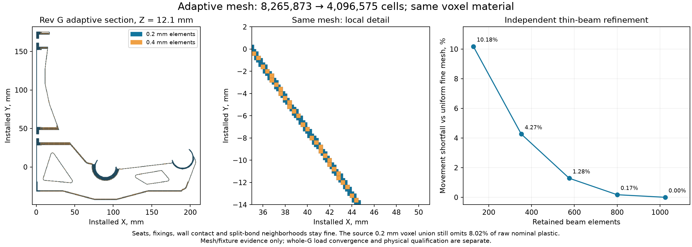

# Adaptive resolution on G's actual sliced material

Adaptive hex coarsening is implemented and passes independent CPU/GPU fixture
checks. Protecting G's seats, fixings, wall contact and split-bond neighborhoods
reduces its 0.2 mm mesh from **8,265,873 to 4,096,575 elements** (50.44%), with
exactly the same represented material. Preparation took 3.83 s after loading
the fine mesh. This is not an accepted whole-G load solution: both bounded
full-G trials failed linear equilibrium convergence.



## What is implemented

`gpu_demo_adaptive.py` replaces eight fully occupied sibling voxels with one
hex. Two sizes keep neighboring element sizes within 2:1. Q1 interpolation
constrains hanging edge/face nodes; the CUDA operator applies `P.T K P`, and
loads use `P.T f`. This constraint approach is described in the
[MFEM nonconforming-mesh documentation](https://mfem.org/howto/ncmesh/).
The implementation here uses the existing Warp backend, not MFEM binaries.

No coarse cell crosses a void or sacrificial-bridge-only connection. All
retained material, including unloaded disconnected fragments, survives.
G's existing [body and aligned helpers](../../designs/rev-g/bracket-with-modifiers.step)
are unchanged; this checkpoint adds no G2 architecture or CAD candidate.

An initial geometry-only count gave 2,664,907 leaves, a 67.76% reduction.
Protecting real interfaces and topology raises the implemented count to
4,096,575. The initial count was not a tested mechanical mesh or speedup.

The first whole-G constraint construction correctly rejected a corner case:
two coarse blocks can share a fine midpoint while their coarse endpoints
remain disconnected. Averaging those constraints would change bonds. The
corrected implementation protects cells incident to split vertices, checks
6,011,221 duplicate interpolation constraints, and passes a dedicated
partial-edge-connection regression. The original rejection log is preserved.

## Independent validation and limits

[Fixture report](adaptive-validation/fixtures/fixtures.json) and
[all fixture fields](adaptive-validation/fixtures/fields.npz) cover solid
transitions, hollow material, separate edge/corner contacts and partial-edge
connections. The adaptive assembled operator agrees with an independent
scikit-fem fine operator projected into the same constrained space to roughly
machine precision. Random displacement, rigid motion, Dirichlet projection,
affine stress at every Gauss point, and a GPU beam solve are checked.

The 16:1 thin-beam study also checks mechanical refinement. An everywhere
coarse mesh underpredicts displacement by 10.18% relative to the uniform fine
FE reference. Protecting the first 4, 8 and 12 mm from the root reduces this
difference to 4.27%, 1.28% and 0.17%. The uniform fine FE reference itself is
not an analytic or physical convergence proof. The test demonstrates why
preserving volume does not justify coarsening thin bending regions arbitrarily.

Adaptive geometric resolution and mechanical resolution remain separate:
refine boundary cells to retain thin plastic, and refine bending/high-gradient
regions to resolve deformation and stress. Removing boundary material can
serve as an explicitly eroded screen; it is not a general guarantee of
conservative contact, local movement or peak stress. Coarse FE spaces can
also underpredict movement, as the beam test shows.

## Finer boundary handling without a uniformly fine grid

A separate full-G quadtree census refines only boundary-crossing rectangles,
retaining entirely covered rectangles and the original 0.2 mm slice slabs.
It exactly reproduces the earlier uniform full-cell volumes at 0.8, 0.4 and
0.2 mm, then continues to 0.025 mm XY. All six levels took 122.09 s together.
[Census](adaptive-validation/boundary-census.json) and
[independent hole/gap fixtures](adaptive-validation/boundary-fixtures.json).

| Finest boundary XY | Omitted raw material | Adaptive prisms before grading | Uniform fine equivalent |
|---|---:|---:|---:|
| 0.2 mm | 8.02% | 1,503,003 | 8,265,873 |
| 0.1 mm | 4.10% | 2,912,989 | 34,473,478 |
| 0.05 mm | 2.15% | 5,702,773 | 140,683,696 |
| 0.025 mm | 1.10% | 11,754,633 | 568,786,644 |

These are geometry counts, not the mechanically tested two-level hex mesh
above. They allow larger interiors, are not graded, and do not yet protect
interfaces or enforce multilevel hanging-node constraints. More elements and
through-thickness mechanical refinement may be required. They demonstrate a
useful direction for recovering thin plastic while preserving real gaps, not
a 48-fold solver speedup or a claim of 0.025 mm printing accuracy.

## Full-G trials: failed, with complete fields retained

The tested source is the historical neutral 2w/5-skin-layer raw shape, with
the thick bridges excluded. Its 0.2 mm full cells omit **8.0177%** of the
71,890.970 mm3 raw nominal footprint volume. This geometry is deliberately
eroded and is not accepted as G's printed material. The 0.4 and 0.8 mm whole-G
preparations omit 16.38% and 33.09%, respectively. Crop losses from the earlier
checkpoint must not be substituted for these whole-part measurements.

Loads are radial nonnegative seat pressures that reproduce the reference
force split and zero torque about each dowel axis. Rigid washer restraints
remain at X=3.6 mm on the 0.2/0.4 mm grids; lateral bore restraints and initial
wall gaps are retained. [Interface precheck](adaptive-validation/g-h0p2-interfaces.json).
This interface model is idealized; hardware, substrate and warm material
properties remain unqualified.

| Trial | CG iterations | CG time | True relative free residual | Outcome |
|---|---:|---:|---:|---|
| Initial | 1,000 | 15.67 s | 2.5996 | Rejected |
| Continuation from saved iterate | 12,000 | 187.74 s | 0.03691 | Rejected |

The acceptance gate is 1e-8 for the true relative free residual, alongside
the tighter recursive residual gate. Neither trial reached the wall contact
active-set update. No movement limit, fracture factor or changed-spool result
can be read from these iterates. Their raw tensile peaks, **7.8219 and
19.9523 MPa**, are retained as failure evidence, not strength predictions.

Both trials retain displacement, forces, residuals, fixed and active contact
indices, gaps and **all eight stress samples in every one of the 4,096,575
leaves**. Reports and per-stress-chunk hashes are published as
[initial](adaptive-validation/g-h0p2-solve-v1.json) and
[continuation](adaptive-validation/g-h0p2-solve-v2.json). Large raw arrays remain
in the preserved local `.work/gpu-demo` evidence directories. Setup, field
recovery and writing bring the respective full trial times to 59.38 and
231.34 s; these are failed-trial timings, not accepted iteration turnaround.
[Local raw-file inventory and hashes](adaptive-validation/raw-evidence-manifest.json)
record those arrays and the separate fresh PETG inputs/cache. Public numerical
fixtures are included directly; the large raw arrays remain local.

The present diagonal preconditioner is inadequate for fast convergence at
this scale. Adaptive cells reduce operator size; a tested multigrid or coarse
correction is still needed to tackle the long bending modes efficiently.

## Fresh slicer demonstration and repaired priming accounting

The historical neutral slice was replayed in 3.22 s, but its ordered path
arrays were not identical; the replay is retained as a failed exact replay.
Historical profiles were neutral geometry settings with a PLA label. Their
earlier P1S bed check was not a calibrated P1S/PETG process claim.

A separate installed **P1S 0.4 mm / Generic PETG / Textured PEI Plate** slice
completed in **2.67 s**. The effective 2-wall, five-top/bottom-layer, 0% base
infill settings pass, as do the three 100% helpers and the P1S bed/exclusion
audit. This uses the installed generic PETG base at 255 C and flow 0.95;
it is not a calibrated filament grade. [Slice receipt](adaptive-validation/orca-p1s-petg-v3.json).

Orca's Bambu dialect uses different feature/width/layer comments. Parser
aliases now handle them, with exact equality against every array in the old
preserved path cache and an independent parser regression.
[Process and parser report](adaptive-validation/slice-parser-and-process-v2.json).

The new slice has 74,024.146 mm3 of object moving extrusion versus 74,100 mm3
in the footer. The first cache build stopped at the existing 0.1% accounting
gate. Investigation found four P1S startup priming moves outside the object,
using 75.526 mm3. Counting them as spent plastic gives 74,099.671 mm3 and a
0.000443% footer difference; none of that priming material receives structural
or bond credit. The original gate is unchanged and both the initial rejection
and repaired receipt are retained.

A new raw nominal-footprint cache then built in 16.14 s, with no simplification,
gap closing or pore filling. Its volume is 71,891.077 mm3 in one credited
structural component. It passes 5,000 independent capsule occupancy samples
and the independent thickness check, with zero measured differences in those
samples. [Shape receipt](adaptive-validation/petg-shape.json) and
[independent validation](adaptive-validation/petg-independent-validation.json).
This does not replace the historical cache used
in the adaptive GPU trials. The fresh P1S/PETG slice and historical-shape GPU
trials remain separate demonstration stages, not an accepted fresh-slice-to-
mechanics loop.

## Reproduction

Use the isolated environment from [GPU validation](GPU-VALIDATION.md), from
the repository root. `GPU_PY` denotes that environment's Python executable.
Use fresh output directories; do not overwrite previous evidence.

```sh
$GPU_PY analysis/rev-g2/gpu_demo_geometry.py --h .2 --max-grid-cells 160000000 --max-seconds 240 --output analysis/rev-g2/.work/demo-fine
$GPU_PY analysis/rev-g2/gpu_demo_interfaces.py --geometry analysis/rev-g2/.work/demo-fine
$GPU_PY analysis/rev-g2/gpu_demo_adaptive.py --geometry analysis/rev-g2/.work/demo-fine --output analysis/rev-g2/.work/demo-adaptive --protect-g-interfaces
$GPU_PY analysis/rev-g2/validate_gpu_demo_adaptive.py --gpu --output analysis/rev-g2/.work/demo-fixtures
$GPU_PY analysis/rev-g2/gpu_demo_solve.py --geometry analysis/rev-g2/.work/demo-fine --adaptive analysis/rev-g2/.work/demo-adaptive --output analysis/rev-g2/.work/demo-solve --maxiter 1000 --max-seconds 180
$GPU_PY analysis/rev-g2/gpu_demo_slice.py --orca "$ORCA_EXE" --p1s-petg --output analysis/rev-g2/.work/demo-slice
$GPU_PY analysis/rev-g2/validate_gpu_demo_slice.py --fresh analysis/rev-g2/.work/demo-slice --output analysis/rev-g2/.work/demo-parser.json
$GPU_PY analysis/rev-g2/gpu_demo_boundary.py --output analysis/rev-g2/.work/demo-boundary.json
```

Next: extend graded boundary refinement with verified constraints; test a
coarse correction/preconditioner; pass full-G
equilibrium/contact and resolution sensitivity; then solve the changed spool
load independently. The seven G2 concept families remain unbuilt. Physical
qualification and all requirements in [G2-BRIEF](../../G2-BRIEF.md) remain open.
