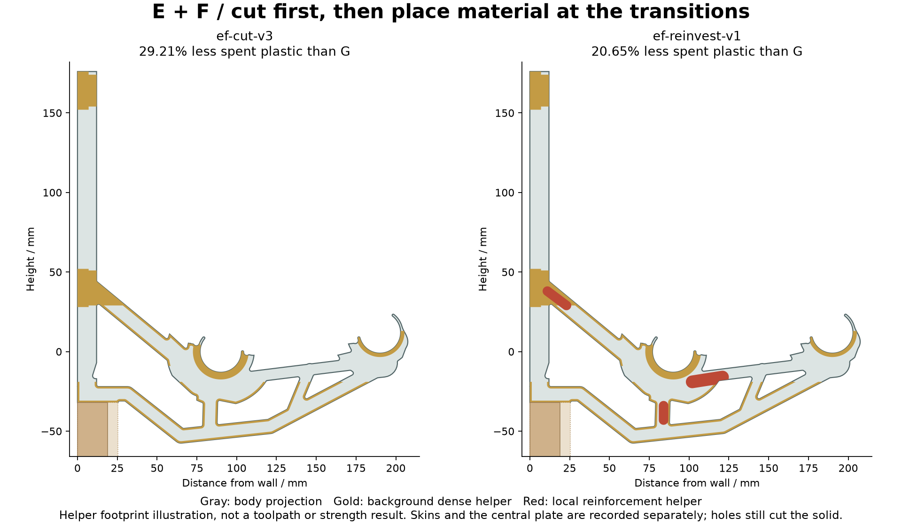
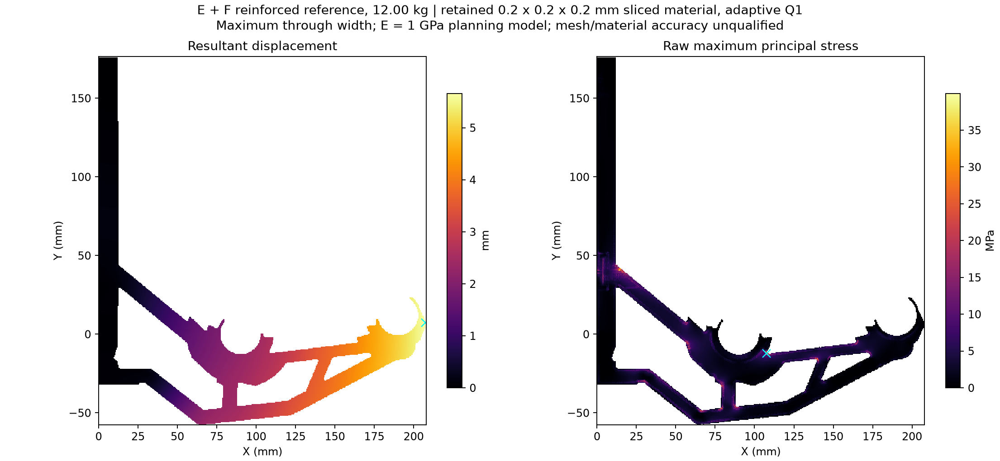

# E + F material reserve and local reinforcement

The implemented cut removes **29.211% of matched G spent extrusion**.
A separate local helper adds **6.342 cm3** back at three transitions, leaving
**20.653% net saving**. These are fresh Orca P1S PETG extrusion totals. The
new cut and reinforced mechanical checks are underway; mass saving is not
strength qualification.

## Measured slice progression

| Candidate | Spent extrusion, cm3 | Saving versus G | Skin, mm | Internal planes |
|---|---:|---:|---:|---|
| Matched P1S G | 74.100 | reference | 1.0 | two 1.0 mm |
| EF reinforced reference | 73.007 | 1.475% | 1.0 | two 1.0 mm |
| EF lean v1 | 65.966 | 10.977% | 0.8 | one 1.0 mm |
| EF lean v2 | 61.613 | 16.851% | 0.8 | one 0.6 mm |
| EF cut v3 | 52.454 | 29.211% | 0.6 | one 0.6 mm |
| EF reinvest v1 | 58.796 | 20.653% | 0.6 | one 0.6 mm plus local backing |

All use two walls, 0% base infill and 100% helper regions. Totals include
startup extrusion and sacrificial bridges. The denominator is the matched
P1S G slice at 74.099671 cm3, not the older neutral-slicer G schedule.
The body is identical across these EF allocation trials. Layer/plate changes
and helper changes require a fresh slice; modifier geometry alone is not
printed plastic. All actual credited path sets are connected and pass the
P1S bed/exclusion and modifier-role checks.

## What the first full EF screen found

At 12 kg, the heavier EF reference gives **5.660824 mm** maximum movement and
**39.997226 MPa** raw tensile peak. G gives 4.335468 mm and approximately
20.0242 MPa under the matched planning model. The first EF body is more
flexible; the 1.475% saving did not establish an efficient design.

Its peak is near installed XYZ 107.758, -12.358, 15.442 mm, where the inner
seat joins the forearm. The local helper extends backing through this joint,
and also covers the wall/upper-brace and seat/keel-post transitions. Placement
is seeded by the accepted reference stress field. The cut and reinvested
states must independently establish the effect on compliance and movement.
If reinforcement needs more budget, the next cuts come from low-stress and
low-strain-energy areas. Preserve load connectivity, bearing/capture geometry,
print support and stability; check the changed load path after each cut.

## Numerical evidence and limits

The reference's first strict linear/contact attempt failed at 6,000 iterations.
A stronger coarse retry also failed its bounded solve. Both raw fields and
all contact iterates survive. Neither failed field is promoted as a prediction.

The successful procedure settles unilateral contact at relative tolerance
1e-4, then recomputes equilibrium/contact at 1e-5. Discovery takes 271.805 s
including all stress export; the final check takes 59.754 s, with 40 linear
iterations and unchanged active contact. True final residual is 8.789e-6;
force/moment balance and contact inequalities pass. All 32,538,824 stress
samples survive. The maximum displacement change between the final discovery
and tight fields, evaluated across every fine node, is 3.235e-7 mm. This is an
iterate comparison, not a mesh-error bound. Earlier attempts, CAD, slicing,
geometry setup and audits are additional elapsed work.

The inscribed grid omits 11.091% of the reference's nominal raw plastic and
15.255% of the thinner cut's material. It adds no material and does not join
real gaps. Disconnected eroded components are retained; only the connected
loaded component receives the applied load. This omission limits quantitative
comparison, especially of local stress. An eroded model is not a guaranteed
conservative bound on every stress or failure mode. The adaptive solve uses
an isotropic E=1000 MPa, nu=0.35 planning law, idealized fixings and unilateral
wall contact. Moulding provides no structural support. Printed anisotropy,
creep, buckling, bonding, fit and a physical load rating remain unqualified.

A fresh EF plane-stress mesh diagnostic remains unsuccessful: its first
attempt encountered two zero-material roundoff elements; after an explicitly
bounded zero-volume cleanup, equilibrium checks still failed. Both attempts
are retained locally. No cheap EF ranking is claimed from those failures.
The completed 100-idea G pilot remains a separate, locally calibrated screen.

## Deliverables

Each directory contains aligned body/helper STEP files, model-only 3MF,
CAD verification, actual slice archive, section images, notes and hashes.
Individual helpers are modifiers, never extra printed parts.

https://github.com/thereprocase/spool-wall-rack/tree/main/designs/rev-g2/ef-cut-v3

https://github.com/thereprocase/spool-wall-rack/tree/main/designs/rev-g2/ef-reinvest-v1

https://github.com/thereprocase/spool-wall-rack/tree/main/designs/rev-g2/ef-hybrid-v1

https://github.com/thereprocase/spool-wall-rack/blob/main/PRINT-CANDIDATES.md

Public compact numerical receipts and full stress-field manifests

https://github.com/thereprocase/spool-wall-rack/tree/main/analysis/rev-g2/ef-hybrid-results

Raw stress arrays, contact iterates, integration caches, failed CAD/package
attempts and full slicer logs remain in ignored local evidence directories.
Do not restart the stopped whole-part CPU meshing jobs.
