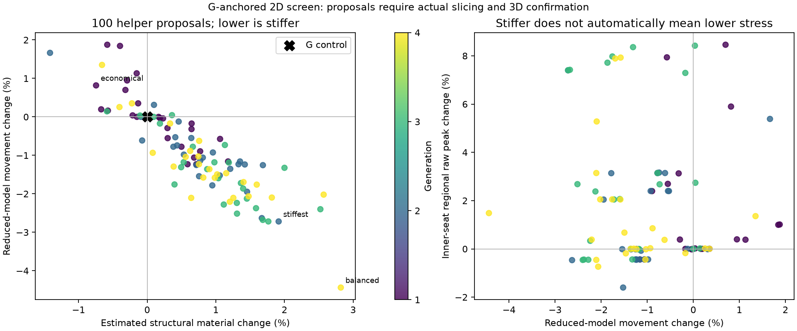
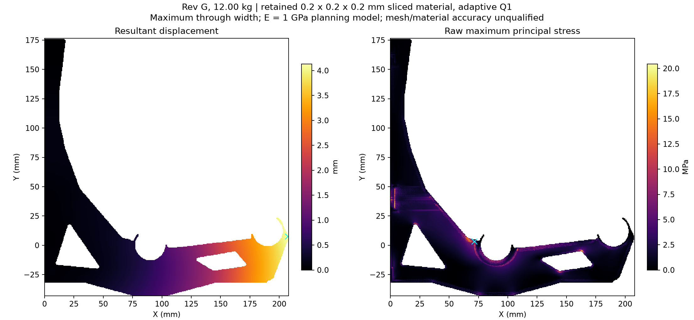

# G evolutionary screening loop

**Continuation: [broader G2 body directions](../../designs/rev-g2/shape-seeds/README.md).**
This completed pilot varied G's helpers only. The next study opens the body
outline and structural family while fixing the interfaces in the
[current contract](../../designs/rev-g2/INTERFACE-CONTRACT.md).


[A: stiffness leader and CAD](../../designs/rev-g2/evolution/f9ad9cdbc331/README.md) ·
[B: unresolved numerical check and CAD](../../designs/rev-g2/evolution/0c3bac68efa9/README.md) ·
[C: lighter helper and CAD](../../designs/rev-g2/evolution/9be1dd4d87d3/README.md).
Green grows the dense helper; red trims it. These are local G helper changes.

The first completed batch evaluated **100 new helper proposals in 677.87 s
(11 min 18 s)**, plus a separate G control. Initial occupancy-cache preparation
took 13.95 s; subsequent setup took 0.36 s. Every proposal passed its reduced
contact/equilibrium checks and retained all 37,985 finite stress cells. This
measures screening throughput. Predictive usefulness requires the actual
slices and 3D checks described below.



| Actual P1S PETG case | Maximum movement | Raw tensile peak | Active pipeline time |
|---|---:|---:|---:|
| Fresh G control | 4.33547 mm | 20.02420 MPa | 2 min 21 s solve/export; preparation separate |
| A: f9ad9cdbc331 | 4.12946 mm | 20.42919 MPa | 6 min 55 s |
| B: 0c3bac68efa9 | Unresolved | Failed fields retained | 9 min 55 s including retry and its field audit |
| C: 9be1dd4d87d3 | 4.37778 mm | 19.46068 MPa | 5 min 39 s |

A's movement indicator was 4.14313 mm; C's was 4.37095 mm. Agreement in these
two nearby cases supports local movement screening, not a general error bound.
Cheap stress trends were unreliable. B failed both the initial 6,000-iteration
solve and the stronger-preconditioner retry; no failed iterate is promoted.
A is the local pilot's stiffness leader. Its completed full-cell refinement
gives **4.154745 mm** maximum movement and **19.679217 MPa** raw tensile peak.
It still exceeds the provisional 4 mm bracket allocation.

The full-cell treatment took **5 min 18 s** of active preparation, solve,
all-field audit and comparison. It releases the adaptive constraints on the
same 8,467,566 retained 0.2 mm cells. All 10,234,400 nodal displacements were
compared; the largest change was 0.025293 mm. All 67,740,528 Gauss stress
samples survive. Compliance increases as expected when the constraints are
released; contact, force and moment checks pass at the stated screen tolerance.
This measures coarsening sensitivity on the same eroded material. It does not
recover the 8.12% omitted boundary volume. The peak changes location and drops
about 3.67%, so small stress differences between candidates remain unresolved.

[Final mesh comparison](evolution-results/batch-02/leader-refinement/mesh-comparison.json) ·
[Final field audit](evolution-results/batch-02/leader-refinement/audit.json) ·
[Measured timing](evolution-results/batch-02/leader-refinement/timings.json) ·
[Pilot calibration and all outcomes](evolution-results/batch-02/calibration.json).



[All 100 records](evolution-results/batch-02/ledger.json),
[scores](evolution-results/batch-02/scores.csv),
[numerical and mutation checks](evolution-results/batch-02/verification.json),
[actual-slice receipts](evolution-results/batch-02/receipt.json), and
[fresh process control](evolution-results/batch-02/p1s-baseline/audit.json).

## Three stages

1. **100 proposals / 20-minute budget.** Seed paired cuts and additions using
   the measured G load path. Run four generations of 25. Breed promising
   allocations, recombine, and retain independent exploration. Each mutation
   changes one to three dimensions by 5–10%, on a 0.05 mm grid. This first
   batch stays within 80–120% of G for each dimension.
2. **Three actual candidates.** Build aligned STEP helpers and a model-only
   3MF, slice with installed P1S/0.4 mm/Generic PETG profiles, reconstruct raw
   credited paths, and solve new 3D material/contact. Time CAD, slicing,
   preparation, solve and every-field export separately. Keep diverse
   finalists: the balanced score leader, the stiffest remaining proposal,
   and a lighter proposal with modest predicted movement cost.
3. **Refine the surviving leader.** Remove the adaptive coarsening constraints
   on the same 0.2 mm material and solve again within a bounded ten-minute
   treatment. Compare displacement and all raw peaks. This is a mesh check;
   it does not recover the omitted boundary material or qualify a print.

The first pilot varies bottom chord, diagonal, inner-seat and front-seat
helper bands and both fixing collars. Body shape, two walls, five 0.2 mm
top/bottom layers, two internal planes, 0% base infill and 100% helpers stay
fixed. It is a local G allocation experiment. The seven G2 architecture
families remain unbuilt and require a broader geometry model.

## What the cheap score means

The baseline is the corrected 2D model with exactly integrated raw slice
volume, not G's superseded hand-built shell/core approximation. A sampled
helper-occupancy response changes that volume locally, normalized to reproduce
the baseline exactly. Walls, skins and internal planes are protected; known
sacrificial bridge footprints receive no new helper stiffness. Every finite
baseline cell survives. This response is an approximation, not a fresh slice,
an extrusion mass measurement or a guarantee of 3D ordering.

The movement indicator scales G's measured 3D baseline by the reduced-model
movement ratio. The pilot's breeding score combines material ratio, movement above
the provisional 4 mm bracket allocation, and increases in global and
inner-seat regional raw stress. Its weights choose experiments; they are
not material allowables or physical acceptance criteria. Global raw peaks
remain reported alongside the regional diagnostic. No percentile substitutes
for a peak and no stressed cell is deleted.

**Feedback changed the next-cycle policy.** The two completed actual-slice
comparisons support movement ranking locally but expose incorrect cheap
stress trends. The default `movement-material` policy therefore uses material
and movement for breeding, with both cheap raw stresses retained as inspection
flags. It applies no cheap stress threshold when selecting the lighter
finalist. Real 3D stress comparisons are mandatory. `--fitness legacy-stress-proxy`
reproduces the pilot's original policy; its existing results are not rewritten.

Actual-slice 3D feedback must check the ordering and improve the next local
model. This follows the general principle of updating inexpensive models
against higher-fidelity evaluations; a single baseline fit is insufficient.
See the [Sandia reduced-model optimization study](https://www.sandia.gov/research/publications/details/a-trust-region-algorithm-for-pde-constrained-optimization-with-bound-constr-2015-11-01/).
This implementation is not a certified trust-region optimizer.

## Coordinate correction found during this pilot

The installed P1S profile has a `0x2` nozzle offset. Orca subtracts this from
emitted XY commands; the parser now restores it before undoing model placement.
Without this correction, the P1S material was shifted -2 mm in installed X.
The historical neutral reference uses `0x0` and all its parsed arrays remain
exactly unchanged. All P1S paths shift exactly +2 mm in installed X, within
2.85e-14 mm arithmetic error; widths, heights, roles, E volumes and bridge masks
remain unchanged. This agrees with Orca's
[point-to-G-code transform](https://github.com/OrcaSlicer/OrcaSlicer/blob/main/src/libslic3r/GCode.cpp).
Earlier P1S caches are preserved as superseded coordinate evidence.

The corrected P1S baseline retains 8,265,894 cells, 21 more than the historical
0.2 mm reference, and omits 8.0176% of nominal raw volume. This small difference
still receives a fresh mechanics check. The inscribed model is not established
as a conservative bound for every local stress, contact condition or print
failure mode.

## Reproduction and evidence policy

Use the existing pinned GPU Python runtime and the installed native CadQuery
runtime, rather than installing another mesher. Run from the repository root:

```sh
python analysis/rev-g2/evo_screen.py --output analysis/rev-g2/.work/evolution/benchmark-new
python analysis/rev-g2/evo_search.py --cache analysis/rev-g2/.work/evolution/benchmark-new/cache --output analysis/rev-g2/.work/evolution/batch-new --seconds 1200 --count 100 --fitness legacy-stress-proxy
python analysis/rev-g2/evo_verify.py --batch analysis/rev-g2/.work/evolution/batch-new --cache analysis/rev-g2/.work/evolution/benchmark-new/cache --output analysis/rev-g2/.work/evolution/batch-new/verification.json
```

The original G slice archive must first be extracted to the existing
`designs/rev-g2/g-recheck/2w-5layers/.work/audit-2w` input location. A supplied
matching occupancy cache avoids rebuilding that cache. `evo_refine.py` accepts
explicit CAD Python and Orca executable paths, the batch and one selection
role. It uses fresh output directories, byte-identical G body exports and
rebuilt helpers. `evo_transfer.py` transfers an initial guess only: the new
operator recomputes loads, restraints, nonzero gaps, reactions and stress.
Unsupported loaded components fail explicitly.

All original attempts, caches, all 100 reduced fields and every 3D stress
chunk remain local. Public ledgers and solve receipts retain hashes and raw
maxima. The interrupted exploratory batch is excluded from the 100 accepted
proposals: its original rounding could produce an 11.11% change. Completed
fields and the interrupted log are preserved; the corrected batch enforces
quantized admissible 5–10% steps.

Material/process properties, warm creep, hardware/substrate capacity, finer
boundary material, physical fit and the G2 qualification gates remain open.
A selected experiment is not a released spool rating.
