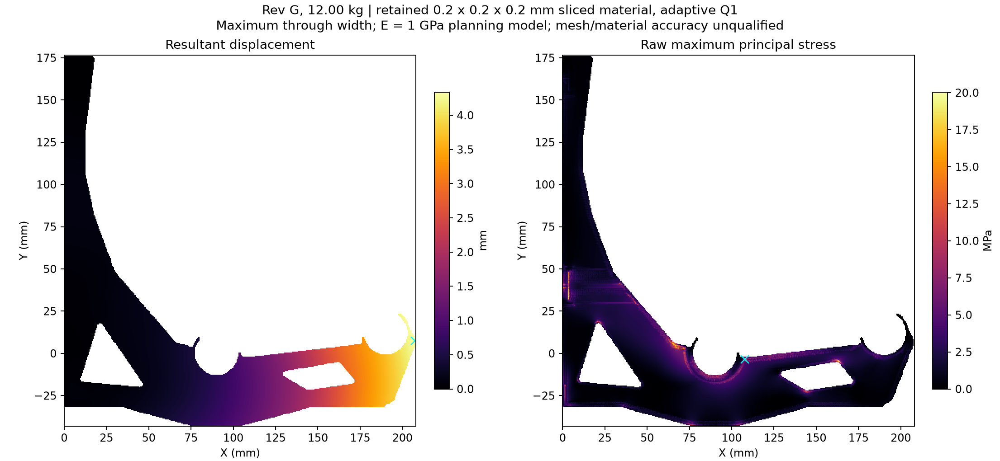

# Rev G: completed 3D contact screen, with explicit accuracy limits

The retained sliced-material model gives **4.3355 mm maximum bracket movement
and 20.0254 MPa raw peak tensile stress at 12 kg**. Wall contact has settled:
there is no penetration and every active wall reaction is compressive.
This is a useful numerical screen, not qualification of the printed bracket.
The 0.2 mm inscribed geometry omits **8.0177%** of the raw nominal plastic;
material/mesh convergence and measured warm material properties remain open.

[Detailed reference audit](g-results/reference-tight/audit.json) ·
[All reference iterations and stress-file hashes](g-results/g-contact-tight-v1/solve.json) ·
[Aligned G STEP and helper handoff](../../designs/rev-g2/g-recheck/2w-5layers/README.md).

## What the reference says

| Quantity, at 12 kg / 117.72 N | Result |
|---|---:|
| Maximum resultant bracket movement | 4.335477 mm |
| Front bearing, load-weighted vertical movement | -3.886728 mm |
| Rear bearing, load-weighted vertical movement | -0.522320 mm |
| Raw maximum principal tensile stress | 20.025374 MPa |
| Raw maximum von Mises stress | 17.554158 MPa |
| Compressive wall reaction | 236.424282 N |
| Active wall nodes | 6,426 |
| Minimum wall gap | 0 mm |
| Minimum active wall reaction | +0.0000003502 N |
| Relative force / moment balance errors | 2.95e-9 / 2.89e-9 |
| True relative free residual | 9.96e-7 |

The maximum movement occurs near the outer front lip at
(207.4, 7.4, 21.6) mm. The raw tensile peak is at the inner-seat/forearm
transition, sampled at (107.6423, -3.5577, 22.8423) mm. The plots project
maxima through width; the cyan crosses mark the actual reported maxima.
All **32,772,600 Gauss samples** in **4,096,575 leaves** remain in the raw
stress files. No finite cell or peak was removed for reporting.

Within this model, 4.3355 mm exceeds the provisional 4 mm bracket allocation
by 0.3355 mm. Adding the separate 1 mm rail/mount reserve gives 5.3355 mm
against the 5 mm total budget. Those reserves are not measurements. A nominal
fourfold fracture factor would require an applicable material/process
allowable of at least 80.10 MPa at this sampled peak; no such allowable or
fracture margin has been established here. Raw stress is not mesh-converged.

## Solver accuracy and the delay

The original trials demanded a 1e-10 relative CG residual before allowing
the first wall-contact update. The full model has 14,207,226 independent
degrees of freedom and a slow residual tail. The initial bilateral wall
restraint also included about 322 N of artificial tensile wall reaction,
which had to be released before its displacements could describe contact.

An explicit 1e-5 inner-solve tolerance let the contact loop complete in
28 steps / 734 seconds, including every final stress sample. A fresh check
at 1e-6, using a finer auxiliary coarse grid, took 72.45 seconds and kept
exactly the same contact set. The maximum change across **every original
mesh node** was **4.894e-7 mm**; the largest change across **every stress
component and Gauss sample** was **5.527e-5 MPa**. The raw tensile peak changed
by 1.505e-6 MPa. These are measured iteration sensitivities, not a certified
bound on the exact continuum solution.

These runs are explicitly labelled `CONTACT_SCREEN_AT_STATED_TOLERANCE_ERODED_MATERIAL_ONLY`.
They do not retroactively pass the original stricter solver gate. Earlier
failures remain failures. The coarse-grid comparison at 0.4 mm failed linear
convergence and provides no accepted mesh-sensitivity result.

A bounded retry of the original 1e-10 CG target after contact settled also
failed: 3,500 iterations left a 3.06e-6 true relative free residual.
Its complete fields are retained separately as a failed iterate. The stated
1e-6 screen and its measured quantity sensitivity are the basis of the
reference numbers above; this retry does not upgrade them to the original gate.

## Method and independent checks

The fine physics is the existing constrained adaptive Q1 operator `P.T K P`.
Eight-point integration retains every leaf. An auxiliary Galerkin coarse
space integrates its basis over the actual retained material using exact
polynomial moments, including fixed-DOF projection. It accelerates iteration
without adding physical material, gap bonds, or sacrificial bridge stiffness.
The tiny unloaded components remain in the fine operator; they receive no
coarse correction that could excite their unforced rigid modes.

PyAMG 5.3.0 builds the auxiliary hierarchy on CPU. The V-cycle, transfers,
symmetric smoothing, coarse inverse and surrounding CG run on CUDA. Six
rigid-body near-nullspace candidates follow the elasticity guidance in
[PETSc's solver manual](https://petsc.org/main/manual/ksp/) and
[PyAMG's aggregation documentation](https://pyamg.readthedocs.io/en/latest/generated/pyamg.aggregation.html).
[PyAMG's MIT license](g-results/PYAMG-LICENSE.txt) is included; Warp retains
its earlier verified Apache-2.0 provenance.

[Independent fixtures](g-results/coarse-fixtures/fixtures.json) compare the
coarse operator with a separately assembled scikit-fem operator on solid,
hollow, partial-contact and translated-grid cases; worst relative difference
is 2.69e-15. GPU preconditioner symmetry, positive quadratic forms and CPU/GPU
agreement pass. A long-beam GPU comparison reduces 580 iterations to 80 while
retaining agreement with an independent direct CPU solution.
[Contact fixtures](g-results/contact-fixtures/fixtures.json) cover opening,
closing, nonzero gaps, contact release and fresh changed-load solves with
displacement/contact warm starts. A zero-free-load normalization bug found
by that restart test was fixed; the failed attempt is retained in the ledger.

## What still limits interpretation

- The retained volume is 66,126.984 mm3 versus 71,890.970 mm3 of raw nominal
  material. Erosion is conservative in material amount; it is not a certified
  upper bound on every local stress or displacement. The constrained coarse
  leaves also need a mechanical refinement comparison.
- The mechanics input is the preserved historical two-wall/five-skin-layer
  Orca slice with three original 100% helpers and 0% base infill. The separately
  checked fresh P1S/PETG slice has not replaced this input. No calibrated
  PETG/ASA print-property claim follows from either slice.
- The constitutive law is isotropic E = 1,000 MPa, nu = 0.35. Printed bond
  anisotropy, warm creep, defects and material/process allowables are unmeasured.
- Washers and bores are idealized restraints, with unilateral wall contact
  and radial nonnegative seat loading. Fastener/substrate capacity, rail sag,
  mount slip, dowel fit and physical qualification remain separate work.
- The 0.025 mm boundary census is still geometry-only. It has not become a
  mechanically tested finer full-G mesh. No G2 architecture is built here.

The next method improvement must reduce and measure material/mesh error on
this completed contact problem. Preserved CPU meshing failures stay stopped.

## Reproduction and evidence

Install [requirements-coarse.txt](requirements-coarse.txt) in the isolated
analysis environment. Use the geometry/adaptive preparation commands from
[ADAPTIVE-MESH.md](ADAPTIVE-MESH.md), then run `gpu_demo_solve.py` with
`--coarse-ratio 8 --linear-rtol 1e-5 --true-residual-limit 1.01e-5` for the
initial contact screen. Pass the last saved `master_u.npy` and
`active_wall_indices.npy` with `--initial` and `--initial-active` for a fresh
check at `--coarse-ratio 4 --linear-rtol 1e-6 --true-residual-limit 1.01e-6`.
Each output directory must be new. Omitting tolerance options retains the
original strict defaults. `report_gpu_g.py` audits saved fields and compares
all samples without altering them.

The published JSON reports contain every computed stress-file hash. Large
raw arrays, complete contact states, original failures and caches remain
preserved locally; they are not all embedded in Git. The evidence manifest
records their relative names, sizes and hashes. No CAD was changed: the
existing G body and all three aligned helper exports remain the handoff.
