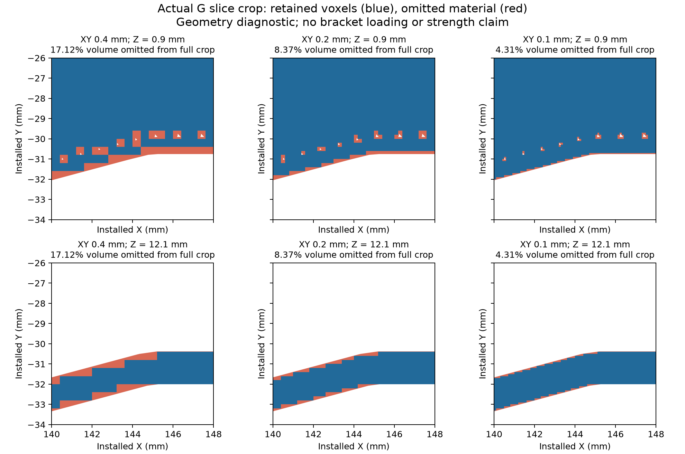

# GPU execution checkpoint: tested backend, unresolved whole-G material fidelity

September 11, 2026. **Warp now runs on the actual RTX 3080 Ti.** An upstream
elasticity example, independent 3D numerical fixtures and a manufactured patch
test on G's raw sliced material have been completed. The conservative voxel
geometry still removes too much material to accept as the corrected bracket.
No whole-G GPU load/contact solve, 3D strength margin or G2 architecture is
accepted. The stopped whole-part CPU meshing jobs remain stopped.

## Selected software and reproducible installation

Selected [NVIDIA Warp 1.17.0](https://github.com/NVIDIA/warp/releases/tag/v1.17.0),
whose [source license](https://github.com/NVIDIA/warp/blob/f4c57f26f1e3936a89afd283e39fcabf6d548dc7/LICENSE.md)
is Apache-2.0. The installed wheel includes its own third-party license notices;
this project does not redistribute that runtime. No commercial solver license
or trial is used. The installed wheel JIT compiles the GPU kernels successfully
under WSL2 on the RTX 3080 Ti, 12 GiB, driver 616.92. This is a tested wheel/JIT
installation, **not a source build of the Warp runtime**.

The wheel's elasticity example SHA-256 matches the tagged upstream source at
`f4c57f26f1e3936a89afd283e39fcabf6d548dc7`. Exact environment versions and source
hashes are in [environment.json](gpu-validation/environment.json).

The reviewed DTU snapshots remain useful research references:
[OpenMP GPU](https://github.com/topopt/TopOpt-in-OpenMP-GPU/tree/b46ed453ad5a05818b563e540ce176c9d85c6fe2)
and [Futhark](https://github.com/topopt/futtop/tree/c3cd2b00632ad57cd3d8917246552b2fb4e99e01).
Neither tree contained a license/COPYING file, and neither repository's GitHub
metadata advertised a license in the current inspection. Reuse permission was
not established, so neither was installed or incorporated. No conclusion about
permission should be inferred from public download availability.

Use an isolated environment with [requirements-gpu.txt](requirements-gpu.txt).
The earlier CAD/meshing environment and its caches are unchanged. These commands
run from the repository root, with a working CUDA device exposed to Python:

```sh
python3 -m venv .work/gpu-venv
.work/gpu-venv/bin/python -m pip install -r analysis/rev-g2/requirements-gpu.txt
.work/gpu-venv/bin/python analysis/rev-g2/gpu_benchmark.py --cg-tol 1e-10 --output analysis/rev-g2/.work/gpu-replay/upstream-tight
.work/gpu-venv/bin/python analysis/rev-g2/validate_gpu_hex.py --output analysis/rev-g2/.work/gpu-replay/fixtures
.work/gpu-venv/bin/python analysis/rev-g2/gpu_material_probe.py --h .4 .2 .1 --output analysis/rev-g2/.work/gpu-replay/material
```

Python 3.11.15 was used for the recorded run. The GPU adapter rejects a CPU
device; it does not silently fall back. Run measurements sequentially. Logs
and original failed attempts remain locally in `.work/gpu-route/logs`.

## Upstream elasticity benchmark

The upstream [mixed-elasticity example](https://github.com/NVIDIA/warp/blob/f4c57f26f1e3936a89afd283e39fcabf6d548dc7/warp/examples/fem/example_mixed_elasticity.py)
is a **2D nonlinear** problem, not 3D bracket elasticity. Its 25-by-25 grid uses
degree-two displacement, imposed displacement 0.1 and Poisson parameter 0.5.
The wrapper leaves the upstream file unchanged and explicitly overrides the
linear solver tolerance to `1e-10`. That override is part of the result.

The [accepted backend comparison](gpu-validation/upstream-tight.json) retains
[both CPU/GPU displacement and upstream stress coefficient fields](gpu-validation/upstream-tight.npz).
Relative L2 differences are **3.24e-6 in displacement** and **7.31e-6 in stress**,
both below the original `1e-4` comparison gate. This is a backend regression,
not independent physical validation of the upstream nonlinear problem.

The first measured GPU call took 0.407 s including setup and available cached
JIT work; the subsequent synchronized step took **0.0985 s**. The Warp CUDA
allocation-pool high water was **20.7 MiB**. Device-wide sampled memory peaked
at **1,350.2 MiB**, including the CUDA context, display and unrelated allocations.
These are different memory measures. Sampling is every 20 ms and can miss
short-lived peaks; the allocator high-water counter is not sampled. CPU timing
includes its own initialization/cache behavior, so no controlled speedup ratio
is claimed. Crop timings below do not predict a bracket solve.

Two default-tolerance comparisons failed the original stress-agreement gate:

- [Default material/load](gpu-validation/failures/default-tolerance/upstream.json):
  stress relative L2 difference `2.372e-4`; full fields retained.
- [Severe near-incompressible case](gpu-validation/failures/near-incompressible.json):
  displacement -0.5, Poisson parameter 0.99, stress difference `5.125e-4`;
  full fields retained. It has not been qualified by the accepted default-case run.

The upstream helper defaults to CG tolerance `1e-4`. Tightening that solve
tolerance resolved the default-case comparison without loosening the acceptance
gate. Neither failed output is substituted for the accepted result. The
upstream stress coefficients are retained exactly as its example produces
them; they are not used as bracket stress or material allowables.

## Independent 3D adapter tests

[gpu_hex.py](gpu_hex.py) implements matrix-free, uniform rectangular Q1
hexahedral linear elasticity using Warp GPU kernels and Warp's CG solver.
The common element matrix is integrated at eight Gauss points; the GPU applies
it without assembling a whole-model stiffness matrix. Preconditioning is
diagonal/Jacobi. **There is no multigrid yet.** Mesh construction and contact
active-set decisions run on the CPU; elasticity operator application, CG vector
work and stress recovery run on the GPU in float64.

The [fixture report](gpu-validation/hex-fixtures.json) passes:

| Check | Measured result |
|---|---:|
| General affine strain, analytic stress | maximum error 1.14e-12 MPa |
| Random displacement: GPU operator vs independently assembled scikit-fem Q1 operator | relative difference 3.00e-16 |
| Translation / infinitesimal rotation | internal force norms below 3e-13 N |
| Hollow beam, 0.4 mm walls / two cells through wall | GPU vs independent direct CPU displacement error 2.44e-13 relative |
| Hollow beam force / moment errors | 1.11e-12 N / 2.90e-12 N mm |
| Nonzero-gap contact | analytical open, close, touching, exact touch and release cases pass |
| Face / edge / corner connectivity | shared face bonds; edge-only and corner-only touches have separate nodes |

The hollow fixture has 400 material cells and zero cavity elements. Its
1 N bending diagnostic solves in about 0.025 s with 140 CG iterations.
All 3,200 finite stress samples, displacement, force, reaction, volumes and
independent CPU displacements are in [hollow-bending.npz](gpu-validation/hollow-bending.npz).
The analytic contact fixtures use an actual 3D bar, not just a scalar spring;
their full fields are in the five `contact-*.npz` files alongside the report.

The first fixture run stopped at an incorrectly written expected cell count
(320 instead of `10 * (8*6 - 4*2) = 400`). It had already passed its elasticity
comparisons. Its [incomplete report and fields](gpu-validation/failures/fixture-count)
remain preserved; the corrected completed run is the accepted fixture report.

No void or sacrificial bridge cell receives stiffness. Nodal connectivity is
split locally when material cells touch only on an edge/corner, even if the
same material connects elsewhere. All eight unaveraged stress samples in
every retained cell are exported. Reported raw peaks are maxima over those
samples, not percentiles, nodal smoothing or bounds on unsampled continuum
stress. No cell is deleted based on its stress.

## Actual G sliced-material crop and resolution limit

The input is the preserved **raw** two-wall/five-skin-layer cache, not its
closed/simplified continuum. The crop is installed X=140..148 mm,
Y=-34..-26 mm, Z=0..24 mm. Its raw slice volume is **415.626717 mm3**.
Source hashes are recorded. This is a geometric footprint volume, not extrusion E.

The [mapper](gpu_material_probe.py) retains a voxel only when its entire XY
rectangle is covered by **every** raw slab crossing its Z interval. It never
uses centroid occupancy, closes gaps or gives voids fractional stiffness.
The synthetic bridge-only connector is excluded through the existing
`layer_shapes` routine, and the mapped beads remain two disconnected components.
The separately preserved G-code validation establishes the real bridge mask.

| XY / Z grid, mm | Retained cells | Retained volume, mm3 | Omitted raw material | GPU patch solve, s |
|---|---:|---:|---:|---:|
| 0.4 / 0.2 | 10,765 | 344.480 | 17.12% | 0.051 |
| 0.2 / 0.2 | 47,606 | 380.848 | 8.37% | 0.101 |
| 0.1 / 0.2 | 198,853 | 397.706 | 4.31% | 0.437 |



The finer crop has 232,445 nodes and a CUDA allocation-pool high water of
**117.2 MiB**. Mapping took 0.705 s and CPU topology construction 7.660 s.
The GPU solve took 200 CG iterations. Its complete
[fields](gpu-validation/refinement/g-crop-h0p1.npz) retain all 1,590,824 Gauss
stress samples, every cell, applied/prescribed data, reactions and geometry.
[Combined coarse reports](gpu-validation/material-probe.json) and
[fine report](gpu-validation/refinement/material-probe.json) include all timings.

These are **manufactured patch tests**: a known affine displacement is imposed
on all material surfaces of the crop, including cavity and cut surfaces, with
interior nodes solved freely. This also supports disconnected particles for
the analytic test only; none are silently discarded. Maximum stress error is
below 2e-8 MPa at all three grids. These boundary conditions make a controlled
operator/mapping check; they are not G's seat, washer, bore or wall conditions.
They do not establish long-beam CG performance or contact at bracket scale.

**The conservative grid is not accepted for whole-G mechanics.** Even the
0.1 mm XY grid removes 4.31% of this crop, concentrated at boundaries and small
pores. A volume difference cannot bound local stress or movement errors, and
the crop cannot establish full-part connectivity. Refinement improves the
geometry but does not demonstrate a converged bracket response.

## Next work and retained gates

1. Resolve thin-path boundary representation with a bounded adaptive/cut-cell
   experiment that preserves disconnected material and actual face bonding, or
   demonstrate adequate full-voxel geometric and mechanical convergence.
2. Establish a practical preconditioner and runtime/memory behavior for a long,
   thin bending problem before scaling to the bracket. Small affine patch
   solves with many prescribed surface nodes are insufficient evidence.
3. Adapt and verify G's actual seat loads, 3.6 mm washer plane, bore restraints
   and nonzero-gap wall contact. Then solve the 117.72 N reference, refinement
   and changed-spool load with all force/moment/stress gates.
4. Only after corrected G feedback, implement the seven preparatory G2
   families and their aligned body/helper STEP checkpoints.

The current [print download index](../../PRINT-CANDIDATES.md) is unchanged in
candidate count: eight earlier implemented handoffs and five G slicing
schedules. This checkpoint adds solver evidence, not a printable architecture.
Measured material/process, creep, dowel fit, rail/mount behavior and physical
qualification remain outstanding. No released spool rating follows from this work.
