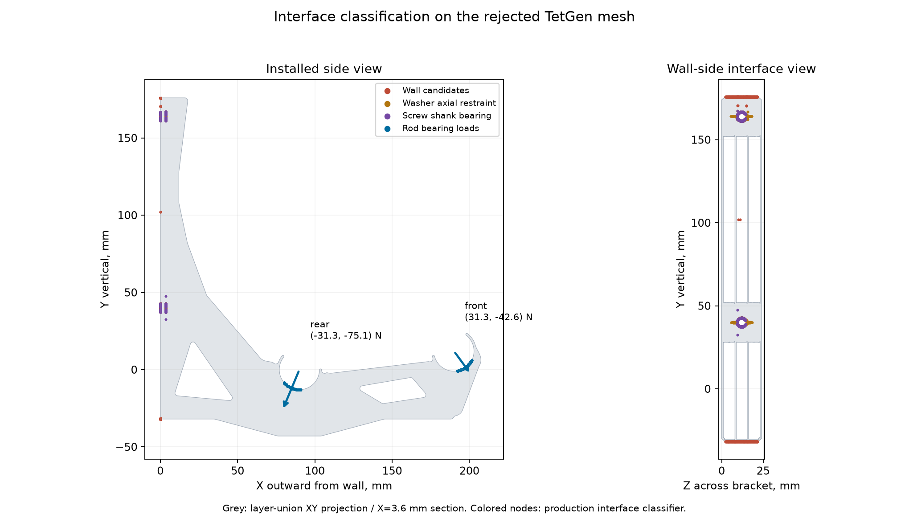

# G2 prerequisite: correct the sliced-material model

**The five-case shape validation is complete; corrected G mechanics is still
in progress. No accepted G2 architecture exists yet.**
[Restart handoff and current results](../../RESTART-2026-09-11.md).
[Completed G contact screen](G-RESULTS.md): 4.3355 mm maximum movement and
20.0254 MPa raw peak tensile stress at 12 kg. A tenfold tighter numerical check
changes no nodal movement by more than 4.894e-7 mm. This remains an eroded-material
screen with 8.02% material omission, not a qualified printed-part result.

[Adaptive mesh checkpoint](ADAPTIVE-MESH.md): verified coarse/fine constraints
halve the protected whole-G 0.2 mm mesh. Both bounded full-G GPU solves failed
equilibrium convergence. A separate boundary census reaches 0.025 mm XY with
1.10% omitted raw plastic; multilevel grading and mechanics remain unfinished.
The fresh P1S/PETG slice, priming accounting and independently checked raw shape
remain distinct from the historical neutral input used in those GPU trials.
[GPU execution and validation checkpoint](GPU-VALIDATION.md): Warp now runs on
the RTX 3080 Ti and passes independent small 3D fixtures plus manufactured patch
tests on a raw G slice crop. Conservative voxel material loss remains 4.31%
even at 0.1 mm XY spacing in that crop. No full-G GPU result is accepted.
[G2-BRIEF.md](../../G2-BRIEF.md) defines the broader study. E13 and G files
remain unchanged.

The new [plastic_shape.py](plastic_shape.py) reads actual extrusion paths,
widths, heights and E values. It excludes 0.4 mm bridge paths from structural
material while retaining their full plastic use. The two-wall, five-layer
reference has 77.9203 cm³ spent plastic, including 6.9405 cm³ of thick bridges;
70.9798 cm³ is credited extrusion. The nominal continuous footprint volume
differs from the extrusion accounting and is reported separately.

The five actual Orca cases are two/eight walls crossed with two/eight top and
bottom layers, plus the two-wall, five-layer reference. Base infill is zero;
the original three helpers remain at 100%. The minimum is two walls. A prior
one-wall diagnostic is not the current reference.


## Completed checks

[Independent shape validation](validation/matrix-shape-validation.md) uses
analytical distances to every potentially covering variable-width capsule,
independent of the cached polygon union. All 50,000 occupancy samples agree
outside a 0.005 mm polygonization band. Through-thickness differences remain
within the independently computed sum of boundary-uncertain layer heights.
The sample set includes the old hotspot and thousands of occupied points
per case. This is a geometry check, not a mechanical acceptance result.

The [process audit](validation/process-matrix.json) verifies effective wall
counts, both shell layer counts and minimum thicknesses, zero base infill,
the three 100% helper modifiers, unchanged source hashes and P1S bed/exclusion
clearance. The neutral process is not a calibrated PETG/ASA print profile.

| Schedule | Credited E volume, cm³ | Sacrificial bridge volume, cm³ | Nominal structural footprint union, cm³ | Exact slice archive |
|---|---:|---:|---:|---|
| 2 walls, 2 skin layers | 60.374 | 6.901 | 61.394 | [ZIP](../../designs/rev-g2/g-recheck/2w-2layers/slice-evidence.zip) |
| 2 walls, 5 skin layers | 70.980 | 6.940 | 71.891 | [ZIP](../../designs/rev-g2/g-recheck/2w-5layers/slice-evidence.zip) |
| 2 walls, 8 skin layers | 81.248 | 6.928 | 82.058 | [ZIP](../../designs/rev-g2/g-recheck/2w-8layers/slice-evidence.zip) |
| 8 walls, 2 skin layers | 103.417 | 5.060 | 104.686 | [ZIP](../../designs/rev-g2/g-recheck/8w-2layers/slice-evidence.zip) |
| 8 walls, 8 skin layers | 119.736 | 5.090 | 120.770 | [ZIP](../../designs/rev-g2/g-recheck/8w-8layers/slice-evidence.zip) |

Total spent plastic is credited E plus sacrificial E. Footprint volume is a
separate geometric quantity. Each archive retains exact G-code, audit 3MF,
effective settings and slice result, with a hash manifest referencing G's
published geometry. [Archive verification](validation/slice-archive-audit.json).

The reference cache loads in 1.57 s and answers 10,000 occupancy queries in
0.064 s; 4,000 through-thickness queries take 0.108 s. Across the five cases,
cache loads take 1.10–2.28 s. These are recorded timings on the analysis
machine, not universal performance guarantees. Creating a new shape requires
an actual slice and the one-time path/polygon build.

The new `integrated_volume(regions)` API computes credited material volume
within supplied XY polygons by exact polygon intersections through the layer
stack. It passes independent two-slab analytic fixtures, including different
raw/continuum geometry, empty regions and overlapping queries. The whole G
projection agrees with the cached volume within 0.000000021 mm³.
[API validation](validation/integrated-volume-api.json).

For a constant-strain P1 triangle, this integration also supplies its exact
material-weighted stiffness under the reduced plane-stress assumptions. The
new [reduced recheck](reduced_plastic.py) retains all 37,985 coarse triangles;
it introduces no stiffness at empty sample points. Exact integration took
50.5 s for that mesh and is cached for reuse. The reduced model collapses
the washer plane and through-width deformation, so it remains a ranking
diagnostic pending the 3D comparison.

## Corrected 3D mechanics: unresolved

The [archived comparison](g-slicer-mapping/comparison.json) checks G's saved h1
finite cells against its original emitted paths. It is diagnostic only.
The new reference's layer-derived material forms one connected structural
component without thick-bridge credit. TetGen boundary recovery now reproduces
the continuum volume and all 39 enclosed voids. The
[independent mesh audit](validation/mesh-audit-tetgen-boundary-only.json)
still rejects that mesh for topology/quality. A bounded-envelope mesher passed
the [hollow-box fixture](validation/ftetwild-hollow-box-h1.json). The two long G
jobs were stopped without a mesh. The [tested GPU route](GPU-VALIDATION.md)
now replaces solver discovery; material fidelity and whole-part scaling remain
open. [Earlier GPU alternatives](GPU-FEM-REVIEW.md) and
[meshing attempts, rejected results and sources](MESHING-NOTES.md).



The colored nodes in this diagram come directly from the production interface
classifier. Its grey geometry is the layer projection and washer-plane section.
This checks interface placement on a rejected diagnostic mesh. The actual
contact routine separately passes analytic opening, closing, touching and
release fixtures; elastic assembly and stress recovery pass affine and rigid-
motion checks. [Numerical fixtures](validation/mechanics-fixtures.json).

The raw nominal footprint reference is retained separately from continuum
meshing experiments. Those experiments explicitly report gap closing,
sub-bead void homogenization, coordinate precision and geometric differences.
The path representation has passed the wall/skin geometry validation. The
mechanical recheck is incomplete. Do not equate a manifold surface, a
successful slice or a coverage check with a verified stress result.

## Reproduce the current work

Use the established [analysis environment](../e13/requirements.txt) plus
[the additional dependency](requirements-extra.txt). Native scripts run through
G's unchanged worker. `slice_matrix.py` runs in Orca's installed environment.

```text
python designs/rev-g2/prepare_g_recheck.py --case 2w-5layers
python designs/rev-g2/prepare_g_recheck.py --case 8w-2layers
python designs/rev-g2/prepare_g_recheck.py --case 2w-8layers
python designs/rev-g2/prepare_g_recheck.py --case 2w-2layers
python designs/rev-g2/prepare_g_recheck.py --case 8w-8layers
python designs/rev-g2/slice_matrix.py /path/to/OrcaSlicer
python analysis/rev-g/run_native.py analysis/rev-g2/plastic_shape.py designs/rev-g2/g-recheck/2w-5layers/.work/audit-2w analysis/rev-g2/g-recheck/2w-5layers/validated-shape
python analysis/rev-g/run_native.py analysis/rev-g2/validate_plastic_shape.py analysis/rev-g2/g-recheck --source-root designs/rev-g2/g-recheck --samples 10000
python analysis/rev-g/run_native.py analysis/rev-g2/mesh_plastic.py --validate-hollow-box --output analysis/rev-g2/validation/ftetwild-hollow-box-h1 --h 1 --backend ftetwild --epsilon-mm .01
```

Repeat the `plastic_shape.py` command for the other four case directories
before the matrix validator. To replay the archived slices without reslicing,
extract each ZIP into its case's `.work/audit-2w` or `.work/audit-8w` directory.
The two-wall, five-skin-layer [reference cache](g-recheck/2w-5layers/validated-shape/layers.json.gz)
is included; other caches are rebuildable from the archived inputs.

```python
import sys
sys.path.insert(0, 'analysis/rev-g2')
from plastic_shape import PlasticShape

shape = PlasticShape.load('analysis/rev-g2/g-recheck/2w-5layers/validated-shape')
inside = shape.contains([[145., -30., 23.2]])
thickness_mm = shape.equivalent_thickness([[145., -30.]])
section = shape.section(23.2)
```

The shape tool produces path data, compressed per-layer raw and simplified polygons,
separate spent/credited volume accounting and optional structural STL/mesh.
These are analysis artifacts. Printing uses the original body and modifiers,
with a separately selected and calibrated P1S PETG or ASA process.
