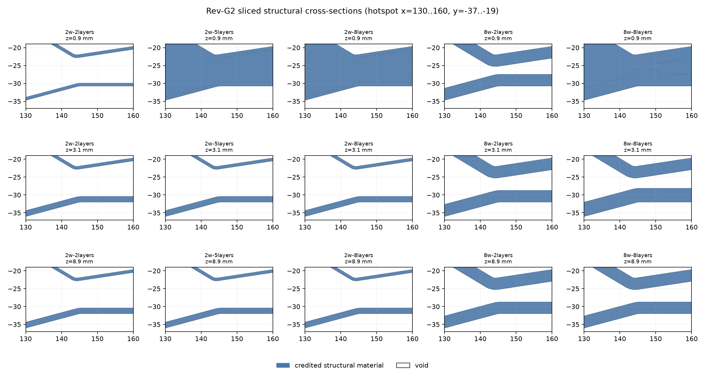

# Rev-G2 slicer-backed shape matrix

The five actual Orca audit slices were rebuilt with `plastic_shape.py --simplify-mm .01` and loaded through `PlasticShape.load`. Structural occupancy uses credited paths only; thick bridge paths remain in the spent-plastic ledger and receive zero stiffness, strength, and bonded-connection credit. No sparse-infill paths were present in any case.

| case | paths | credited E (mm³) | thick bridges (mm³) | cached raw union (mm³) | capsule mismatches outside 0.005 mm |
|---|---:|---:|---:|---:|---:|
| 2w-2layers | 204466 | 60373.79 | 6901.28 | 61393.75 | 0 |
| 2w-5layers | 214373 | 70979.80 | 6940.47 | 71890.97 | 0 |
| 2w-8layers | 221924 | 81247.88 | 6928.30 | 82057.76 | 0 |
| 8w-2layers | 337125 | 103417.43 | 5060.14 | 104686.25 | 0 |
| 8w-8layers | 360326 | 119736.00 | 5089.80 | 120769.74 | 0 |

The independent variable-width capsule oracle used 10,000 samples per case: global bounding box, the requested `(130..160, -37..-19)` hotspot, and near-active-path samples. Cache occupancy agreed for all sampled points outside the active-layer 0.005 mm boundary band; each case contained thousands of positive occupancy samples. Independent integrated-thickness checks passed `actual error <= sum(layer heights where oracle margin <= 0.005 mm)` with zero residual outside that computed uncertainty band. Cache-load and query timings are in `matrix-shape-validation.json`.

This is a geometry and accounting validation only. It does not establish stiffness, strength, print quality, or a physical acceptance result.
