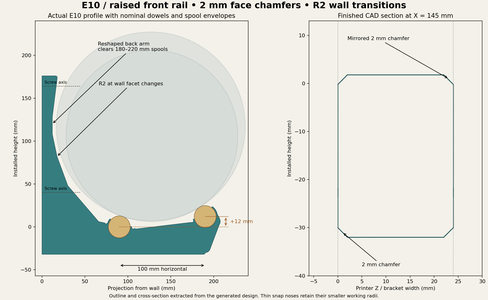
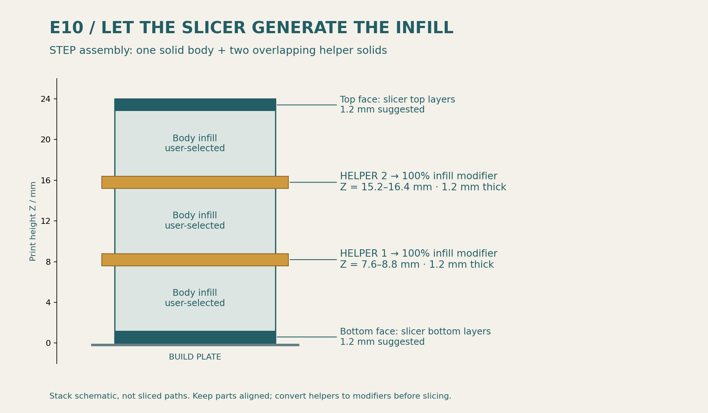

# E10 — running prototype with front rail raised 12 mm

**[Download the STEP assembly](bracket-with-modifier-helpers.step)** — one solid CAD body and two aligned 1.2 mm helper solids. Import as aligned parts of one object, then convert the helpers to 100% infill modifiers.


## Geometry changes

- Rear / front rail centers: (90, 0) and (190, 12) mm in installed side coordinates.
- Both broad faces use **2 mm chamfers**, mirrored about the bracket width midpoint. Chamfers stay at full depth through structural corner blends and taper only at the thin retainer regions. Side-profile fillets are formed first; face chamfers follow.
- Exposed body facets join with **nominal R2 fillets**. Snap noses keep their smaller functional radii; the wall-contact strip retains square end contact corners.
- Reshaped the back arm inward to clear the rearward-shifted spool while keeping full-height wall contact. The tight middle portion is 12 mm deep in projection.
- Reoriented both retainers to the raised-rail spool contact directions. The rigid bearing sectors oppose the contact points and the spool tracks remain exposed.
- Carried the raised front-seat buttress down to the original arm base, eliminating the disconnected-looking bottom stub. The underside stays at Y = −32 mm; the front region gains depth.
- Retained 3.6 mm screw landings, Ø5.2 mm shank clearance and Ø16 mm nominal access, with axes at Y = 164 and 40 mm.



## Geometry verification

The STEP roundtrip contains three valid solids. Body and helper STLs pass edge-closure checks. Ø15.8 mm straight driver, Ø13 mm washer and M5 nominal-shank envelope checks pass at both fixings.

The nominal 180–220 mm flange sweep, including the seat-clearance radius sensitivity, has **3.93 mm minimum clearance** over 322 evaluated cases. The finish verification samples full-depth segments around the structural outline, including the pre-existing corner blends, on both faces. Sampled body-facet arcs deviate from the nominal R2 construction by less than 0.001 mm in the exported profile; the STEP profile simplification tolerance is 0.005 mm.

The check includes 726 material probes over 121 full-depth outline segments and eight near-face probes confirming the thin fingers retain material. Both coupons preserve the full 24 mm width. The STEP remains a valid CAD solid; the STL cleanup closes four microscopic tessellation triangles without modifying the STEP. [Tessellation audit](stl-tessellation-check.json).

[Finished geometry checks](engineering-verification.json) · [STEP/helper/hardware checks](verification.json) · [Chamfer edge specification](finish-specification.json).

## Print setup

| Setting | Prototype value |
|---|---|
| Orientation | Supplied broad side down; do not separate or auto-arrange helper parts |
| Layers | 0.20 mm, including first layer for band alignment |
| Body infill | 15%; zero structural credit in analysis |
| Exterior solid faces | 1.2 mm top and 1.2 mm bottom, six layers each |
| Helper bands | Z 7.6–8.8 and 15.2–16.4 mm, each set as a **100% infill modifier** |
| Walls | PLA 8 / PETG 10 as prototype starting points; inspect actual toolpaths |
| Wall-count reference | 0.4 mm nozzle, 0.42 / 0.45 mm assumed outer / inner widths |
| Filament process | Exact manufacturer's grade profile, with verified flow and bonding |



STEP stores geometry and alignment, not slicer settings. The helpers must not become separately printed slabs. Inspect all four solid bands, perimeters under the rear seat, full screw-landing material and printable access roofs. The main CAD body is solid so the slicer can generate the selected infill.

If STEP components do not import correctly, use [body-only.stl](body-only.stl), [helper-1.stl](helper-1.stl) and [helper-2.stl](helper-2.stl) as aligned parts of one object.

## Engineering status

E10 is the running geometry prototype. The [E9 FEM and creep guide](../../analysis/e9/RESULTS.md) is a prior-finish baseline; the changed chamfers have not been re-solved as E10. No physical rod fit or creep qualification has been performed.

The nominal 26.0 mm seat is provisional. See the [dowel source check and fit coupons](../../fit/README.md). A published 1-inch catalog diameter does not establish a minimum/maximum production tolerance.

Serviceability criteria remain **5 mm total movement at full load and 1 mm change per full spool added or removed**. The 12 kg equivalent per-bracket case and 85°F sustained / 100°F for six hours per year remain analysis targets, not a released load rating.

## Rebuild

From this directory, with OpenSCAD and the Python CAD dependencies:

```sh
openscad -o profile.svg -D 'part="profile"' bracket.scad
python build_step.py
python repair_stl.py
python verify_step.py
python verify_engineering.py
python render_cpu.py
python draw_engineering.py
python draw_helpers.py
```
