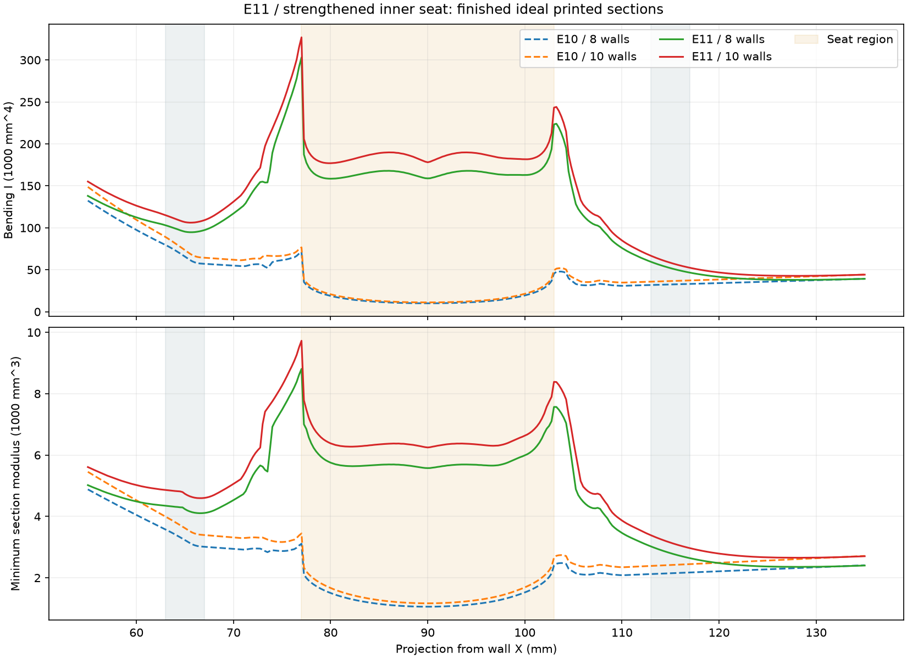
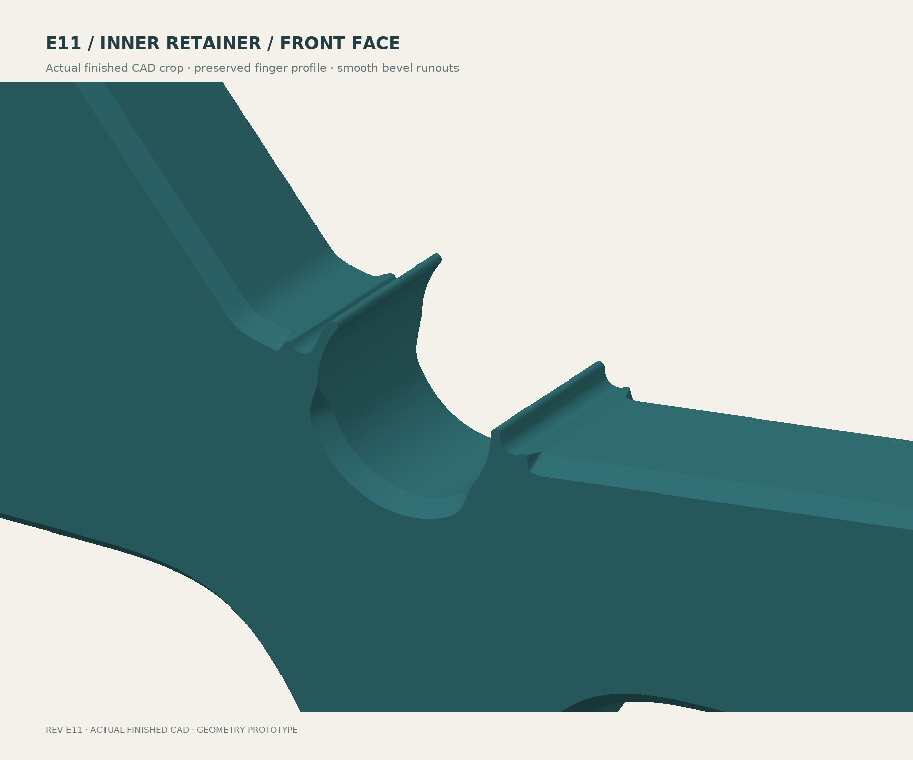

# E11 — reinforced inner seat and mirrored 50° finish

**[Download STEP with aligned helpers](bracket-with-modifier-helpers.step)** ·
[Current print guide](../../README.md) · [New E11 FEA](../../analysis/e11/RESULTS.md)


The inner seat now has a smooth 38 mm underside reinforcement, approximately
57 mm center section depth and R6 rigid-shoulder blends. The finished ideal
printed section exceeds both adjacent plain-arm reference bands: minimum
bending-I ratios are 1.539 on the wall side and 2.658 on the outer side; minimum
elastic section-modulus ratios are 1.282 and 1.846. These are local geometric
comparisons, not rupture or lifetime ratings.




Both broad faces retain a 2 mm inset and rise 2.384 mm at **50° above the bed**.
Independent STEP material probes measure 50° on each side. Structural corner
blends retain full chamfer depth; the bevel tapers only before thin retainers.
The rear/front centers remain (90,0)/(190,12) mm.

## Finish and fingers



[Inner reverse face](finish-inner-reverse.png) ·
[Outer retainer](finish-outer-front.png) · [Outer reverse face](finish-outer-reverse.png).

The four flexible-finger sectors match E10 at nine print depths, within the
documented 0.025 mm STL comparison tolerance. Their functional 1.35 mm nominal
thin sections, rounded noses, relief pockets and root transitions are preserved.
The CAD comparison is independent of the eight material-presence probes in the
finish check. Physical insertion force and retention are not measured.

The 322-case nominal 180–220 mm spool sweep gives 3.927 mm minimum clearance.
The delivered STEP has one valid main body plus two valid helpers. Both driver,
washer and nominal M5 shank envelopes clear; both lands retain their support.

[STEP/hardware checks](verification.json) · [Finish and clearance probes](engineering-verification.json) ·
[Full finger comparison](final-finish-verification.json) · [Build record](build-verification.json).

The STLs are closed single components. Welding exporter-created near-coincident
vertices moves them by at most 0.00005 mm and discards collapsed triangles; it
does not modify the STEP. [Tessellation audit](stl-tessellation-check.json).

## Slicing

Import as **one object with three aligned parts**. The main CAD body is a solid
envelope for slicing, not an instruction to print it at 100%.

| Setting | Working value |
|---|---|
| Orientation | Supplied broad side down |
| Body envelope | 207.51 × 246.00 × 24 mm; check bed exclusions |
| Layer / first layer | 0.20 / 0.20 mm |
| Body walls | PLA 8 / PETG 10 as prototype starting points |
| Reference nozzle and outer/inner line widths | 0.4 mm; 0.42 / 0.45 mm |
| Wall generator / solid-region gap fill | Arachne / Everywhere |
| Body infill | 15%; zero structural credit |
| Exterior solid faces | 1.2 mm each, six layers |
| Helper bands | Z 7.6–8.8 and 15.2–16.4 mm |
| Helper treatment | Convert each to a **100% infill modifier** |


Keep helpers aligned and do not print them as separate exterior slabs. STEP
does not store modifier status, wall count or filament settings. The helpers
extend 2 mm past the body bounds; this overlap is intentional.

If the STEP importer cannot preserve components, import these as aligned parts:
[body-only.stl](body-only.stl), [helper-1.stl](helper-1.stl), [helper-2.stl](helper-2.stl).
`body-mounted.stl` uses installed engineering axes and is not the oriented print fallback.


Actual OrcaSlicer 2.4.2 8/10-wall audits pass with 120 layers. The 24 intended
solid-band layers pass the inner-seat footprint test; the sampled full L-planes
and seat walls also pass. The minimum seat-band footprint coverage is 99.79%,
with a documented 0.03 mm rounding/tessellation allowance.
Sampled flexible-finger coverage exceeds 99.84%. Arachne variable-width walls
fill the small nose pocket found in the initial classic-wall audit, preserving
the delivered CAD. Solid-region gap fill is set to Everywhere; see
[Orca's setting documentation](https://github.com/OrcaSlicer/OrcaSlicer_WIKI/blob/main/print_settings/strength/strength_settings_infill.md).
[Numerical toolpath evidence](toolpath-verification.json).

The audit uses equivalent whole-object height ranges for the two full-plane
helpers. It verifies the intended material paths, not a particular STEP-importer
interaction. Neutral audit profiles/G-code stay local and are not calibrated
print deliverables. Use the intended grade's temperature, cooling and flow;
inspect actual band support, bonding, access roofs and fingers before printing.

## Rebuild and verify

Use OpenSCAD and the Python packages in [the analysis environment](../../analysis/e11/requirements.txt).
From this directory:

```sh
openscad -o profile.svg -D 'part="profile"' bracket.scad
python build_step.py
python repair_stl.py
python verify_step.py
python verify_engineering.py
python verify_sections.py
python final_finish_check.py
python render_cpu.py
python draw_engineering.py
python draw_helpers.py
python slice_audit.py 8 /path/to/orca-slicer
python slice_audit.py 10 /path/to/orca-slicer
python inspect_toolpaths.py
```

Section and finger comparisons require the preserved E10 mounted STL.
`repair_stl.py` is a narrowly bounded tessellation repair, not a CAD repair.
The build copies shapes before meshing and verifies the delivered STEP on reimport.

The new [E11 numerical report](../../analysis/e11/RESULTS.md) includes matched
E10/E11 reduced models, 8/10-wall 3D refinement, washer-compression refinement,
updated material coefficients and explicit creep sensitivities. Exact rod fit,
printing, snap behavior and sustained/hot load qualification remain unperformed.
