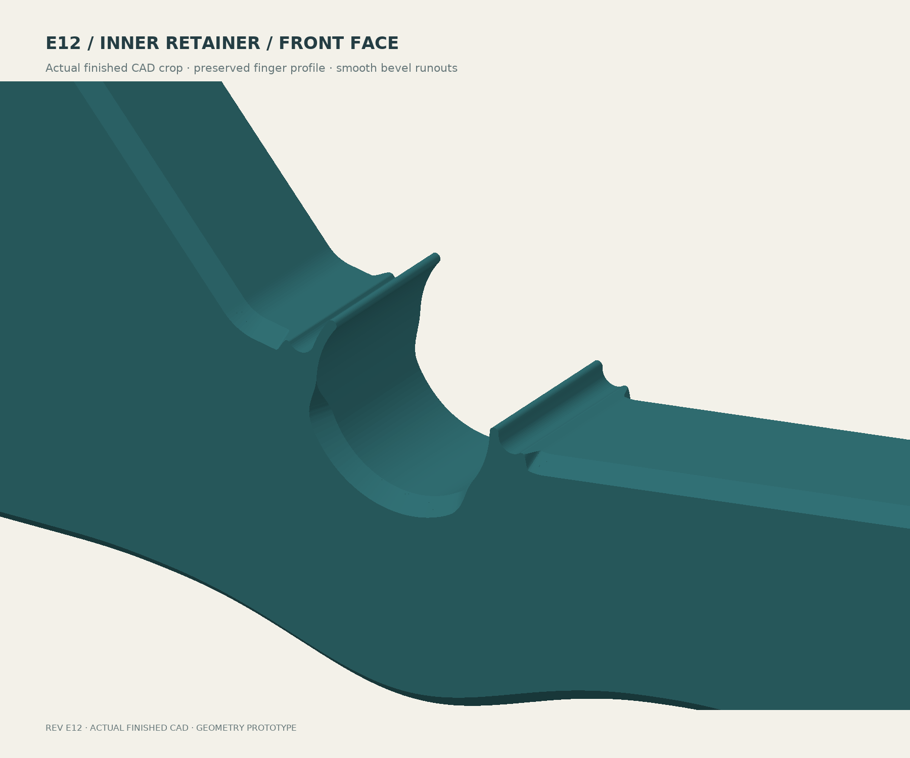

# E12 — quarter-depth inner seat

**[Download STEP with aligned helpers](bracket-with-modifier-helpers.step)** ·
[Current print guide](../../README.md) · [Current FEA](../../analysis/e12/RESULTS.md)


The added underside depth is **9.5 mm**, one-quarter of E11's 38 mm and below
the 12.67 mm maximum. It forms a shallow, broader blend. The inner center
section is about 28.5 mm deep; the overall body is **207.51 × 217.50 × 24 mm**.
No strain-relief holes were added. E12 does not inherit E11's claim of exceeding
both adjacent arms; [the section audit](section-verification.json) reports the
lower margin and the improvement over E10.


## Finish and validation

The R6 rigid shoulder blends, fingers, relief pockets and hardware are preserved.
The 2 mm face inset has a 2.384 mm rise: **50° above the bed on both faces**.
Runouts remain limited to the thin retainers. The four flexible sectors match
E10 at nine depths within the documented 0.025 mm STL tolerance.



[Inner reverse](finish-inner-reverse.png) · [Outer front](finish-outer-front.png) ·
[Outer reverse](finish-outer-reverse.png).

The STEP reimports as one valid body and two valid helpers. Closed STLs,
Ø15.8 mm driver, Ø13 mm washer and nominal M5-shank envelopes pass. The 322-case
180–220 mm nominal spool sweep retains 3.927 mm minimum clearance. Physical
rod tolerance, snap force, fatigue and loaded contact remain untested.

[Build record](build-verification.json) · [STEP/hardware checks](verification.json) ·
[Angles and clearance](engineering-verification.json) · [Complete finger comparison](final-finish-verification.json) ·
[Tessellation audit](stl-tessellation-check.json) · [Section-property plots](section-comparison.png).

## Slicing handoff

Import the STEP as **one object with three aligned parts**, broad side down.
Set the body to 8 walls for the PLA prototype or 10 for PETG, using the guide's
0.4 mm nozzle / 0.42 and 0.45 mm nominal widths. Use 0.2 mm layers including the
first, six top/bottom layers, 15% body infill, **Arachne walls and Everywhere
gap fill**. These are working assumptions, not a calibrated filament profile.

Convert both named helper parts to **100% infill modifiers**, at their supplied
Z=7.6–8.8 and 15.2–16.4 mm positions. Their 2 mm overlap outside the body is
intentional. Do not fuse them or print them as extra slabs. STEP does not store
modifier status or slicer settings.


If the importer loses components, use [body-only.stl](body-only.stl),
[helper-1.stl](helper-1.stl) and [helper-2.stl](helper-2.stl) as aligned parts.
`body-mounted.stl` uses installed engineering axes and is not the print fallback.


Both 8/10-wall audits pass 120 layers, all 24 intended solid-band layers around
the seat, and sampled full L-planes, walls and fingers.
[Coverage, settings and source hashes](toolpath-verification.json).
The audit represents the full-plane helpers with equivalent height ranges;
it checks material paths, not a particular STEP import interaction or bonding.
No printer was connected and no print was started.

## Rebuild

Use OpenSCAD and [the recorded Python environment](../../analysis/e12/requirements.txt).
From this directory:

```sh
openscad -o profile.svg bracket.scad
python build_step.py
python repair_stl.py
python verify_step.py
python verify_engineering.py
python verify_sections.py
python final_finish_check.py
python render_cpu.py
python draw_engineering.py
python draw_depth_comparison.py
python draw_helpers.py
python slice_audit.py 8 /path/to/orca-slicer
python slice_audit.py 10 /path/to/orca-slicer
python inspect_toolpaths.py
```

Comparisons use the preserved E10 STL, E11 source outline and E11 section audit.
The narrowly bounded STL weld repairs exporter near-coincident vertices; it
does not change the STEP. [FEA reproduction and interpretation](../../analysis/e12/README.md).
