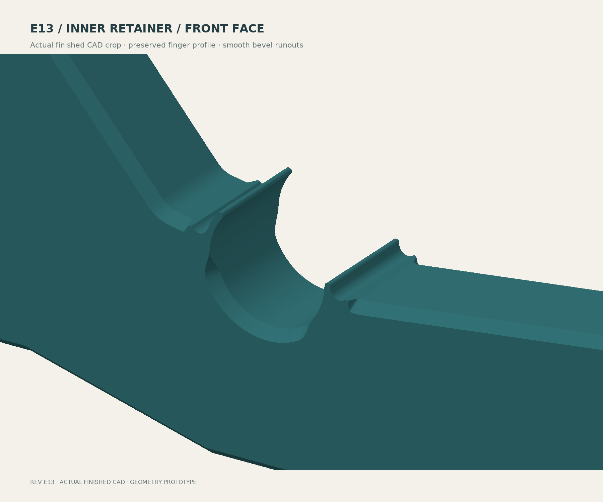

# E13 — angular inner-seat reinforcement

**[Download STEP with aligned helpers](bracket-with-modifier-helpers.step)** ·
[Current guide](../../README.md) · [Refined FEA](../../analysis/e13/RESULTS.md)


Added underside depth is **11 mm**, 1.5 mm more than E12 and below the 12.67 mm
cap. Straight 41 mm horizontal flanks join a 28 mm flat, with small corner
blends. The center section is 30 mm deep; the body is **207.51 × 219 × 24 mm**.
No holes were added. The matched comparisons and local section audit quantify
the improvement without inheriting E11's adjacent-section superiority target.


The R6 rigid shoulders, fingers, relief pockets and hardware remain. Both
faces have 2 mm chamfer inset, 2.384 mm rise and **50° above the bed**. Actual
STEP probes check the three straight underside segments and both bevel angles.
The four flexible sectors match E10 at nine depths within 0.025 mm STL tolerance.



[Reverse face](finish-inner-reverse.png) · [Outer front](finish-outer-front.png) ·
[Outer reverse](finish-outer-reverse.png).

The STEP reimports as one valid body and two valid helpers. Closed STLs,
Ø15.8 mm driver, Ø13 mm washer and nominal M5 envelopes pass. The 322-case
nominal spool sweep retains 3.927 mm minimum clearance. Printed rod tolerance,
snap force, fatigue and loaded contact remain untested.

[Build record](build-verification.json) · [STEP/hardware](verification.json) ·
[Angles, straight facets and clearance](engineering-verification.json) ·
[Finger comparison](final-finish-verification.json) · [STL audit](stl-tessellation-check.json) ·
[Sections](section-verification.json).

## Slicing handoff

Import the STEP as **one object with three aligned parts**, broad side down.
Use 8 walls for the PLA prototype or 10 for PETG, 0.2 mm layers, six top/bottom
layers, 15% body infill, **Arachne walls and Everywhere gap fill**. The guide
uses a 0.4 mm nozzle and 0.42/0.45 mm nominal widths. Calibrate the actual filament.

Convert both named helper parts to **100% infill modifiers** at the supplied
Z=7.6–8.8 and 15.2–16.4 mm positions. Their 2 mm overlap is intentional. STEP
does not encode modifier status. Do not fuse or print the helpers as extra slabs.


If components are lost during import, use [body-only.stl](body-only.stl),
[helper-1.stl](helper-1.stl) and [helper-2.stl](helper-2.stl) as aligned parts.
`body-mounted.stl` uses installed engineering axes and is not the print fallback.


Both 8/10-wall audits pass 120 layers and all 24 solid-band layers, with sampled
full L-planes, walls and fingers. Minimum seat-band/wall/finger coverage is
**99.82% / 99.99% / 99.84%**, with the documented 0.03 mm allowance.
[Settings, coverage and hashes](toolpath-verification.json). Equivalent full-plane
height ranges represent the helpers in the neutral audit. No print was started.

## Rebuild

Use OpenSCAD and [the recorded Python environment](../../analysis/e13/requirements.txt).
From this directory:

```sh
openscad -o profile.svg bracket.scad
python build_step.py
python repair_stl.py
python verify_step.py
python verify_engineering.py
python verify_sections.py
python final_finish_check.py
python render_cpu.py
python draw_engineering.py
python draw_depth_comparison.py
python draw_helpers.py
python slice_audit.py 8 /path/to/orca-slicer
python slice_audit.py 10 /path/to/orca-slicer
python inspect_toolpaths.py
```

Comparisons use preserved E10 finger geometry and E12 section/outline data.
Detached bevel remnants are checked against the intended chamfer before removal;
the STL weld repairs near-coincident exporter vertices without changing STEP.
[FEA reproduction and interpretation](../../analysis/e13/README.md).
