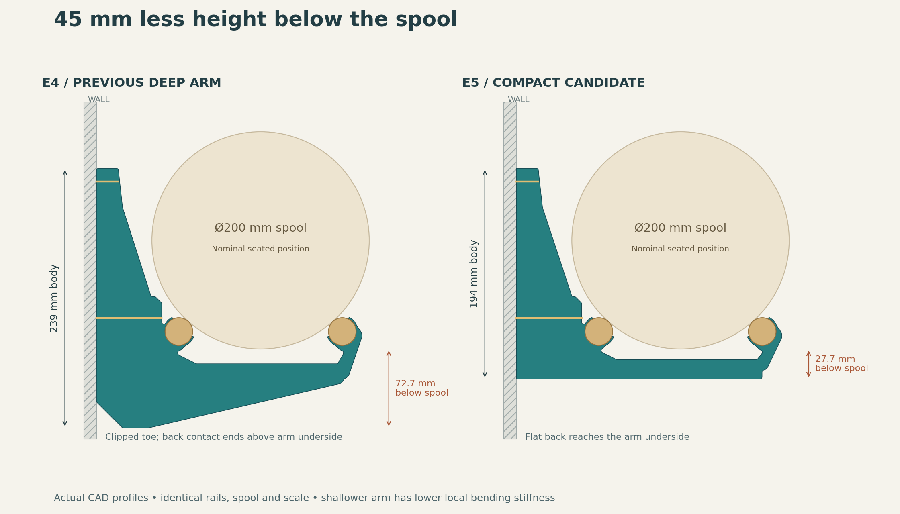

# E5 — fixed-spacing height study, not selected

This study raises the underside by 45 mm while retaining 150 mm rail spacing. It provides a 194 mm full-height flat back and leaves 27.7 mm below a nominal 200 mm spool.

The 18 mm arm sacrifices too much local section stiffness to accept as an equivalent structural replacement. The final CAD midspan second moment of area is approximately 6,932 mm⁴ versus 38,013 mm⁴ in E4, with the same rail span. E6 instead shortens the span and restores a deeper arm. Both revisions remain unvalidated prototypes.

[Original section comparison](vertical-verification.json) · [E4/E5/E6 comparison](../closed-wall-e6/vertical-verification.json)
