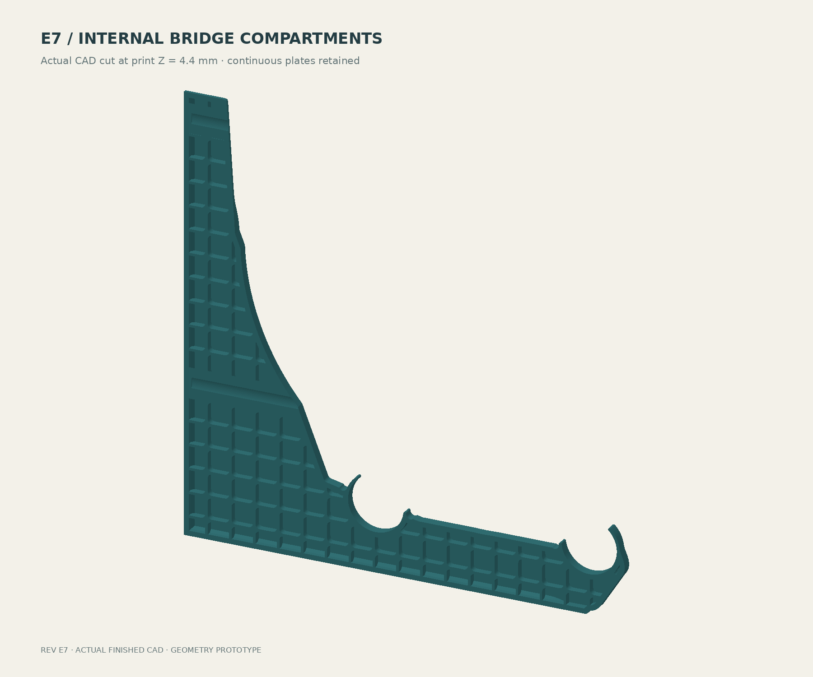

# E7 — compartmented voids and accessible wall fixings

E7 retains the closed-wall bracket and its four continuous 1.2 mm load-plane plates. It divides the three air bands into short bridge compartments and replaces the long screw bores with recessed washer seats close to the wall. The external arm depth and 2.4 mm structural perimeter remain E6 dimensions; the separate PLA/PETG beef-up study is not incorporated.



## First prints

- [Bridge coupon STL](bridge-coupon.stl): 36 × 36 × 24 mm, three hollow bands with the production cell size and plate thickness. Inspect the first roof layers at Z = 7.6, 15.2 and 22.8 mm; use slicer previews and optionally pause before later layers conceal the first bridge surface.
- [Fastener coupon STL](fastener-coupon.stl): extracted from the actual upper fixing, in print orientation. Check M5/#10 clearance, washer insertion, straight driver access and the access roof. This small sample does not establish the full wall-leg strength.
- [Full bracket STL](bracket.stl): geometry prototype, with the broad side on the bed.
- [Finished STEP, ZIP archive](bracket-step.zip): editable final solid. Unzip to obtain `bracket.step`.
- [Unchanged 8 mm snap coupon](snap-coupon-8mm.stl): local fit sample, not the full-width insertion-force test.

## Internal printing geometry

Each full compartment fits inside a 10 × 10 mm box. The fixed lattice has 1.2 mm dividing walls and R2 full-cell corners. Boundary cells are clipped to the original cavity envelope; tiny air slivers are filled. No cell can have a straight geometric span greater than 14.14 mm, including diagonals. Actual slicer bridge direction, extrusion width, anchorage and sag still require verification.

The air bands retain their original Z intervals: 1.2–7.6, 8.8–15.2 and 16.4–22.8 mm. Their final counts are 106, 97 and 106 cavities after bevel and fastener keepouts. The solid plates remain at 0–1.2, 7.6–8.8, 15.2–16.4 and 22.8–24 mm, interrupted locally by the fastener features. These added dividing walls support printing; no structural capacity is assigned to them. They supplement the continuous plates rather than replace them.

The main structural perimeter remains 2.4 mm. Preserve 0.2 mm layers and 1.2 mm top/bottom settings. Fifteen percent infill receives zero strength credit. These are true CAD voids; infill does not appear inside them. Verify actual solid paths in thin walls and plates. No validated printer/material profile or machine-ready G-code is included.

## Fixing and driver access


| Feature | E7 geometry |
|---|---:|
| Nominal screw clearance circle | Ø5.2 mm, with small upper print-roof relief |
| Intended shank fit | #8 / #10 wood screws; M5 clearance |
| Plastic between washer and wall | 3.6 mm |
| Washer envelope checked | Ø13 mm OD × Ø5.5 mm ID × 1.2 mm thick |
| Nominal straight access circle | Ø16 mm |
| Driver envelope verified against final CAD | Ø15.8 mm cylinder |
| Screw axes above rail-center datum | 164 and 40 mm |
| Screw spacing | 124 mm |

A #10 has a nominal major diameter of 0.190 inch, or 4.826 mm. The 5.2 mm clearance gives approximately 0.37 mm diametral clearance for #10 and 0.20 mm for nominal M5. M5 fit is more sensitive to printed hole undersizing; verify the coupon. The M5 designation is a clearance compatibility statement, not a recommendation to drive a metric machine screw directly into a wood stud. [Nominal screw diameter reference](https://boltdepot.com/fastener-information/Machine-Screws/Machine-Screw-Diameter).

Use a flat-under-head screw or a suitable washer on the flat landing. A countersunk head does not match this seat without appropriate hardware. The washer land supports approximately 99.1% of the checked washer annulus; a small upper bore relief accounts for the missing fraction. The land depth is 3.6 mm, not the complete wall-leg projection.

The old lower screw axis at Y = 12 mm aimed a straight driver into the rear rod/retainer region. Raising it to Y = 40 mm clears the dowel seats. Removed the obsolete projecting screw-head pad and long narrow sleeve geometry. Both openings extend forward to open air. Use an extended driver bit with approximately 60 mm of unobstructed reach beyond the head for the lower fixing; the verified envelope does not represent an entire drill chuck or arbitrary driver angle. Install before loading spools.

The large access opening has a circular lower region and tangent 45-degree upper shoulders, transitioning into a short rounded cap at print Z = 22.4 mm. That leaves a nominal 1.6 mm outer roof skin and avoids a long flat tunnel ceiling. The small screw bore also has upper roof relief. Printed roof quality remains a coupon check.

## Verification and tradeoffs

The final CAD is one valid solid. The full bracket and both new coupon meshes have no boundary or nonmanifold edges. Boolean checks find zero interference for the tested M5 shank, washer and driver envelopes at both fixings. The nominal 180–220 mm spool clearance sweep still passes. [DFM checks](dfm-verification.json) · [Compartment geometry](dfm-build.json) · [External clearance](verification.json) · [Finished-solid check](finish-verification.json).

Modeled solid volume increases from approximately 94.3 cm³ in E6 to 133.8 cm³ in E7, about 42%, including compartment walls and access reinforcement. The compact approximately 206.73 × 208 × 24 mm envelope remains. E7 does not adopt the 34 mm arm-depth proposal from the material sizing study.

**Slicer paths, physical bridge quality, mounting strength, snap behavior and sustained-load capacity remain unverified.** The internal long-span issue now has a concrete compartmented geometry to test. E6's material/load reports remain historical screening studies; the changed wall connection and local plate interruptions require renewed analysis before transferring any result. No safe spool count is released.

## Rebuild

Use OpenSCAD, Python, CadQuery/OCP, NumPy, Shapely, Matplotlib, Pillow and VTK. E7's `bracket.scad` exports only the exterior/cavity seed profiles. The authoritative finished geometry comes from `dfm_geometry.py` and `finish_cad.py`; an unfinished SCAD bracket export is intentionally disabled.

```sh
openscad -o profile.svg -D 'part="profile"' bracket.scad
openscad -o cavity-profile.svg -D 'part="hollow_profile"' bracket.scad
python finish_cad.py
python verify_dfm.py
python check_and_draw.py
python render_cpu.py
python draw_dfm.py
```

Run from this directory. Verification can extract the delivered STEP archive if the uncompressed file is absent. Repackage the regenerated STEP into `bracket-step.zip` when publishing a geometry change. Keep the separate open-web exploration isolated.
