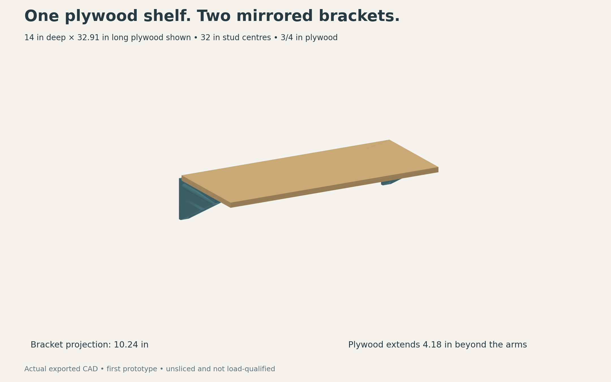
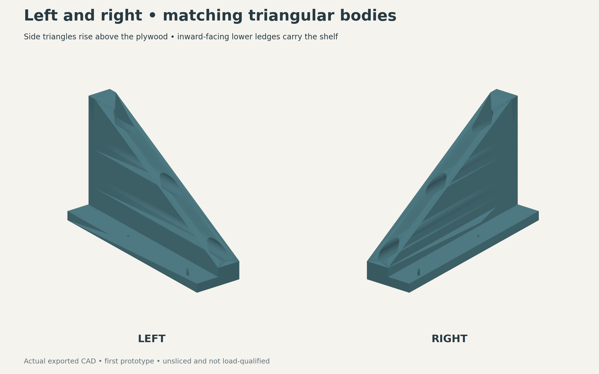
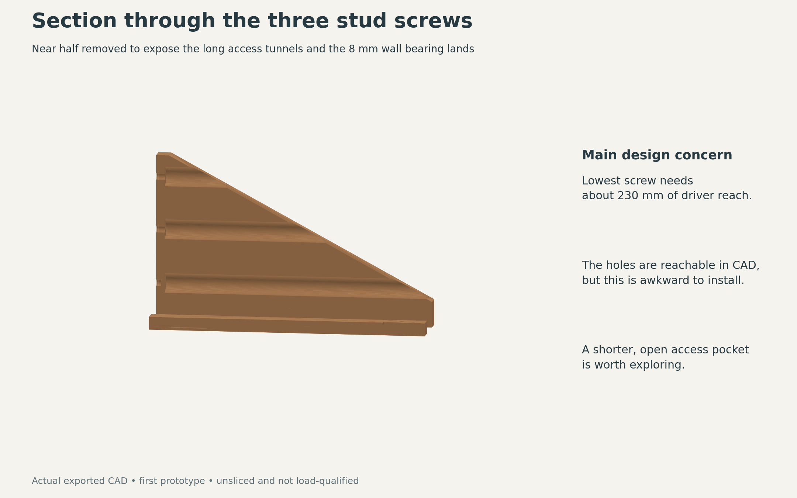

# Plywood shelf brackets — 14-inch shelf

A left and right solid triangular bracket support one continuous plywood shelf. Each bracket fixes to one stud with three screws. **The triangular bodies rise above the shelf, outside the plywood ends. Inward-facing lower ledges support the plywood; only the 12 mm ledges sit beneath it.** This v2 arrangement supersedes the earlier below-shelf prototype.







[Dimensioned layout](shelf-layout.svg)

## Dimensions and assumptions

| Item | First design |
|---|---:|
| Plywood depth | 355.6 mm / 14 in |
| Plywood thickness shown | 19.05 mm / 3/4 in; measure actual stock |
| Bracket projection from wall | 260 mm / 10.24 in |
| Triangle height above plywood underside | 145 mm / 5.71 in |
| Triangle height above 19.05 mm plywood top | 125.95 mm / 4.96 in |
| Ledge thickness below plywood | 12 mm |
| Side triangle thickness along wall | 32 mm |
| Inward ledge projection | 32 mm |
| Total part width along wall | 64 mm |
| Rear plywood edge from wall | 10.5 mm |
| Unsupported front overhang | 106.1 mm / 4.18 in |
| Stud screw axes above plywood underside | 24, 75, 125 mm |
| Stud screw shank clearance | 6.5 mm nominal plus printable roof |
| Washer bearing depth from wall | 8 mm |
| Access bore | 18.5 mm nominal plus 45-degree roof |
| Example stud centres | 812.8 mm / 32 in |
| Example plywood cut | 779.8 × 355.6 mm, actual thickness |

The 14-inch dimension describes the plywood. The one-piece bracket supports its rear 249.5 mm. A full-depth 14-inch triangular body would require a different print arrangement or a structural joint. This version deliberately retains a one-piece broad-side print on the P1S. Its analytical rotated outline is approximately 248 mm square before a brim; actual machine exclusions still require a slice.

Shelf length is **measured stud spacing − 33 mm** between these side panels and 0.5 mm end clearances. Measure stud centres before cutting. The example uses two brackets on studs 32 inches apart. The shelf span and load have not been supplied; 32 inches is a layout example, not a verified allowable span.

The raised side triangles and rear stops form an open-top plywood saddle, with 0.5 mm end clearances. There is no thickness-sensitive sliding slot. Lower the board into the pair after installing both brackets. Two 3 mm pilot holes per bracket, at 100 and 220 mm from the wall, accept optional retention screws through the plywood. Limit plastic engagement to 6–8 mm; these screws retain the board and are not assigned gravity-load capacity. Drill the board with clearance holes and avoid wedging the plastic apart.

## CAD downloads

| Hand | STEP | STL | Body and aligned modifier |
|---|---|---|---|
| Left | [Print STEP](exports/left-print.step) | [STL](exports/left-print.stl) | [STEP assembly](exports/left-with-helper.step) |
| Right | [Print STEP](exports/right-print.step) | [STL](exports/right-print.stl) | [STEP assembly](exports/right-with-helper.step) |

[Full shelf assembly STEP](exports/shelf-assembly.step). Use the handed body-only files for inspection; apply the 100% modifier instructions below before printing.

## Source and CAD build

Edit [parameters.json](parameters.json), then run:

```sh
python -m pip install -r designs/plywood-shelf/requirements.txt
python designs/plywood-shelf/build.py
```

The build produces left/right installed STEP, print-oriented STEP and STL, aligned whole-body helper STEP assemblies, a shelf assembly, and a JSON geometry receipt in `exports/`. The dedicated GitHub workflow runs the build on this design branch and publishes successful exports back to that branch.

**V2 geometry:** the dedicated build regenerates and checks both raised triangles, lower bearing ledges, handed print exports and renders. [Current geometry receipt](exports/verification.json) records the revision, exact footprints, volume, plywood bearing area and geometry checks. Read the `above-shelf-v2` receipt; the old below-shelf receipt does not qualify this revision.

**Prototype status:** no actual Orca slice, structural analysis, physical fit or load test has been performed.

Checks cover valid connected solids, mirrored volume equality, plywood interference, three straight driver paths, retained backing around the plywood pilots, and nominal bed/brim envelope. They do not qualify strength, creep, a real screw installation, or machine-specific print exclusions.

## Printing

Use OrcaSlicer, P1S and 0.4 mm nozzle. Place the supplied outer broad face on the bed to keep primary bending in XY. The right part receives its own mirrored print orientation.

For this deliberately solid first trial, use at least two walls, 0% base infill and convert the aligned **whole_body_100_percent_modifier** to a 100% infill modifier. A practical initial slice may use eight walls, 0.2 mm layers and 1.6 mm top/bottom thickness. Inspect the actual paths and mass before printing. This conservative fill is intentionally expensive; later material reduction needs separate checks.

The helper overlaps the body exactly. Import as one object with two parts, then assign modifier status; do not print both as overlapping bodies. STEP does not store slicer settings. The access tunnels have 45-degree roofs pointing away from the bed. Brim clearance in the CAD check is 3 mm; no machine profile or corner exclusion is changed.

PETG/ASA remain candidate materials inherited from the rack project. No grade or process has been qualified for this geometry. Solid fill does not remove layer-bond, creep or washer-bearing limits.

## Installation and load path

Three fasteners share one vertical stud centreline. The CAD reserves room for a nominal 6 mm screw, a flat washer up to 18 mm OD and a straight tool up to 18 mm OD. Confirm the selected head, washer, holder and shank dimensions. The lowest tunnel needs roughly 230 mm of reach; use a long magnetic extension and install before the plywood.

Select wood structural screws for the actual stud and wall finish. Required length includes the 8 mm printed land, wall finish and the screw manufacturer's required embedment. This geometry does not select a screw capacity or wood embedment. Seat washers gently against backed plastic; avoid crushing the bracket or wall finish. The bracket needs firm, flat wall bearing.

Gravity enters through the inward-projecting ledge, crosses its root into the raised side triangle and reaches the stud fixings and wall compression zone. The ledge adds bending across the print layers; its root and layer bonding need explicit structural and physical checks. Merely turning the old bracket upside down would not provide an underside bearing surface, so v2 includes a new ledge. The three screws should not be assumed to share withdrawal equally. Two brackets also mean the plywood itself must span between them; boxes at the front and unequal left/right loads need separate checks.

Before release, confirm shelf span and intended contents, actual screw assembly and substrate; inspect a real slice; check printed fit; then assess immediate deflection and sustained loading. No spool-rack load rating or earlier FEM result transfers to this shelf.

## Revision note

The earlier below-shelf geometry and build evidence remain in Git history. V2 changes the load path, plywood cut length, print thickness and screw arrangement. Earlier volume and fit results are superseded. The 14-inch shelf depth, 260 mm arm projection and 106.1 mm front overhang remain.

## Provenance

This is a separate shelf derivative of the spool rack's broad-side printed architecture. It replaces the rod seats, spool clearance constraints, moulding datum and two-hole pattern with plywood saddles and three stud fixings. Existing E13/F/G/G2 evidence remains unchanged.

- [P1S nominal build volume](https://bambulab.com/en-us/p1)
- [Bambu print-volume limitations](https://wiki.bambulab.com/en/knowledge-sharing/print-volume-limitations)
- [CadQuery export documentation](https://cadquery.readthedocs.io/en/latest/importexport.html)
