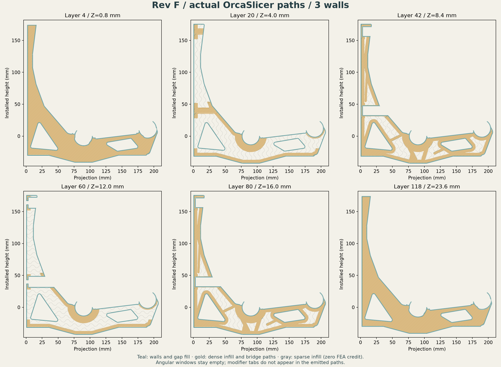

# Rev F — experimental CAD and modifier checkpoint

**September 10, 2026. Geometry and slicing are checked for the three-wall and
four-wall experiments. No Rev F candidate demonstrates the requested 4×
fracture margin.** The newest light one-wall study is incomplete at modifier
STL export. [Analysis and status](../../analysis/rev-f/README.md) ·
[Next sprint](../../NEXT-SPRINT.md) · [E13 prototype guide](../../E13-ENGINEERING-GUIDE.md).


Rev F keeps E13's exterior envelope, 24 mm width, rod seats, flexible fingers,
relief pockets, back wall, screw lands and driver access. Two R2 angular
windows and their 0.6 mm, 50° mouth bevels are subtracted from the body.
Independent CAD booleans confirm the protected interfaces are unchanged and
nothing is added outside E13. The body is one valid solid, approximately
207.51 × 219.00 × 24 mm. Its 231,235.77 mm³ envelope is **not printed volume**.
[Body build audit](body-build-verification.json) ·
[Independent geometry checks](geometry-verification.json).

## Checkpoint downloads: shaped planes, three walls

These files preserve the first complete Rev F handoff experiment. They are
research artifacts, not a selected winner or calibrated machine profile.

- [Body-only STEP](body-only.step) and [body-only STL](body-only.stl).
- [Body plus three aligned helper STEP solids](bracket-with-modifiers.step).
- [Model-only 3MF with actual modifier roles](rev-f-model-and-modifiers.3mf).
- Individual helpers: [dense chords and seats](dense-chords-and-seats.step),
  [lower plane](rib-plane-lower.step), [upper plane](rib-plane-upper.step).
- [Exact parameters](selected-layout.json), [helper checks](helper-verification.json),
  [package checks](3mf-verification.json), [completed Orca checks](toolpath-verification.json).

The STEP assembly has **four solids: one printable body and three modifiers**.
STEP does not encode slicer behavior: import as one object with aligned parts
and convert all three helpers to 100% infill modifiers. The 3MF already records
those roles and candidate-level wall/skin/infill settings. It includes no
printer or filament preset and no G-code. Choose the intended calibrated
printer/material before any physical print.

| Helper | Intended body-overlapping material | Selection tab |
|---|---|---|
| Dense chords and seats | Full-width lower/diagonal chords, seat bands and screw lands | Outside back wall, Y = 65–75 mm |
| Lower rib plane | Shaped plane at print Z = 7.6–8.8 mm | Y = 105–115 mm |
| Upper rib plane | Shaped plane at print Z = 15.2–16.4 mm | Y = 125–135 mm |

The dense helper uses a connector halo outside the outline with 0.05 mm overlap
inside the existing printed wall. Helpers are clipped by the body in slicing;
**tabs and external halo must never print**. All helper/STL connectivity and
four-solid STEP checks pass for this download.


The neutral audit uses 0.2 mm layers, three walls, 1.2 mm broad skins,
1.2 mm shaped planes and 8% gyroid sparse infill. Sparse infill receives zero
structural credit. OrcaSlicer 2.4.2 emits **121.95 cm³ / 151.21 g** at the
neutral 1.24 g/cm³ density. Its 120-layer audit confirms three modifier roles,
vertex round-trip error below 0.000014 mm, empty windows, no printed selection
tabs and at least 99.55% nominal structural footprint coverage with the stated
0.03 mm rounding allowance. The later toolpath audit completes the preliminary
package audit's stated pending checks.



## Other saved candidates

The [four-wall full-plane experiment](studies/full-plane-4w/README.md) has a
complete aligned handoff and actual Orca volume of **118.57 cm³ / 147.02 g**,
12.0% below E13's eight-wall reference. It was explored while matching baseline
stiffness was still the objective; its refined 3D strength screen does not pass.

The [one-wall light study](../../analysis/rev-f/studies/light-full-1w/README.md)
uses 0.8 mm skins/planes and local tunnel reinforcement. Its approximately
87.81 g mass is an estimate. The analytical CAD is valid, but the dense helper's
STL connectivity assertion fails after adding the tunnel saddle. There is no
completed light-candidate 3MF or actual sliced mass in this checkpoint.

## Reproduction and CLI crash diagnosis

The scripts use the [pinned engineering dependencies](../../analysis/e13/requirements.txt).
Run from the repository root in a disposable Python environment:

```sh
python analysis/rev-f/run_native.py designs/rev-f/build_body.py
python analysis/rev-f/run_native.py designs/rev-f/verify_geometry.py
python analysis/rev-f/run_native.py designs/rev-f/build_helpers.py
python designs/rev-f/package_3mf.py
python designs/rev-f/slice_audit.py /path/to/OrcaSlicer
python analysis/rev-f/run_native.py designs/rev-f/inspect_toolpaths.py
```

For the archived four-wall handoff, pass `designs/rev-f/studies/full-plane-4w`
as the candidate directory to helper building, packaging and inspection;
pass it after the Orca executable to slicing. Its body file is identical.

The initial 3MF claimed an Orca native-project generator while omitting the
native project preset bundle. Inspection of the 2.4.2 CLI source found an early
printer/filament setting dereference before `--load-settings` on that import
path. The corrected package truthfully identifies its geometry generator and
uses generic model import with part roles; CLI inspection and slicing then
passed repeatedly. The audit also fixes `--orient 0 --arrange 0` to preserve the
supplied transform. See the [official CLI modes](https://www.orcaslicer.com/wiki/cli/cli_mode),
[CLI options](https://www.orcaslicer.com/wiki/cli/cli_misc) and
[OrcaSlicer source](https://github.com/OrcaSlicer/OrcaSlicer/blob/v2.4.2/src/OrcaSlicer.cpp).
A separate native-Python teardown issue is handled by the disposable runner;
failed assertions still produce nonzero exit status.

The next sprint optimizes mass within the existing movement and fracture limits,
with actual sliced volume and 3D finalist gates. E13 stiffness is a comparison,
not a requirement. [Sprint brief](../../NEXT-SPRINT.md).
