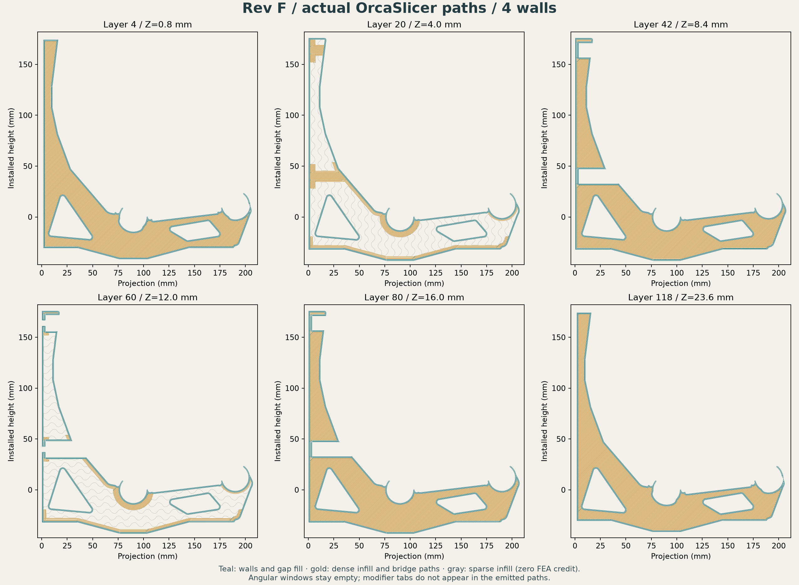

# Rev F four-wall full-plane experiment

**Archived experiment; requested 4× fracture margin is not met.** This was the
best completed sliced-mass result during the baseline-stiffness exploration.
The current objective permits more movement within the serviceability limits.

[Body and three aligned STEP helpers](bracket-with-modifiers.step) ·
[Model-only modifier 3MF](rev-f-model-and-modifiers.3mf) ·
[Exact parameters](selected-layout.json) ·
[Completed toolpath audit](toolpath-verification.json).

The body is identical to the top-level Rev F CAD. Use four walls, 1.2 mm broad
skins and two full 1.2 mm internal planes, 8% sparse infill, with local dense
chords and seats. Three helpers must be modifiers; their tabs must not print.
The STEP contains no slicer settings. The 3MF contains part settings and roles,
but no machine/filament profile or G-code.

Actual neutral Orca output is **118.57 cm³ / 147.02 g**, 12.0% below E13 eight
walls at the same 1.24 g/cm³ density. All 120 layers pass the recorded coverage,
modifier-role, empty-window and nonprinting-tab checks.

The h1 3D front movement is 2.1565 mm at E = 1 GPa, versus E13's 2.1480 mm.
Its raw tensile peak is 17.598 MPa, giving a 2.30 strength ratio against the
40.5 MPa scalar input. This fails the required ratio of four.
[Refinement and raw fields](../../../../analysis/rev-f/README.md).
