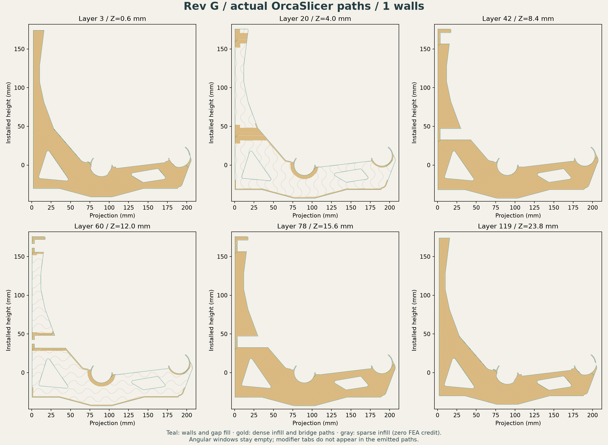

# Rev G — evolutionary-search research CAD

**The genetic study is complete. No tested finalist demonstrates the requested
4× fracture margin.** These files are research artifacts, not a qualified print
recommendation. E13 remains the [established prototype handoff](../closed-wall-e13/README.md),
with its existing physical-validation limits.


The displayed body is the full-plane search finalist
`213f8c56151ddee40d51`. It preserves E13's exterior, seats, fingers, screw lands
and driver access. Its two angular windows use 0.9 of the Rev F window scale.
The body envelope remains approximately 207.51 × 219.00 × 24 mm. New window
mouths have 0.6 mm insets at 50°; the existing exterior finish is unchanged.
[Independent delivered-STEP comparisons](geometry-verification.json).

## Research downloads

| File | Contents |
|---|---|
| [Model and three modifiers](rev-g-model-and-modifiers.3mf) | Geometry-only multipart 3MF with modifier roles and per-object process overrides |
| [Body and three helper solids](bracket-with-modifiers.step) | Four aligned, named STEP solids; STEP does not encode slicer settings |
| [Body STEP](body-only.step) · [body STL](body-only.stl) | One printable body, without selection helpers |
| [Dense support helper](dense-chords-and-seats.step) | Chords, seats and fixing-tunnel support |
| [Lower plane](rib-plane-lower.step) · [upper plane](rib-plane-upper.step) | Two separate full internal planes |
| [Exact parameters](selected-layout.json) | Candidate dimensions and nominal process choices |

There are **three modifiers**. Their projecting tabs make selection easier;
the tabs and connecting halo lie outside the printed body. Keep all components
aligned. In a STEP import, convert every helper to a **100% infill modifier**;
only the body is a printable part. The 3MF already encodes those roles.

The supplied 3MF contains no machine or filament profile and no G-code. It
truthfully identifies its geometry packager, avoiding the incomplete native
project metadata that caused the earlier Orca CLI crash. A local neutral
OrcaSlicer 2.4.2 audit supplies separate temporary presets. It is not a
calibrated process for a particular printer or material.


## Actual slicing result

The full-plane finalist uses one nominal wall, 1.0 mm broad skins, two 1.0 mm
internal planes at Z = 7.8–8.8 and 15.2–16.2 mm, and 5% sparse infill. The
dense helper uses 100% rectilinear infill. The neutral audit uses 0.2 mm layers,
Arachne walls and gap fill everywhere.

It emits **83.68 cm³ / 103.76 g per bracket** at the shared neutral density
of 1.24 g/cm³: **37.91% less plastic than E13's 167.11 g** reference slice.
All 120 layers are present; three modifier roles survive the Orca round trip;
maximum vertex error is below 0.0001 mm. No selection-tab or window extrusion
is detected. Minimum sampled structural coverage is 99.73%, and minimum dense
helper coverage is 98.73%, using the documented 0.03 mm footprint allowance.
[Toolpath audit](toolpath-verification.json) · [3MF/input hashes](3mf-verification.json)
· [Helper solids and STL checks](helper-verification.json).



These checks concern nominal emitted bead footprints. They do not prove bridge
formation, bonding, extrusion quality, fit, creep or strength in a physical part.
Sparse infill receives zero stiffness credit in the mechanical model.

## Mechanical status and alternatives

The full-plane candidate's h1 model gives 3.246 mm front vertical movement and
3.306 mm maximum mean seat translation at E = 1 GPa and the 12 kg reference
load. Its raw maximum tensile principal stress is **55.05 MPa**, above the
10.125 MPa screening limit. The peak rises and changes location with mesh
refinement; no converged fracture margin is established.

The [mechanical report](../../analysis/rev-g/README.md) retains all finite
fields, mesh audits, buckling results and rejected constraints. The current
download is the lowest-mass finalist from the completed full-plane search,
not an accepted optimum.

| Saved study | Actual mass | Outcome |
|---|---:|---|
| [Seed 1 thin shaped planes](studies/seed1-best/README.md) | 84.35 g | Movement, fracture and dense-footprint failures |
| [Full-plane search finalist](studies/full-plane-best/README.md) | 103.76 g | Toolpaths pass; fracture screen fails on all three meshes |
| [Wider inner-seat support](studies/seat-support/README.md) | 108.03 g | Movement improves; coarse fracture screen still fails |
| [Repaired F light helper](studies/repaired-f-light/README.md) | 93.76 g | Export and slicing repaired; original F strength failure remains |

## Reproduce

Use the [analysis requirements](../../analysis/e13/requirements.txt). From the
repository root, with `python` referring to that environment:

```text
python analysis/rev-g/run_native.py designs/rev-g/build_body.py
python analysis/rev-g/run_native.py designs/rev-g/repair_stl.py
python analysis/rev-g/run_native.py designs/rev-g/build_helpers.py
python designs/rev-g/package_3mf.py
python designs/rev-g/slice_audit.py /path/to/OrcaSlicer
python analysis/rev-g/run_native.py designs/rev-g/inspect_toolpaths.py
python analysis/rev-g/run_native.py designs/rev-g/verify_geometry.py
```

CAD/helper/packaging scripts accept the candidate folders used in the studies;
the body builder accepts a parameter JSON followed by its output folder. Run
Orca in its installed environment. The native worker preserves failure exit
codes and flushes outputs before process teardown; it does not turn failures
into successful builds. Regeneration can change tessellation bytes, so rerun
the linked audits after any rebuild.
