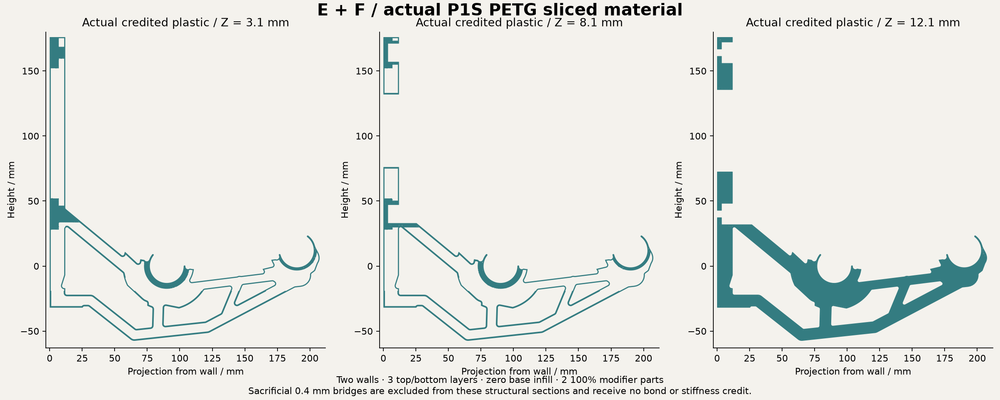

# EF cut v4 / thin upper mast with a flat print base

Implemented experimental CAD and actual Orca slice. Physical print and strength are unqualified.

Spent extrusion is **50.364 cm3**, versus matched P1S G at 74.100 cm3: **32.032% less**. This includes sacrificial bridges and startup extrusion; it is not CAD volume or a weighed print.

Numerical screening is pending. Sliced mass and CAD checks are not a load rating.

The upper mast has a six-millimetre web on the print base, with tapered shoulders returning to full width before either mounting region. This removes low-energy material in the current planning load case. The outer XY projection is retained. Its protected G bearing and capture geometry has zero CAD symmetric difference. Mounting axes stay fixed, washer-land support is 99.08%, and driver clearance is checked. The locating underside stays at Y=-32 mm for the first 25.4 mm from the wall. Moulding supplies no assumed structural support.

Use OrcaSlicer, P1S, 0.4 mm nozzle, calibrated PETG or ASA, two walls, 3 top/bottom layers at 0.2 mm, zero base infill and 100% rectilinear helpers. This receipt is the PETG slice; ASA requires a fresh process check. Import one object with aligned parts. Only the body prints. Every helper and its external tabs/halos must remain an infill modifier. STEP preserves alignment but does not encode slicer roles. The model-only 3MF records roles but carries no printer/filament calibration. The slice archive is engineering evidence, not machine-ready G-code.

Sacrificial 0.4 mm bridges count as spent plastic and receive zero structural or bond credit. Nominal credited paths form one connected component; that is not a guarantee of successful unsupported printing.

Combined STEP

https://raw.githubusercontent.com/thereprocase/spool-wall-rack/main/designs/rev-g2/ef-cut-v4/bracket-with-modifiers.step

Body STEP

https://raw.githubusercontent.com/thereprocase/spool-wall-rack/main/designs/rev-g2/ef-cut-v4/body-only.step

Model-only 3MF

https://raw.githubusercontent.com/thereprocase/spool-wall-rack/main/designs/rev-g2/ef-cut-v4/part-model-and-modifiers.3mf

Individual helper STEPs

https://raw.githubusercontent.com/thereprocase/spool-wall-rack/main/designs/rev-g2/ef-cut-v4/dense-chords-and-seats.step

https://raw.githubusercontent.com/thereprocase/spool-wall-rack/main/designs/rev-g2/ef-cut-v4/central-rib-plane.step

Actual slice and effective settings

https://raw.githubusercontent.com/thereprocase/spool-wall-rack/main/designs/rev-g2/ef-cut-v4/slice-evidence.zip

All files and verification receipts

https://github.com/thereprocase/spool-wall-rack/tree/main/designs/rev-g2/ef-cut-v4

