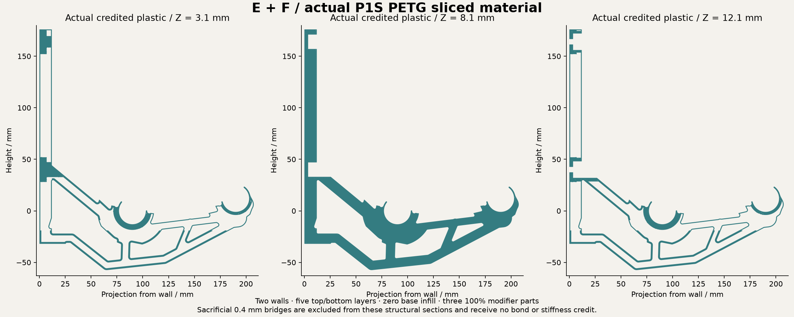

# EF deep frame with backed seat roots

Implemented experimental CAD and actual Orca slice. Physical print and strength are unqualified.

Spent extrusion is **73.007 cm3**, versus matched P1S G at 74.100 cm3: **1.475% less**. This includes sacrificial bridges and startup extrusion; it is not CAD volume or a weighed print.

Retained-material contact screen: 5.660824 mm maximum movement and 39.997226 MPa raw tensile peak at 12 kg. Status: CONTACT_SCREEN_AT_STATED_TOLERANCE_ERODED_MATERIAL_ONLY. Material omission: 11.091%. All finite stress samples and failed attempts remain preserved. Isotropic planning properties, boundary omission and physical qualification remain unresolved.

The body retains the verified E+F outer geometry. Its protected G bearing and capture geometry has zero CAD symmetric difference. Mounting axes stay fixed, washer-land support is 99.08%, and driver clearance is checked. The locating underside stays at Y=-32 mm for the first 25.4 mm from the wall. Moulding supplies no assumed structural support.

Use OrcaSlicer, P1S, 0.4 mm nozzle, calibrated PETG or ASA, two walls, 5 top/bottom layers at 0.2 mm, zero base infill and 100% rectilinear helpers. This receipt is the PETG slice; ASA requires a fresh process check. Import one object with aligned parts. Only the body prints. Every helper and its external tabs/halos must remain an infill modifier. STEP preserves alignment but does not encode slicer roles. The model-only 3MF records roles but carries no printer/filament calibration. The slice archive is engineering evidence, not machine-ready G-code.

Sacrificial 0.4 mm bridges count as spent plastic and receive zero structural or bond credit. Nominal credited paths form one connected component; that is not a guarantee of successful unsupported printing.

Combined STEP

https://raw.githubusercontent.com/thereprocase/spool-wall-rack/main/designs/rev-g2/ef-hybrid-v1/bracket-with-modifiers.step

Body STEP

https://raw.githubusercontent.com/thereprocase/spool-wall-rack/main/designs/rev-g2/ef-hybrid-v1/body-only.step

Model-only 3MF

https://raw.githubusercontent.com/thereprocase/spool-wall-rack/main/designs/rev-g2/ef-hybrid-v1/rev-g-model-and-modifiers.3mf

Individual helper STEPs

https://raw.githubusercontent.com/thereprocase/spool-wall-rack/main/designs/rev-g2/ef-hybrid-v1/dense-chords-and-seats.step

https://raw.githubusercontent.com/thereprocase/spool-wall-rack/main/designs/rev-g2/ef-hybrid-v1/rib-plane-lower.step

https://raw.githubusercontent.com/thereprocase/spool-wall-rack/main/designs/rev-g2/ef-hybrid-v1/rib-plane-upper.step

Actual slice and effective settings

https://raw.githubusercontent.com/thereprocase/spool-wall-rack/main/designs/rev-g2/ef-hybrid-v1/slice-evidence.zip

All files and verification receipts

https://github.com/thereprocase/spool-wall-rack/tree/main/designs/rev-g2/ef-hybrid-v1

