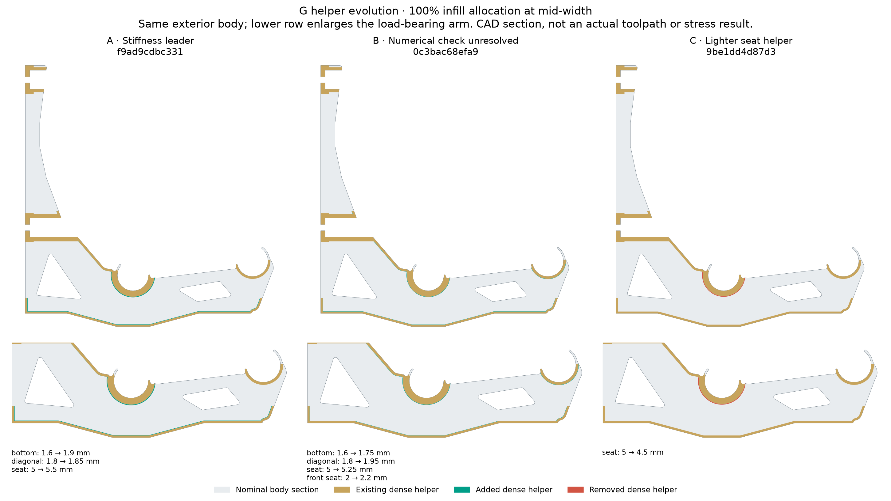

# G helper candidate 0c3bac68efa9

Selection role: **stiffest**. Experimental CAD, not a qualified bracket or load rating.

[Combined body/helper STEP](bracket-with-modifiers.step) · [Model-only 3MF](rev-g-model-and-modifiers.3mf) · [Body STEP](body-only.step) · [Actual Orca slice and settings](slice-evidence.zip)

The exterior body is byte-identical to G. These dimensions change the aligned 100% infill helper allocation:

| Parameter | mm |
|---|---:|
| bottom band | 1.75 |
| diagonal band | 1.95 |
| seat band | 5.25 |
| front seat band | 2.2 |
| lower tunnel collar mm | 3.5 |
| upper tunnel collar mm | 2.5 |

Import the model-only 3MF as one object with multiple parts. The body prints; the three helpers are 100% rectilinear infill modifiers. External tabs and halos must stay modifiers. Use OrcaSlicer, P1S/0.4 mm, calibrated PETG settings, at least two walls, five 0.2 mm top/bottom layers and 0% base infill. STEP carries geometry and alignment, not slicer roles.

Individual helpers: [dense chords and seats](dense-chords-and-seats.step), [lower internal plane](rib-plane-lower.step), [upper internal plane](rib-plane-upper.step). [CAD checks](helper-verification.json), [body provenance](source-verification.json), [3MF role checks](3mf-verification.json), [hashes](SHA256SUMS.json).

The bounded 3D solve failed linear convergence. A stronger-preconditioner retry also failed. Complete failed fields and raw peaks are retained; they are not movement or strength predictions.

[Detailed 3D audit](../../../../analysis/rev-g2/evolution-results/batch-02/0c3bac68efa9/audit/audit.json) · [Search workflow and qualification limits](../../../../analysis/rev-g2/EVOLUTION.md).
