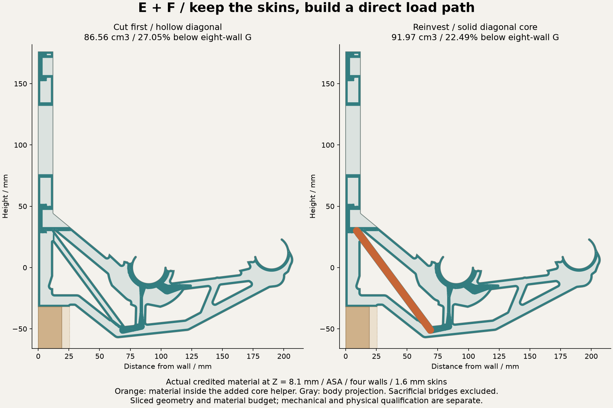

# G controls and continuous E + F brace

**Recovered print files change the physical reference.** The successful overnight ASA archive is associated with E13 and specifies seven walls, 10% base infill and 1.6 mm minimum skins. The saved G PETG project specifies two walls. Its exact submitted slice is not recovered. See the evidence and association limits here:

https://github.com/thereprocase/spool-wall-rack/blob/main/designs/rev-g2/print-controls/RECOVERED-PRINTS.md

The eight schedules below are deliberate virtual controls. Every one has aligned body/helper STEP, model-only 3MF, an actual Orca slice, bed/process checks, section images and SHA256SUMS.json. All retain 1.6 mm skins and zero base infill, with 100% helpers. The denominator is G at eight walls: 118.660028 cm3. These controls are not replicas of the successful ASA print.

| Schedule | Spent extrusion, cm3 | Volume saving vs G eight walls | Orca estimated grams |
|---|---:|---:|---:|
| ef-core-asa-4w-1p6 | 91.971 | 22.492% | 95.65 |
| ef-triangulated-asa-4w-1p6 | 86.565 | 27.048% | 90.03 |
| ef-triangulated-asa-6w-1p6 | 104.336 | 12.071% | 108.51 |
| ef-triangulated-asa-8w-1p6 | 121.409 | -2.317% | 126.27 |
| g-asa-4w-1p6 | 93.087 | 21.552% | 96.81 |
| g-asa-8w-1p6 | 118.660 | -0.000% | 123.41 |
| g-petg-4w-1p6 | 93.087 | 21.552% | 118.22 |
| g-petg-8w-1p6 | 118.660 | -0.000% | 150.70 |

ASA/PETG pairs have identical numeric paths, widths, heights, roles, volumes and structural masks at each G wall count. Four walls remove 21.552% of extrusion volume relative to eight walls. Equal geometry does not imply equal print bonding, stiffness, creep or strength. Cross-polymer volume percentages are not mass percentages.

The direct-brace E+F body with four walls first saves 27.048%. A new continuous 100% helper fills the diagonal and intersects the bearing/keel tie. Its 5.406 cm3 of actual reinvestment leaves **22.492% net saving** and 2.957 cm3 before reaching the 20% target. All three designed local routes retain 100% of local credited material and both endpoint anchors in a single component. CAD verifies a single core inside the body, overlapping existing dense material by 1341.708 mm3 and the bearing/keel helper by 691.965 mm3.

**The core trial fails the stiffness target.** At 12 kg and the same uncalibrated 1 GPa isotropic planning law:

| Intermediate 1e-4 contact diagnostic | Maximum movement, mm | Raw tensile peak, MPa | Omitted nominal material |
|---|---:|---:|---:|
| G, eight walls and 1.6 mm skins | 2.672976 | 21.000368 | 4.734% |
| E+F solid core, four walls and 1.6 mm skins | 4.981787 | 32.195513 | 8.902% |

Both settle unilateral wall contact at the stated intermediate tolerance. Both tighter 1e-5 attempts miss their 120-second solve budgets; all failed fields remain preserved. These are not tight accepted solutions. Core movement exceeds the 4 mm bracket allocation and its raw peak is higher than G, so material saving and connectivity do not establish a winner. Numerical discretization, material omission, anisotropy, print quality, buckling, warm creep, hardware and physical qualification remain unresolved. No stress cells were filtered and no percentile peak substituted.

Timing: G preparation takes 127.34 s, then its first bounded contact attempt fails. A resumed intermediate attempt takes 194.82 s including stress export; tighter verification fails. Core preparation takes 150.21 s, intermediate discovery and full stress export 322.52 s, followed by a failed tight attempt. CAD, raw slicing, report work and failed runs must be counted separately; these results do not demonstrate a reliable 5-minute architecture loop.

Current core handoff and its separate verification receipts

https://github.com/thereprocase/spool-wall-rack/tree/main/designs/rev-g2/print-controls/ef-core-asa-4w-1p6

All compact numerical receipts, including failed attempts

https://github.com/thereprocase/spool-wall-rack/tree/main/analysis/rev-g2/print-control-results

The fixed G rod, seat and mount positions are preserved. The lower locating edge stays at Y=-32 mm for at least 25.4 mm from the wall. Moulding carries no assumed load. Sacrificial 0.4 mm bridge extrusion counts toward spent plastic and receives zero stiffness, strength or bond credit.

Each schedule folder links the combined STEP, body STEP, every helper STEP and model-only 3MF. STEP does not store slicer roles: only the body is a printable part, and all other parts must remain aligned 100% infill modifiers. The actual slice ZIP is engineering evidence, not ready-to-print machine instructions. Source hashes prove which existing CAD files were copied. Generic printer/filament profiles are not calibration.

Reproduction uses analysis/rev-g2/package_part.py, gpu_demo_slice.py with explicit material/wall/skin options, prepare_print_control.py, finish_contact.py, audit_ef_bonds.py and checkpoint_print_controls.py. The raw fields remain in ignored local caches; compact public receipts preserve the distinction between geometry, slicing, intermediate numerics, failed tightening and physical qualification.
