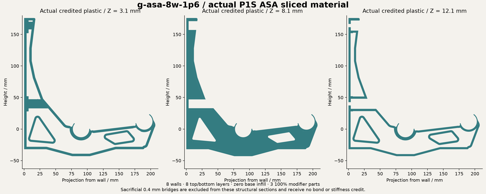

# G print control / ASA / 8 walls / 1.6 mm skins

Implemented experimental CAD and actual Orca slice. Physical performance is unqualified.

Spent extrusion **118.660 cm3**, versus reconstructed G with eight walls and 1.6 mm skins at **118.660 cm3**: **0.000% less volume**. Orca estimates **123.41 g** in ASA; this is not a weighed print. Cross-polymer volume savings are not mass savings.

Retained-material contact screen at 12 kg: **2.672976 mm** maximum movement, **21.000368 MPa** raw tensile peak. Linear tolerance 1e-04; 4.734% nominal material omitted. Same uncalibrated isotropic 1 GPa planning law for all controls. No measured ASA/PETG modulus or strength is inferred. This is an intermediate diagnostic; the 1e-5 gate is not established. Failed tighter attempts remain recorded.

Recovered print evidence changes the physical reference: the overnight ASA archive has seven walls and 10% base infill, and its associated downloaded STEP matches E13 exactly. The newer downloaded STEP matches G; the saved PETG project has two walls, 10% base infill and all three dense helpers, but it was saved after the morning print began. Its exact submitted PETG slice is not recovered. These are deliberately controlled G schedules with 1.6 mm skins and unchanged G helpers, not replicas of the successful ASA print. Earlier EF savings used a separate two-wall, 1.0 mm skin digital G baseline. See the recovery receipt alongside these handoffs.

Use OrcaSlicer, P1S, 0.4 mm nozzle, **8 walls**, **eight top and bottom layers at 0.2 mm**, **0% base infill**, and **100% infill for every supplied helper**. Only the body is a printable part. Import STEP parts aligned and assign modifier roles; STEP does not store those roles. The model-only 3MF records roles but does not calibrate a printer or filament. Slice archives are engineering evidence, not ready-to-print machine instructions.

Sacrificial 0.4 mm bridges count as spent plastic but receive zero stiffness, strength or bond credit. Actual credited material forms one component; geometric connectivity does not measure bond strength or ensure unsupported print quality. Rods, mounts, spool clearance and the 25.4 mm moulding locating underside remain fixed. Moulding supplies no assumed structural support.

Combined STEP

https://raw.githubusercontent.com/thereprocase/spool-wall-rack/main/designs/rev-g2/print-controls/g-asa-8w-1p6/bracket-with-modifiers.step

Body STEP

https://raw.githubusercontent.com/thereprocase/spool-wall-rack/main/designs/rev-g2/print-controls/g-asa-8w-1p6/body-only.step

Model-only 3MF

https://raw.githubusercontent.com/thereprocase/spool-wall-rack/main/designs/rev-g2/print-controls/g-asa-8w-1p6/part-model-and-modifiers.3mf

Individual helper STEPs

https://raw.githubusercontent.com/thereprocase/spool-wall-rack/main/designs/rev-g2/print-controls/g-asa-8w-1p6/dense-chords-and-seats.step

https://raw.githubusercontent.com/thereprocase/spool-wall-rack/main/designs/rev-g2/print-controls/g-asa-8w-1p6/rib-plane-lower.step

https://raw.githubusercontent.com/thereprocase/spool-wall-rack/main/designs/rev-g2/print-controls/g-asa-8w-1p6/rib-plane-upper.step

Actual slice and effective settings

https://raw.githubusercontent.com/thereprocase/spool-wall-rack/main/designs/rev-g2/print-controls/g-asa-8w-1p6/slice-evidence.zip

