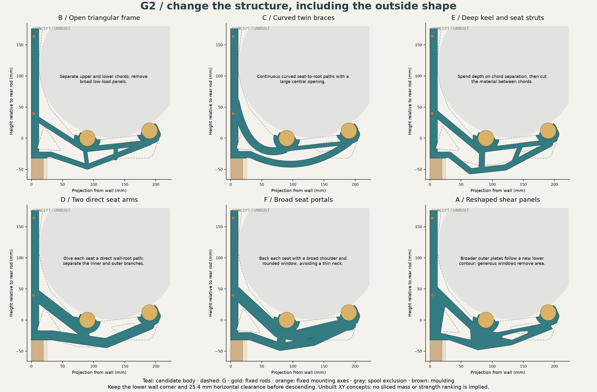
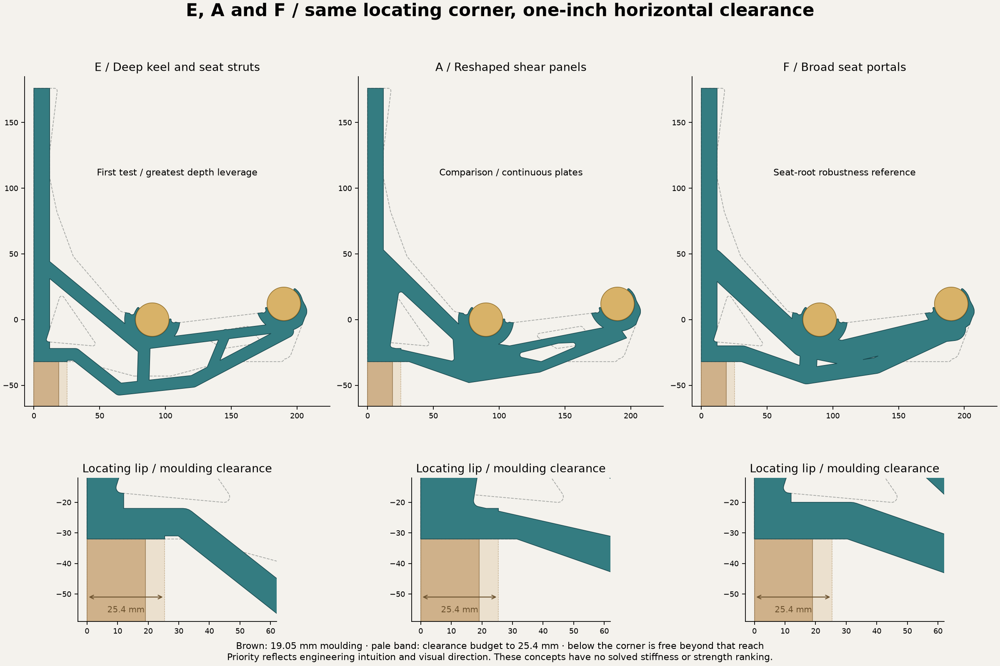

# G2: six broader body directions

These seeds change the outer body, member paths and large openings. The dashed
outline is G for scale. Rod and mounting coordinates stay fixed; the gray
region excludes the swept 180–220 mm spool flanges. The moulding datum is now
resolved: retain G's lower wall corner and a horizontal underside for at least
25.4 mm from the wall before descending. The crown moulding projects 19.05 mm.
Brown marks the moulding; the pale band shows the extra horizontal allowance.
This replaces the original 15 mm estimate. See the current interface contract.

E plus F is the selected next implementation. E offers a deeper frame; F supplies
broader seat-root transitions. A remains the principal alternative for the
continuous-plate direction. This priority reflects engineering intuition and
visual preference, not a calculated strength ranking. D remains an exploratory
alternative with a different visual character.

| Seed | Direction | Intended comparison |
|---|---|---|
| [B: open frame](B-open-truss.png) | Distinct upper/lower chords and a few diagonals | Reduce broad plate area while keeping separated load paths. |
| [C: curved braces](C-curved-braces.png) | Two continuous curved branches | Trade sharp junctions for curved seat-to-root transitions. |
| [E: deep keel](E-deep-keel.png) | Low chord with short seat struts | Test whether depth buys more stiffness than added helper width. |
| [D: separate arms](D-independent-arms.png) | Independent inner and outer seat branches | Change how the two seat loads reach the wall. |
| [F: seat portals](F-seat-portals.png) | Broad shoulders and rounded open bays | Reduce dependence on the thin inner-seat neck. |
| [A: shear panels](A-shear-panels.png) | New lower contour and larger windows | Compare continuous plates with the open-member families. |

All six are **unbuilt geometry sketches**. They have connected XY projections
and a nominal spool-clearance check, recorded in [verification](verification.json).
Projected area is not printed mass. A connected projection does not establish
3D or sliced-material connectivity, printable roofs, driver access, positive
capture performance or strength. The proposed through-width strategies are
parameters for subsequent CAD, not features represented by these side views.

[Parameterized seed definitions](generate.py) · [Machine-readable outlines](seeds.geojson).
Rebuild with `python designs/rev-g2/shape-seeds/generate.py` using the existing
GPU Python runtime's Shapely, NumPy and Matplotlib dependencies. This reuses the
continuous spool-sweep construction but does not impose the superseded local
E13 underside floor. The original seven-family worksheet remains preparatory;
these six sketches do not complete its required STEP/helper work.

The next search should explore these different families before local 5–10%
mutations. The measured 100-in-11-min throughput applies to the G helper pilot;
the broader body screen has not yet established its throughput or prediction
accuracy. Fresh slice/3D checks remain the acceptance stage for promising shapes.
