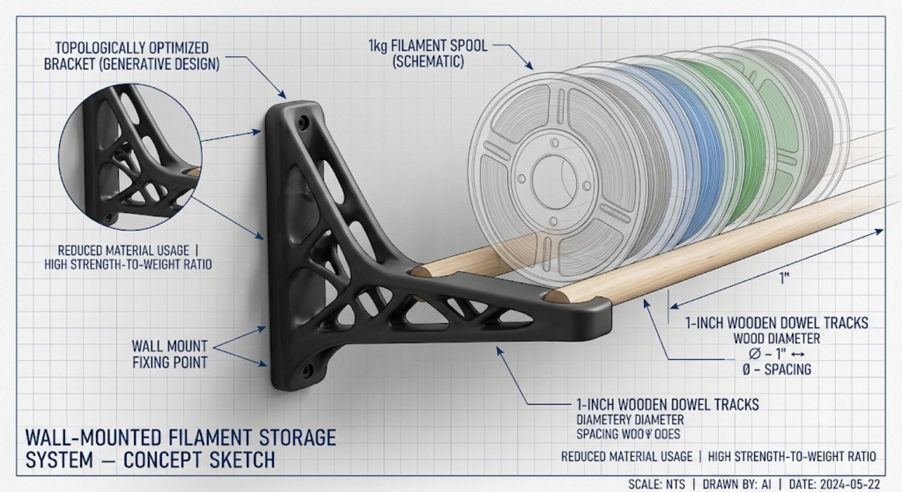

# Open-web exploration — deferred

The reference image records an aesthetic direction for a future, separate design path. It is not evidence of topology optimization, strength, dimensions, or printability. Develop this concept separately after resolving the closed-wall prototype. Do not transfer load ratings between concepts.

